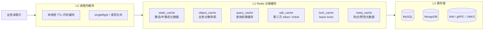

# 【历史专题稿】缓存体系设计：从零散缓存到统一缓存平台

> **状态说明**
> 本文保留为 Redis / Cache 平台化之前的专题设计稿，主要用于回看当时的缓存家族设计与迁移思路，**不再作为现行真值层入口**。
> 当前 Redis 现状请读 [../../03-基础设施/06-Redis使用情况.md](../../03-基础设施/06-Redis使用情况.md)，当前三层设计与接入方法请读 [../../03-基础设施/11-Redis三层设计与落地手册.md](../../03-基础设施/11-Redis三层设计与落地手册.md)。
> 本文中的代码锚点按历史阶段保留，**不保证继续与当前仓库路径完全一致**。

**本文回答**：`qs-server` 当前已经有对象缓存、查询缓存、启动预热、分布式锁、SDK 缓存和进程内缓存，但这些能力仍然分散在不同模块和不同实现风格中。本文给出一套面向 `qs-server` 的完整缓存设计：统一缓存分层、缓存家族、Redis 数据类型、TTL 与预热策略、锁的边界、观测与治理方式，以及如何从当前代码平滑迁移过去。

---

## 30 秒结论

先记住结论：

| 维度 | 设计结论 |
| ---- | -------- |
| 总体目标 | 把缓存从“各模块各写各的 Redis 逻辑”升级成“**统一缓存平台 + 业务装饰器**” |
| 分层 | 采用 **L0 进程内缓存**、**L1 Redis 分类缓存**、**L2 MySQL/Mongo/IAM 源存储** 三层结构 |
| 分类 | 不再按模块拆缓存，而是按 **静态元数据、对象快照、查询结果、SDK token、锁、热点元数据** 六类拆分 |
| Redis 类型 | **String** 是主力；**Hash / Set / ZSet** 只在适合的场景使用；**不为了“多类型”而滥用 Redis 类型** |
| 一致性 | 业务缓存统一采用 **cache-aside**；锁和缓存都不承担业务真相；真相仍在 MySQL / Mongo / IAM |
| TTL | 不再使用“一组全局 TTL + 一个全局抖动比率”思路，而是按缓存家族分层配置 TTL、jitter、negative cache |
| 预热 | 启动预热只负责 **静态/半静态热点**；查询缓存预热只针对明确高价值查询；不做全量盲预热 |
| 锁 | Redis 只负责 **best-effort lease lock**；数据库批处理继续优先使用 **MySQL GET_LOCK** 这类与事务域一致的锁 |

一句话：**统一的是治理方式，不是把所有缓存强行收敛成一个“万能缓存类”。**

---

## 为什么现在还不够统一

`qs-server` 当前已经有不少缓存能力，但还没有形成统一设计。主要问题不是“没缓存”，而是**缓存治理边界还不清楚**。

### 1. 缓存家族没有被显式建模

当前运行时里至少存在这些缓存：

- 静态/半静态对象缓存：
  - `scale:*`，见 [internal/apiserver/infra/cache/scale_cache.go](../../internal/apiserver/infra/cache/scale_cache.go)
  - `questionnaire:*` / `questionnaire:published:*`，见 [internal/apiserver/infra/cache/questionnaire_cache.go](../../internal/apiserver/infra/cache/questionnaire_cache.go)
  - `scale:list:v1`，见 [internal/apiserver/application/scale/global_list_cache.go](../../internal/apiserver/application/scale/global_list_cache.go)
- 业务对象缓存：
  - `assessment:detail:*`，见 [internal/apiserver/infra/cache/assessment_detail_cache.go](../../internal/apiserver/infra/cache/assessment_detail_cache.go)
  - `testee:info:*`，见 [internal/apiserver/infra/cache/testee_cache.go](../../internal/apiserver/infra/cache/testee_cache.go)
  - `plan:info:*`，见 [internal/apiserver/infra/cache/plan_cache.go](../../internal/apiserver/infra/cache/plan_cache.go)
- 查询结果缓存：
  - `stats:query:*`，见 [internal/apiserver/infra/statistics/cache.go](../../internal/apiserver/infra/statistics/cache.go)
  - `assess:list:{user}:...`，见 [internal/apiserver/infra/cache/my_assessment_list_cache.go](../../internal/apiserver/infra/cache/my_assessment_list_cache.go)
- SDK 缓存：
  - `wechat:cache:*`，见 [internal/apiserver/infra/wechatapi/cache_adapter.go](../../internal/apiserver/infra/wechatapi/cache_adapter.go)
- 分布式锁：
  - `answersheet:processing:*`
  - `qs:plan-scheduler:leader`
  - 见 [internal/pkg/redislock/lock.go](../../internal/pkg/redislock/lock.go)、[internal/worker/handlers/answersheet_handler.go](../../internal/worker/handlers/answersheet_handler.go)、[internal/worker/plan_scheduler.go](../../internal/worker/plan_scheduler.go)
- 进程内缓存：
  - `ScaleListCache` 本地内存层
  - `MyAssessmentListCache` 本地内存层
  - IAM `SnapshotLoader`

这些缓存都存在，但当前代码没有统一表达：

- 这一类缓存属于什么家族
- 该走哪种 Redis profile / keyspace
- 该使用什么 TTL / jitter / negative cache
- 该不该预热
- 该如何失效

所以现在是“**实现已经有了，分类语义还不完整**”。

### 2. key 构造方式仍然混用

当前 key 生成同时存在两套风格：

- 新路径：走 [`internal/pkg/rediskey/builder.go`](../../internal/pkg/rediskey/builder.go)
- 旧路径：`addNamespace(fmt.Sprintf(...))`，见：
  - [assessment_detail_cache.go](../../internal/apiserver/infra/cache/assessment_detail_cache.go)
  - [testee_cache.go](../../internal/apiserver/infra/cache/testee_cache.go)
  - [plan_cache.go](../../internal/apiserver/infra/cache/plan_cache.go)

这意味着：

- namespace 和 family 语义不是统一入口
- profile / keyspace 细分后，旧缓存更难平滑迁移
- 读写审计时很难统一检索和治理

### 3. 缓存策略在不同实现之间不一致

几个明显例子（Phase 3 之前）：

- `singleflight` 只在部分对象缓存上使用，`assessment/plan` 没接入  
  见 [internal/apiserver/infra/cache/singleflight.go](../../internal/apiserver/infra/cache/singleflight.go)
- `statistics` 查询缓存维护了自己的一套 `QueryCachePolicy` / 解压逻辑，没有复用统一 `CachePolicy`  
  见 [internal/apiserver/infra/statistics/cache.go](../../internal/apiserver/infra/statistics/cache.go)
- negative cache 只在 `questionnaire/testee` 这种少数对象上使用，但开关、TTL 和 sentinel 处理并不在统一 helper 中  
  见 [internal/apiserver/infra/cache/questionnaire_cache.go](../../internal/apiserver/infra/cache/questionnaire_cache.go)、[internal/apiserver/infra/cache/testee_cache.go](../../internal/apiserver/infra/cache/testee_cache.go)
- `MyAssessmentListCache` 通过 `DeletePattern` 做前缀失效，属于可用但不够优雅的治理方式  
  见 [internal/apiserver/infra/cache/my_assessment_list_cache.go](../../internal/apiserver/infra/cache/my_assessment_list_cache.go)

这不是“谁写得不对”，而是因为**缺少统一缓存策略目录（catalog）**。

### 4. 预热仍然偏“启动脚本”，不是“缓存治理”

当前预热逻辑已经不错，但它还是偏局部：

- 已发布量表 / 问卷预热，见 [internal/apiserver/infra/cache/warmup.go](../../internal/apiserver/infra/cache/warmup.go)
- 可选的统计查询预热，也在同文件里

问题在于：

- 预热对象来源主要靠代码硬编码和配置，不基于“缓存家族”
- 没有统一的热数据来源模型
- 预热没有和“夜间统计刷新”“repair/backfill 完成”“版本发布”形成标准联动

### 5. 观测能力还不够“按家族治理”

当前有：

- [`MetricsCollector`](../../internal/apiserver/infra/cache/metrics.go)
- [`CacheManagerImpl`](../../internal/apiserver/infra/cache/cache_manager.go)

但还缺：

- 按缓存家族、key family、profile 的 hit/miss/error/latency 指标
- 预热耗时、预热成功率、预热回源量
- 压缩率、value size 分布
- 锁冲突率、降级次数

因此，当前更像“有缓存监控代码”，还不是“有缓存治理指标”。

---

## 设计目标与非目标

### 目标

这套缓存设计的目标是：

1. **统一缓存家族定义**：每一类缓存都能回答自己是什么、为什么存在、谁拥有它。
2. **统一路由与 keyspace**：所有 Redis key 都通过统一 builder 和 family router 生成。
3. **统一 TTL / jitter / negative cache 策略**：按缓存家族治理，而不是按仓储文件零散配置。
4. **统一预热模型**：启动预热、定时预热、发布后预热、repair 后预热有一致入口。
5. **统一观测模型**：按 family / profile / operation 看命中率、回源率、延迟和故障。
6. **统一锁边界**：说明什么场景该用 Redis 锁，什么场景不该用。

### 非目标

这套设计**不**追求：

- 把所有缓存逻辑重写成一个超大 generic 框架
- 把 Redis 当作业务真相
- 用 Redis 替代 MySQL/Mongo/IAM 的主数据存储
- 把所有 MQ / queue / projector 问题都抽象成缓存问题

统一的是**治理层**，不是抹掉业务差异。

---

## 目标架构

### 分层模型

缓存系统按三层治理：

### 设计解释

- **L0** 只解决单实例热点和击穿，不承诺跨实例一致性。
- **L1** 负责跨实例共享缓存，但按家族拆 profile / keyspace。
- **L2** 永远是真相来源。

也就是说：

- L0 是“快”
- L1 是“省”
- L2 是“准”

---

## 缓存家族目录（Cache Catalog）

统一设计的核心，不是一个抽象基类，而是一个**缓存家族目录**。

每个 family 都必须定义：

- family 名
- keyspace / profile
- Redis 数据类型
- value 形态
- 默认 TTL / jitter / negative TTL
- 预热方式
- 写后失效方式
- fallback 行为

下面是 `qs-server` 的目标家族划分。

### 1. `static_meta`

用于静态或半静态元数据。

| 维度 | 设计 |
| ---- | ---- |
| 典型 key | `scale:*`、`questionnaire:*`、`questionnaire:published:*`、`questionnaire:{code}:{version}`、`scale:list:v1` |
| 当前代码 | [scale_cache.go](../../internal/apiserver/infra/cache/scale_cache.go)、[questionnaire_cache.go](../../internal/apiserver/infra/cache/questionnaire_cache.go)、[global_list_cache.go](../../internal/apiserver/application/scale/global_list_cache.go) |
| Redis profile | `static_cache` |
| keyspace suffix | `cache:static` |
| Redis type | `String` 为主 |
| 值结构 | JSON；value 较大时允许 gzip |
| 读写模式 | `cache-aside`；发布/更新后失效或直接重建 |
| 预热 | 启动后预热；发布后按 family 触发预热 |

这个 family 已经最接近统一治理，也是当前最适合做启动预热的一类缓存。

### 2. `object_view`

用于业务对象的单实体快照。

| 维度 | 设计 |
| ---- | ---- |
| 典型 key | `assessment:detail:*`、`testee:info:*`、`plan:info:*` |
| 当前代码 | [assessment_detail_cache.go](../../internal/apiserver/infra/cache/assessment_detail_cache.go)、[testee_cache.go](../../internal/apiserver/infra/cache/testee_cache.go)、[plan_cache.go](../../internal/apiserver/infra/cache/plan_cache.go) |
| Redis profile | `object_cache` |
| keyspace suffix | `cache:object` |
| Redis type | `String` |
| 值结构 | JSON；按 family 决定是否压缩 |
| 读写模式 | `cache-aside`；写成功后失效，读 miss 回填 |
| 预热 | 默认不做全量预热；只允许有限的热点对象预热 |

这类缓存和 `static_meta` 的区别是：**它们更易变、更多样，不能盲目长 TTL，也不该做大面积启动预热。**

### 3. `query_result`

用于聚合或列表查询结果。

| 维度 | 设计 |
| ---- | ---- |
| 典型 key | `stats:query:*`、`assess:list:{user}:...` |
| 当前代码 | [infra/statistics/cache.go](../../internal/apiserver/infra/statistics/cache.go)、[my_assessment_list_cache.go](../../internal/apiserver/infra/cache/my_assessment_list_cache.go) |
| Redis profile | `query_cache` |
| keyspace suffix | `cache:query` |
| Redis type | `String` |
| 值结构 | JSON；一般不压缩，除非对象明显偏大 |
| 读写模式 | `cache-aside`；TTL 驱动为主，辅以事件/版本失效 |
| 预热 | 仅预热明确高价值查询；不做全量 query 预热 |

这类缓存的核心不是“持久”，而是“挡首击、挡重复读”。

### 4. `sdk_token`

用于第三方 SDK 的 token / ticket。

| 维度 | 设计 |
| ---- | ---- |
| 典型 key | `wechat:cache:*` |
| 当前代码 | [cache_adapter.go](../../internal/apiserver/infra/wechatapi/cache_adapter.go) |
| Redis profile | `sdk_cache` |
| keyspace suffix | `cache:sdk` |
| Redis type | `String` |
| 值结构 | provider 原始字符串或轻量 JSON |
| 读写模式 | 由 SDK 使用；按 provider 返回的 expiry 设置 TTL |
| 预热 | 一般不主动预热 |

这类缓存和业务缓存不同，它本质上是**第三方凭证缓存**。

### 5. `lock_lease`

用于 best-effort 分布式互斥。

| 维度 | 设计 |
| ---- | ---- |
| 典型 key | `answersheet:processing:*`、`qs:plan-scheduler:leader` |
| 当前代码 | [redislock/lock.go](../../internal/pkg/redislock/lock.go) |
| Redis profile | `lock_cache` |
| keyspace suffix | `lock` |
| Redis type | `String` |
| 值结构 | token |
| 读写模式 | `SET NX EX` + compare-and-delete |
| 预热 | 不适用 |

这不是缓存命中率问题，而是协调问题，所以必须单独建模。

### 6. `meta_hotset`

用于缓存治理元数据，而不是业务对象本身。

| 维度 | 设计 |
| ---- | ---- |
| 典型内容 | 热 key 排名、预热清单、family 版本 token、query version token |
| Redis profile | `meta_cache` |
| keyspace suffix | `cache:meta` |
| Redis type | `Hash` / `Set` / `ZSet` |
| 目的 | 为预热、失效、热度治理服务 |

这类 key 当前几乎还没有成体系，但它是统一治理的关键补充层。

---

## Redis 数据类型设计

用户提到“存储要根据不同场景使用不同的数据类型”，这是对的，但前提是：**按语义选类型，不要为“用了更多 Redis 类型”而用。**

### 1. `String`

**适用场景**：

- 单对象快照
- 列表查询结果
- SDK token
- 版本 token
- lease lock token

**在 `qs-server` 里的主力用途**：

- `scale / questionnaire / assessment / testee / plan`
- `stats:query:*`
- `wechat:cache:*`
- `answersheet:processing:*`

**结论**：`String` 仍然是主力类型，因为大部分缓存值本质上就是“整体快照”。

### 2. `Hash`

**适用场景**：

- 一个实体有多个独立字段，需要局部更新
- 需要在同一个 key 下维护多项轻量元数据

**在目标设计中的推荐用途**：

- 预热状态元数据
- family 级治理元数据
- 热点统计摘要

**不建议**用 Hash 存：

- 复杂业务对象快照
- 会整体序列化/整体反序列化的大 JSON

### 3. `Set`

**适用场景**：

- 幂等 membership
- 黑白名单 / 成员集合
- 某个 family 当前的逻辑成员关系

**在目标设计中的推荐用途**：

- 若未来恢复 Redis 幂等集合，使用按日分桶的 `Set`
- 预热白名单集合

### 4. `ZSet`

**适用场景**：

- 热度排序
- 带分数的优先级预热队列
- 定时候选集合

**在目标设计中的推荐用途**：

- `top N` 热 key 排名
- 启动后优先预热集合
- repair/backfill 完成后的受影响热点对象清单

### 5. 不使用 `List / Stream` 作为业务缓存主结构

原因很简单：

- `qs-server` 已经有 NSQ / worker / MQ 体系
- 缓存系统不应该再引入第二套业务事件总线

所以：

- `List / Stream` 不是缓存主设计的一部分
- 有消息需求优先回到现有事件系统

---

## TTL、jitter 与 negative cache 设计

当前项目已经有 TTL 和 jitter，但还是偏全局。完整设计里，TTL 必须按 family 配置。

### family 级 TTL 矩阵

| Family | 典型对象 | TTL | Jitter | Negative cache | 说明 |
| ------ | -------- | --- | ------ | -------------- | ---- |
| `static_meta.scale_detail` | `scale:{code}` | `24h` | `15%` | `5m` | 稳定且可预热 |
| `static_meta.questionnaire_published` | 当前已发布问卷 | `24h` | `15%` | `5m` | 稳定且高热点 |
| `static_meta.questionnaire_versioned` | 历史版本问卷 | `24h` | `15%` | `10m` | 版本对象天然更稳定 |
| `static_meta.questionnaire_working` | 工作版本问卷 | `30m` | `10%` | `1m` | 管理态对象更易变 |
| `static_meta.scale_list` | 已发布量表列表 | Redis `10m` + L0 `30s` | `15%` | 无 | 列表热点但可快速重建 |
| `object_view.assessment_detail` | 测评详情 | `15m` | `10%` | `30s` | 易变，不适合 2h 以上 |
| `object_view.testee_detail` | 受试者详情 | `30m` | `10%` | `30s` | 更新频率中等 |
| `object_view.plan_detail` | 计划详情 | `30m` | `10%` | `30s` | 管理写入存在但不算高频 |
| `query_result.statistics` | 系统/问卷/计划/受试者统计 | `5m` | `20%` | 无 | 查询缓存，只挡重复读 |
| `query_result.my_assessment_list` | 我的测评列表 | Redis `5m` + L0 `30s` | `20%` | 无 | 需靠版本失效，不应依赖 `DeletePattern` |
| `sdk_token.wechat` | token/ticket | `provider_expiry - safety_window` | 无 | 无 | TTL 跟随第三方协议 |
| `lock_lease.*` | 锁 | 按任务定义 | 无 | 无 | 锁不参与 jitter |

### 设计原则

1. **TTL 不是统一越长越好**  
   例如 `assessment_detail` 明显比 `scale` 更易变，TTL 应短。

2. **jitter 不是全局一个值就结束**  
   静态元数据和查询缓存的雪崩风险不同，应按 family 控制。

3. **negative cache 只给合适的对象**  
   - 版本化、稳定对象：可以更长
   - 高频新建、可能刚创建的对象：只能很短，甚至关闭

4. **锁与 token 不做 jitter**  
   这不是“缓存同时失效”问题，而是协议与协调问题。

---

## 预热设计

预热的本质不是“启动时多跑几个接口”，而是**提前把明确高价值的数据放入正确的缓存家族**。

### 预热分层

### A. 启动预热：只针对 `static_meta`

继续保留当前思路，但明确 family 边界：

- 预热所有已发布 `scale`
- 预热所有已发布 `questionnaire`
- 预热 `scale:list:v1`

对应代码入口仍然可以复用：

- [internal/apiserver/infra/cache/warmup.go](../../internal/apiserver/infra/cache/warmup.go)

但它应该升级为：

- 不再直接依赖某个具体 repository 类型判断
- 而是依赖 `CacheCatalog` 判断哪些 family 允许启动预热

### B. 查询预热：只针对配置明确的 `query_result`

查询缓存预热不是越多越好。

只允许预热：

- 首页/工作台首屏统计
- 明确配置的 `org_id`
- 明确配置的问卷或计划

这和当前 [`StatisticsWarmupConfig`](../../internal/apiserver/infra/cache/warmup.go) 的方向一致，但应升级为 family-aware 设计。

### C. 事件/任务后预热

以下场景不应只依赖 TTL 自然回填：

- 发布新问卷/量表后
- `statistics_sync` 成功后
- `seeddata` repair/backfill 完成后

这些场景应该显式触发：

- 对应 family 的预热
- 或至少执行 family 局部失效

### D. 热点驱动预热

长期设计里，预热来源不应只靠配置，还应该来自：

- 访问日志
- family 级 miss 统计
- `ZSet` 热点排行榜

即：

- 配置告诉系统“必须热什么”
- 热点统计告诉系统“最近真的热什么”

---

## 失效与一致性设计

缓存统一治理最难的不是 `SET`，而是 **invalidate**。

### 统一原则

### 1. 对象缓存：`cache-aside + 写后失效`

适用于：

- `assessment_detail`
- `testee_detail`
- `plan_detail`
- `scale_detail`
- `questionnaire_*`

写路径成功后：

- 优先 `DEL` 单 key
- 需要时额外触发局部重建

### 2. 列表/查询缓存：优先“版本 token”，避免热路径 `DeletePattern`

当前 `MyAssessmentListCache` 的：

- `DeletePattern`
- Redis + 本地内存双删

能工作，但不是目标方案。

目标应改为：

- 引入用户级版本 token，例如  
  `query:version:assessment:list:{userID}`
- version token 存放在独立 `meta_cache` / `cache:meta` family，不和 query result 共用淘汰策略
- 列表 key 改为  
  `query:assessment:list:{userID}:v{token}:{hash}`
- 失效时只需要 `INCR version`

这样可以：

- 不扫描 Redis
- 不依赖通配删除
- 对高基数 query cache 更友好

### 3. 静态缓存：发布/下架后主动重建，不等 TTL

对 `scale/questionnaire` 这类缓存：

- 发布
- 激活版本切换
- 删除

都应视为“缓存治理事件”。

即：

- 不是简单删一下就结束
- 而是 family 级别的定向刷新

### 4. repair / seeddata 场景必须显式处理缓存

凡是：

- 历史上的一次性重建 / retime / repair 作业
- 任何批量 retime / repair

执行完都不应期待业务缓存“自己慢慢变对”。

必须有标准动作：

- 清 query cache
- 触发 statistics warmup
- 必要时清局部对象缓存

---

## 锁设计

缓存和锁共用 Redis，但**设计上必须分层看待**。

### 什么时候用 Redis 锁

只在这些场景使用 Redis lease lock：

1. **重复工作抑制**  
   例如 `answersheet:processing:*`
2. **轻量选主**  
   例如 scheduler leader
3. **非事务型、短时协调**

### 什么时候不用 Redis 锁

以下场景不应优先用 Redis 锁：

1. **数据库批处理 + 数据库事务绑定的任务**  
   继续优先用 MySQL `GET_LOCK`
2. **需要 fencing token 的强一致协调**
3. **长时间持锁任务**

所以当前统计夜间任务继续走 MySQL 锁是合理的，见：

- [internal/apiserver/application/statistics/sync_service.go](../../internal/apiserver/application/statistics/sync_service.go)

### 统一锁治理要求

所有 Redis 锁都应统一定义：

- key family
- ttl
- 降级策略
- 失败后的业务语义

例如：

- `answersheet` 锁：Redis 不可用时允许降级，由下游幂等兜底
- scheduler leader 锁：Redis 不可用时不启动 scheduler

这类“降级语义”必须是 lock catalog 的一部分。

---

## 代码组织设计

统一缓存设计落地后，代码结构建议这样收口。

### `component-base` 负责

- named redis profiles
- keyspace 组合
- 基础 Redis 原语
- lease lock 基础原语

### `qs-server` 负责

- `CacheFamily` 定义
- family -> profile / keyspace / ttl / warmup / invalidation 路由
- 业务装饰器
- warmup planner
- cache metrics / family metrics

### 推荐代码组织

### 1. `internal/apiserver/infra/cache/catalog.go`

定义：

- family 常量
- 默认 TTL / jitter / negative TTL
- 是否允许预热
- 是否允许压缩
- 默认 Redis profile

### 2. `internal/apiserver/infra/cache/router.go`

负责：

- family -> `redis.UniversalClient`
- family -> `rediskey.Builder`
- family -> keyspace

### 3. `internal/pkg/rediskey/builder.go`

升级成唯一 key 构造入口。

目标是完全移除：

- [`namespace.go`](../../internal/apiserver/infra/cache/namespace.go)
- 手写 `fmt.Sprintf("prefix:%s", ...)`

### 4. 业务装饰器继续存在，但只负责业务对象映射

保留：

- `CachedScaleRepository`
- `CachedQuestionnaireRepository`
- `CachedAssessmentRepository`
- `CachedTesteeRepository`
- `CachedPlanRepository`

但它们不再自己决定：

- TTL
- keyspace
- compress
- negative cache

这些都从 catalog/router 取。

---

## 观测与运维设计

缓存平台必须具备可观测性，否则后面还会重新碎掉。

### 必须具备的指标

### family 级缓存指标

- `cache_hit_total{family=...}`
- `cache_miss_total{family=...}`
- `cache_error_total{family=...}`
- `cache_latency_ms{family=...,op=get|set|del}`

### payload 指标

- `cache_value_bytes{family=...}`
- `cache_compressed_bytes{family=...}`
- `cache_compression_ratio{family=...}`

### 预热指标

- `cache_warmup_runs_total{family=...}`
- `cache_warmup_duration_seconds{family=...}`
- `cache_warmup_items_total{family=...}`
- `cache_warmup_failures_total{family=...}`

### 锁指标

- `lock_acquire_total{name=...}`
- `lock_contention_total{name=...}`
- `lock_degraded_total{name=...}`

### query cache 治理指标

- `query_cache_version_increments_total{family=...}`
- `query_cache_rebuild_total{family=...}`

### 日志要求

不是所有 cache hit 都打日志，但必须在这些时候打：

- family fallback 到源存储
- warmup 失败
- lock 降级
- Redis profile 不可用
- version invalidation 异常

---

## 分阶段实施计划

完整设计不应该一次性推翻当前代码，而应该分阶段实施。

### Phase 1：统一目录与 builder

目标：

- 建 `CacheCatalog`
- 所有 key 全部走 `rediskey.Builder`
- 移除 `addNamespace`

收益：

- family 语义明确
- keyspace/profile 可以统一切换

### Phase 2：完成 Redis profile 拆分

目标：

- 在已经落下的 `static_cache`、`query_cache` 基础上，补齐：
  - `object_cache`
  - `sdk_cache`
  - `lock_cache`
- 默认部署采用 **同一 Redis/Cluster、不同 DB** 的 profile 隔离：
  - default：DB 0
  - `static_cache`：DB 1
  - `object_cache`：DB 2
  - `query_cache`：DB 3
  - `sdk_cache`：DB 4
  - `lock_cache`：DB 5
- fallback 语义固定为：
  - **profile 未配置**：回退默认 Redis
  - **profile 已配置但不可用**：family 自身降级，不静默回退默认 Redis
- `worker` 的 `lock_cache` 是这一阶段最重要的 runtime 消费方：
  - `answersheet` 去重/互斥 lease lock
  - `plan scheduler` leader lock

收益：

- 资源隔离
- 淘汰策略隔离
- 运维容量更清晰

### Phase 3：统一 TTL / negative / compression / singleflight 策略

当前状态：

- 已完成。运行时已统一通过 `CacheCatalog + CachePolicy` 装配 family / object 策略
- `assessment_detail`、`plan` 已接入对象级 singleflight，`questionnaire/testee/scale` 也统一收口到共享 read-through helper
- `statistics` 查询缓存已删除独立 `QueryCachePolicy`，直接复用共享 `CachePolicy`
- `compression` 已改成 family 默认 + 对象可覆写；全局 `cache.compress-payload` 仅作为兼容 fallback

### Phase 4：重写 query cache 失效模型

当前状态：

- 已完成。`MyAssessmentListCache` 已从 `DeletePattern` 迁移到 `version token + versioned key`
- version token 已收口到独立 `meta_cache` / `cache:meta` family，不和 query result 共用淘汰策略
- 已形成统一规范：
  - 稳定 scope
  - version token key
  - versioned query result key
  - `Bump` 型失效
- 现有 `DeletePattern` 仍保留给运维和少数非 query 场景，但已退出 query/list cache 主路径

### Phase 5：预热与热度治理

当前状态：

- 已完成。预热已从“启动时手写几段 warmup”升级成 `WarmupCoordinator + WarmupRegistry` 驱动的 family-aware warmup
- 仅 `static` 与 `query` family 纳入主动预热；`object/sdk/lock/meta` 继续按需使用，不做 startup warmup
- 热点排行榜已落到 `meta_cache`，使用 ZSet 记录 `warmup:hot:{family}:{kind}`，作为 warmup 选种输入
- `publish / statistics sync / repair-complete` 三类触发已经统一接入 coordinator：
  - `worker -> apiserver` internal gRPC post-action 回调负责 `scale/questionnaire` 发布后静态缓存联动
  - nightly `statistics sync` 完成每个 org 后，直接触发对应 query family warmup
  - `POST /internal/v1/cache/governance/repair-complete` 作为 `seeddata / repair` 任务结束后的统一治理入口
- 降级语义已固定：
  - `static/query cache` 不可用时，对应 family warmup 直接跳过
  - `meta_cache` 不可用时，热榜记录与热榜选种跳过，但显式 seed / 触发目标继续工作
  - 所有 publish / sync / repair 联动均为 best-effort，不阻断主任务完成

### Phase 6：Prometheus 与运维面板

当前状态：

- 已完成。缓存治理主观测面已经统一收口到 Prometheus 指标与 apiserver internal 运维面板：
  - Prometheus 是主时序观测面
  - internal REST 只提供当前状态、最近一次 warmup 结果和 hotset 预览
- family degraded 不再只是日志语义，而是有显式 runtime 状态：
  - `default`
  - `fallback_default`
  - `named_profile`
  - `degraded`
  - `disabled`
- apiserver 已新增 internal 面板：
  - `GET /internal/v1/cache/governance/status`
  - `GET /internal/v1/cache/governance/hotset?kind=...&limit=...`
- worker 继续不暴露 internal 面板；`lock_cache` 的治理状态只通过 `/metrics` 和结构化日志输出

当前推荐的治理指标包括：

- `qs_cache_get_total{family,policy,result}`
- `qs_cache_write_total{family,policy,op,result}`
- `qs_cache_operation_duration_seconds{family,policy,op}`
- `qs_cache_payload_bytes{family,policy,stage}`
- `qs_cache_family_available{component,family,profile}`
- `qs_cache_family_degraded_total{component,family,profile,reason}`
- `qs_cache_warmup_runs_total{trigger,result}`
- `qs_cache_warmup_items_total{trigger,family,kind,result}`
- `qs_cache_warmup_duration_seconds{trigger,result}`
- `qs_cache_hotset_records_total{family,kind,result}`
- `qs_cache_warmup_hot_reads_total{family,kind,result}`
- `qs_cache_hotset_size{family,kind}`
- `qs_query_cache_version_total{kind,op,result}`
- `qs_cache_lock_acquire_total{name,result}`
- `qs_cache_lock_release_total{name,result}`
- `qs_cache_lock_degraded_total{name,reason}`

标签规则已固定为低基数，只允许：

- `component`
- `family`
- `policy`
- `profile`
- `kind`
- `trigger`
- `result`
- `op`
- `reason`
- `name`

不会把 `scope/userID/orgID/planID/questionnaireCode/versionKey` 这类高基数值打进 Prometheus label。高基数明细只会出现在 internal 面板返回体中。

---

## 最终结论

`qs-server` 的缓存不应该再被理解成：

- “几个 repository 上套了 Redis”
- “启动时顺手 warmup 一下”
- “有锁就也用 Redis 放一起”

更合理的理解应该是：

**缓存是一套独立的运行时子系统。**

它需要统一回答：

- 缓什么
- 为什么缓
- 缓在哪里
- 缓多久
- 怎么预热
- 怎么失效
- 怎么观测
- 哪些场景绝不能把缓存当真相

对 `qs-server` 来说，最合适的落地方式不是做一个“万能缓存框架”，而是：

1. 保留业务装饰器
2. 建立统一 `CacheCatalog`
3. 按 family 拆 profile / keyspace / policy
4. 让 warmup、TTL、negative cache、锁和指标都围绕 family 治理

这才是从“东一块西一块”走向“统一缓存平台”的正确方向。
