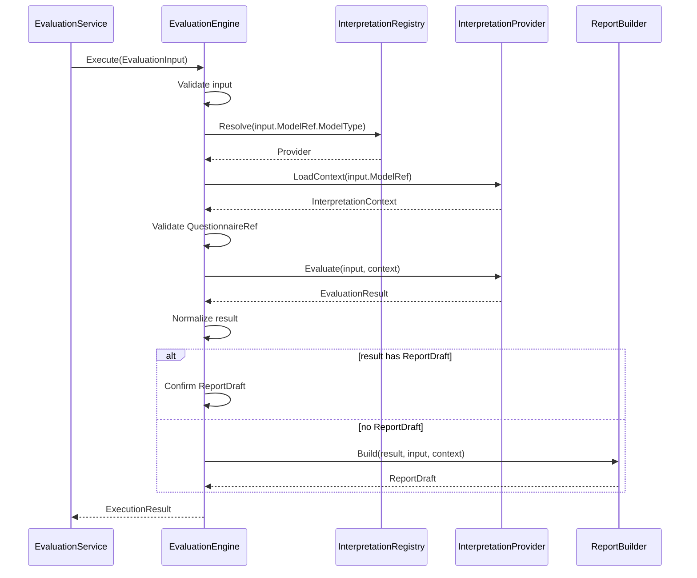

# 03-Evaluation引擎链路：模型解析、规则加载、执行与报告生成

> 本文是 Evaluation 模块文档的第三篇，聚焦 **EvaluationEngine 的内部执行链路**。
>
> 第二篇已经说明：`AnswerSheetSubmittedEvent` 触发 Evaluation 主链路，EvaluationService 创建或加载 `Assessment`，固化 `InterpretationModelRef`，读取 `AnswerSheetSnapshot`，构造 `EvaluationInput`，再调用 EvaluationEngine 执行。
>
> 本文继续回答：EvaluationEngine 拿到 `EvaluationInput` 后，如何根据 `ModelRef` 解析 Provider，如何加载模型 Context，如何校验答卷与模型的问卷版本一致性，如何执行具体解释模型，如何归一化 `EvaluationResult`，以及如何生成或返回报告草稿。

---

## 1. 结论先行

EvaluationEngine 的核心职责是：

> **作为通用执行框架，基于 Interpretation Model 抽象完成模型解析、上下文加载、输入校验、模型执行、结果归一化和报告草稿生成。**

它不是医学量表专用执行器。

它也不是 MBTI 专用执行器。

它应该只依赖这一组抽象：

```text
EvaluationInput
InterpretationModelRef
InterpretationRegistry
InterpretationProvider
InterpretationContext
EvaluationResult
ReportDraft
```

核心链路可以概括为：

```text
EvaluationInput
    ↓
Validate Input
    ↓
Resolve Provider by ModelRef.ModelType
    ↓
Provider.LoadContext(ModelRef)
    ↓
Validate QuestionnaireRef Consistency
    ↓
Provider.Evaluate(input, context)
    ↓
Normalize EvaluationResult
    ↓
Build or Confirm ReportDraft
    ↓
Return ExecutionResult
```

一句话：

> **EvaluationEngine 管“执行框架”，Provider 管“具体模型算法”。**

---

## 2. 本文边界

本文重点：

```text
EvaluationEngine 的职责；
EvaluationInput 的前置校验；
InterpretationRegistry 如何解析 Provider；
Provider.LoadContext 如何加载模型执行上下文；
QuestionnaireRef 一致性校验；
Provider.Evaluate 如何执行具体模型；
EvaluationResult 归一化；
ReportDraft 生成或确认；
ExecutionResult 返回；
ScaleProvider 与 MBTIProvider 在引擎中的同级关系；
引擎链路中的错误分类和观测字段。
```

本文不展开：

```text
Assessment 创建或状态推进；
AnswerSheet 提交与保存；
MedicalScale / MBTIModel 领域模型细节；
Provider 接口完整契约设计；
失败重试与补偿策略；
Report 持久化；
事件 Outbox / MQ 实现。
```

这些由其它文档承接：

```text
01-Evaluation模型--Assessment-EvaluationRun-Result-Report模型设计.md
02-Evaluation执行链路--从AnswerSheet提交到Assessment完成.md
04-Evaluation失败重试链路--幂等-错误状态-补偿处理.md
05-Evaluation事件链路--答卷提交-测评完成-报告生成.md
06-Evaluation模块分层架构与事实源索引.md
../report/README.md
../instrument/README.md
```

---

## 3. EvaluationService 与 EvaluationEngine 的区别

Evaluation 模块中容易混淆两个对象：

```text
EvaluationService
EvaluationEngine
```

它们职责不同。

| 对象 | 层级 | 主要职责 |
| --- | --- | --- |
| EvaluationService | Application | 编排主业务链路，管理 Assessment、事务、结果保存、报告保存、事件出站 |
| EvaluationEngine | Engine / Domain Service | 执行模型解析、Context 加载、Provider 执行、结果归一化、报告草稿生成 |

EvaluationService 负责：

```text
处理 AnswerSheetSubmittedEvent；
创建或加载 Assessment；
幂等和状态判断；
加载 AnswerSheetSnapshot；
构造 EvaluationInput；
调用 EvaluationEngine；
保存 EvaluationResult；
保存 InterpretReport；
推进 Assessment 状态；
记录 EvaluationRun；
发布事件。
```

EvaluationEngine 负责：

```text
校验 EvaluationInput；
根据 ModelRef 解析 Provider；
加载 InterpretationContext；
校验 QuestionnaireRef；
调用 Provider.Evaluate；
归一化 EvaluationResult；
构造或确认 ReportDraft；
返回 ExecutionResult。
```

EvaluationEngine 不应该保存数据库。

EvaluationEngine 不应该推进 Assessment 状态。

EvaluationEngine 不应该发布事件。

---

## 4. 引擎链路总览

EvaluationEngine 内部链路如下：



这条链路中最关键的边界是：

```text
Engine 通过 Registry 找 Provider；
Provider 内部可以有具体模型算法；
Engine 不硬编码 scale / mbti 的规则细节；
Engine 返回执行产物，不负责持久化。
```

---

## 5. ExecutionResult：引擎输出对象

EvaluationEngine 最终不应只返回裸 `EvaluationResult`。

更推荐返回一个 `ExecutionResult`，用于承载引擎执行后的完整产物。

推荐结构：

```text
ExecutionResult
├── AssessmentRef
├── ModelRef
├── QuestionnaireRef
├── ContextRef / RuleSnapshotRef
├── EvaluationResult
├── ReportDraft
├── Warnings
├── Metrics
└── Metadata
```

其中：

```text
EvaluationResult  是模型执行产物；
ReportDraft       是报告草稿；
RuleSnapshotRef   是本次规则上下文引用；
Warnings          是非致命问题，如部分可选字段缺失；
Metrics           是执行耗时、题目数量、因子数量等；
Metadata          是 trace、provider、版本等信息。
```

EvaluationService 拿到 ExecutionResult 后，才负责：

```text
保存 EvaluationResult；
保存 InterpretReport；
推进 Assessment；
记录 EvaluationRun；
发布事件。
```

---

## 6. Step 1：校验 EvaluationInput

EvaluationEngine 的第一步是校验输入。

必须校验：

```text
AssessmentRef 非空；
AnswerSheetRef 非空；
AnswerSheetSnapshot 非空；
ModelRef 非空；
ModelRef.ModelType 非空；
ModelRef.ModelCode 非空；
ModelRef.ModelVersion 非空；
QuestionnaireRef 非空；
SubjectRef 是否满足业务要求；
TraceContext 是否可选。
```

其中最重要的是：

```text
ModelRef 必须完整；
QuestionnaireRef 必须完整；
AnswerSheetSnapshot 必须是只读执行输入。
```

不要在引擎内部重新推导 latest model。

错误方向：

```text
input.ModelRef 为空 -> 根据 QuestionnaireCode 查 latest Scale。
```

正确方向：

```text
input.ModelRef 为空 -> 返回 InvalidEvaluationInput。
```

因为 ModelRef 应该在 Assessment 创建时已经固化。

---

## 7. Step 2：解析 Provider

输入校验通过后，引擎根据 `ModelRef.ModelType` 解析 Provider。

抽象调用：

```go
provider, err := registry.Resolve(input.ModelRef.ModelType)
```

如果 `ModelType = scale`：

```text
Resolve -> ScaleProvider
```

如果 `ModelType = mbti`：

```text
Resolve -> MBTIProvider
```

Registry 的职责：

```text
根据 ModelType 找到 Provider；
保证 Provider 唯一；
未注册模型返回明确错误；
避免 Engine 中出现 if scale / if mbti 分支。
```

错误方向：

```go
switch input.ModelRef.ModelType {
case "scale":
    return e.runScale(input)
case "mbti":
    return e.runMBTI(input)
}
```

正确方向：

```go
provider := e.registry.Resolve(input.ModelRef.ModelType)
```

---

## 8. Step 3：加载 InterpretationContext

Provider 解析成功后，引擎调用：

```go
context, err := provider.LoadContext(ctx, input.ModelRef)
```

Context 是模型规则上下文。

它必须是只读快照。

Scale 场景下：

```text
ScaleProvider.LoadContext
    -> ScaleQueryService.GetEvaluationContext
    -> EvaluationScaleContext
```

EvaluationScaleContext 可能包含：

```text
ScaleRef；
QuestionnaireRef；
FactorSnapshots；
ScoringSpecSnapshots；
InterpretationRulesSnapshots；
RuleVersion / RuleHash。
```

MBTI 场景下：

```text
MBTIProvider.LoadContext
    -> MBTIQueryService.GetEvaluationContext
    -> MBTIContext
```

MBTIContext 可能包含：

```text
ModelRef；
QuestionnaireRef；
DimensionRules；
TypeProfiles；
ReportTemplates；
RuleVersion / RuleHash。
```

Context 加载失败时，应返回明确错误。

典型错误：

```text
ModelNotFound；
ModelNotPublished；
ModelArchived；
ContextLoadFailed；
RuleSnapshotMissing；
```

---

## 9. Step 4：校验 QuestionnaireRef 一致性

Context 加载成功后，EvaluationEngine 必须校验：

```text
input.QuestionnaireRef == context.QuestionnaireRef
```

也就是：

```text
input.QuestionnaireCode == context.QuestionnaireCode
input.QuestionnaireVersion == context.QuestionnaireVersion
```

这一步属于通用引擎校验，不应该只放在 ScaleProvider 内部。

原因是：

```text
Scale 需要绑定 QuestionnaireVersion；
MBTI 也需要绑定 QuestionnaireVersion；
BigFive 等模型也通常基于特定问卷版本；
答卷与模型规则版本不一致会导致结果不可追溯。
```

不一致时，应返回：

```text
QuestionnaireRefMismatch
```

错误示例：

```text
expected model questionnaire = ADHD_PARENT@1.0.0
actual answer sheet questionnaire = ADHD_PARENT@1.1.0
```

这类错误应该由 EvaluationService 标记为 failed，并记录 EvaluationRun。

---

## 10. Step 5：调用 Provider.Evaluate

通过一致性校验后，引擎调用：

```go
result, err := provider.Evaluate(ctx, input, context)
```

Provider 内部执行具体模型逻辑。

ScaleProvider 可能执行：

```text
遍历 FactorSnapshots；
根据 QuestionCodes 提取答案；
根据 ScoringSpec 计算 FactorScore；
根据 InterpretationRules 命中 RiskLevel；
生成医学量表 EvaluationResult；
生成 ReportDraft。
```

MBTIProvider 可能执行：

```text
读取维度题目映射；
计算 E/I、S/N、T/F、J/P 偏好；
解析 TypeCode；
加载 TypeProfile；
生成人格画像 EvaluationResult；
生成 ReportDraft。
```

EvaluationEngine 不关心这些内部细节。

它只关心：

```text
Provider 是否成功返回 EvaluationResult；
EvaluationResult 是否与 input.ModelRef 一致；
EvaluationResult 是否与 input.AssessmentRef 一致；
EvaluationResult 是否可被持久化；
ReportDraft 是否存在或能被构造。
```

---

## 11. Step 6：归一化 EvaluationResult

不同 Provider 返回的结果结构可能略有差异。

EvaluationEngine 应对结果做基础归一化。

归一化包括：

```text
补齐 AssessmentRef；
补齐 ModelRef；
补齐 QuestionnaireRef；
补齐 RuleSnapshotRef；
校验 Result 中的 ModelRef 与 input.ModelRef 一致；
校验结果结构非空；
将模型特定结果包装到统一字段；
记录 provider metadata。
```

推荐结果结构：

```text
EvaluationResult
├── AssessmentRef
├── ModelRef
├── QuestionnaireRef
├── ScoreResults
├── InterpretationResults
├── ProfileResults
├── ReportDraft
├── RuleSnapshotRef
└── Metadata
```

注意：归一化不是把所有模型强行压成 Scale 形态。

错误方向：

```text
所有模型结果都必须有 FactorScore / RiskLevelResult。
```

正确方向：

```text
Scale 可以有 FactorScore / RiskLevelResult；
MBTI 可以有 DimensionScore / TypeProfile；
统一结果只提供可承接的外壳。
```

---

## 12. Step 7：构造或确认 ReportDraft

Provider 可以选择返回 ReportDraft。

也可以只返回结构化 EvaluationResult，由 EvaluationEngine 的 ReportBuilder 构造报告草稿。

两种模式：

```text
模式一：Provider 生成 ReportDraft
模式二：ReportBuilder 根据 EvaluationResult 生成 ReportDraft
```

### 12.1 Provider 生成 ReportDraft

适合模型差异较大的场景。

例如 MBTI 的人格画像报告可能由 MBTIProvider 直接组合。

优点：

```text
模型对自己的报告结构最了解；
减少通用 ReportBuilder 的复杂度。
```

缺点：

```text
Provider 容易膨胀；
报告风格不统一。
```

### 12.2 ReportBuilder 生成 ReportDraft

适合报告结构统一、模型只提供结果数据的场景。

优点：

```text
报告生成统一；
Provider 更聚焦模型执行。
```

缺点：

```text
ReportBuilder 需要理解不同模型的展示差异；
可能出现 if scale / if mbti 分支。
```

### 12.3 推荐策略

短期建议：

```text
允许 Provider 返回 ReportDraft；
EvaluationEngine 校验 ReportDraft 是否完整；
没有 ReportDraft 时再调用 ReportBuilder；
ReportBuilder 可以按 ModelType 使用模板分派。
```

注意：最终 `InterpretReport` 的持久化仍属于 EvaluationService。

---

## 13. ReportDraft 与 InterpretReport 的区别

`ReportDraft` 是引擎输出。

`InterpretReport` 是持久化报告事实。

二者区别：

| 对象 | 所属阶段 | 说明 |
| --- | --- | --- |
| ReportDraft | 引擎执行阶段 | 未持久化的报告草稿 |
| InterpretReport | Evaluation 持久化阶段 | 已保存的最终报告事实 |

ReportDraft 可以包含：

```text
Title；
Sections；
Summary；
Suggestions；
Charts；
RawPayload；
RenderSchema；
```

InterpretReport 应额外包含：

```text
ReportID；
AssessmentID；
ModelRef；
QuestionnaireRef；
SubjectRef；
Snapshot；
CreatedAt；
Version。
```

EvaluationEngine 只产出 ReportDraft。

EvaluationService 负责把 ReportDraft 变成 InterpretReport。

---

## 14. ScaleProvider 在引擎中的位置

ScaleProvider 是当前最重要的 Provider 实现。

在引擎链路中，它的位置是：

```text
EvaluationEngine
    -> Registry.Resolve(scale)
    -> ScaleProvider.LoadContext
    -> ScaleProvider.Evaluate
```

ScaleProvider 内部可以调用：

```text
ScaleQueryService；
MedicalScaleEvaluator；
ScoreCalculationEngine；
AssessmentAnalysisEngine；
ScaleReportComposer。
```

但这些都应封装在 ScaleProvider 或 Scale 专用 Evaluator 内部。

EvaluationEngine 不应该知道：

```text
Factor 如何遍历；
ScoringSpec 有哪些策略；
InterpretationRules 如何匹配；
RiskLevel 如何定义；
总分因子如何识别。
```

这些属于 Scale 模型执行细节。

---

## 15. MBTIProvider 在引擎中的位置

MBTIProvider 是未来新增模型的 Provider 实现。

在引擎链路中，它的位置是：

```text
EvaluationEngine
    -> Registry.Resolve(mbti)
    -> MBTIProvider.LoadContext
    -> MBTIProvider.Evaluate
```

MBTIProvider 内部可以调用：

```text
MBTIQueryService；
MBTIEvaluator；
DimensionScoringEngine；
TypeCodeResolver；
TypeProfileComposer；
MBTIReportComposer。
```

EvaluationEngine 不应该知道：

```text
E/I 如何计分；
S/N 如何计分；
T/F 如何计分；
J/P 如何计分；
TypeCode 如何解析；
TypeProfile 如何匹配。
```

这些属于 MBTI 模型执行细节。

---

## 16. 引擎错误分类

EvaluationEngine 应返回明确错误。

典型错误分类：

```text
InvalidEvaluationInput
ProviderNotFound
ContextLoadFailed
ModelNotFound
ModelNotPublished
QuestionnaireRefMismatch
ProviderEvaluateFailed
InvalidEvaluationResult
ReportDraftBuildFailed
UnsupportedModelType
```

这些错误由 EvaluationService 接收后转换为：

```text
Assessment failed；
EvaluationRun failed；
FailureReason；
必要时 AssessmentFailedEvent。
```

错误分类示例：

| 错误 | 发生阶段 |
| --- | --- |
| InvalidEvaluationInput | Step 1 输入校验 |
| ProviderNotFound | Step 2 Provider 解析 |
| ContextLoadFailed | Step 3 Context 加载 |
| QuestionnaireRefMismatch | Step 4 一致性校验 |
| ProviderEvaluateFailed | Step 5 Provider 执行 |
| InvalidEvaluationResult | Step 6 结果归一化 |
| ReportDraftBuildFailed | Step 7 报告草稿构造 |

---

## 17. 引擎可观测性

EvaluationEngine 必须输出足够日志和指标。

建议日志字段：

```text
trace_id
assessment_id
answer_sheet_id
model_type
model_code
model_version
questionnaire_code
questionnaire_version
provider_name
context_rule_hash
stage
duration_ms
error_code
```

建议阶段耗时：

```text
validate_input_duration_ms
resolve_provider_duration_ms
load_context_duration_ms
validate_questionnaire_ref_duration_ms
provider_evaluate_duration_ms
normalize_result_duration_ms
build_report_draft_duration_ms
engine_total_duration_ms
```

建议指标：

```text
evaluation_engine_execute_total
evaluation_engine_success_total
evaluation_engine_failure_total
evaluation_engine_failure_by_stage
evaluation_provider_evaluate_duration_ms
evaluation_context_load_duration_ms
```

排障时应能回答：

```text
Provider 是否解析成功？
Context 是否加载成功？
加载的是哪套规则？
答卷与模型是否问卷版本一致？
Provider 内部执行耗时多少？
报告草稿是否生成成功？
失败发生在哪个阶段？
```

---

## 18. 引擎伪代码

以下伪代码用于表达职责边界，不代表最终代码实现。

```go
func (e *EvaluationEngine) Execute(ctx context.Context, input EvaluationInput) (*ExecutionResult, error) {
    if err := e.validateInput(input); err != nil {
        return nil, NewEngineError(StageValidateInput, err)
    }

    provider, err := e.registry.Resolve(input.ModelRef.ModelType)
    if err != nil {
        return nil, NewEngineError(StageResolveProvider, err)
    }

    modelContext, err := provider.LoadContext(ctx, input.ModelRef)
    if err != nil {
        return nil, NewEngineError(StageLoadContext, err)
    }

    if err := e.validateQuestionnaireRef(input.QuestionnaireRef, modelContext.QuestionnaireRef()); err != nil {
        return nil, NewEngineError(StageValidateQuestionnaireRef, err)
    }

    result, err := provider.Evaluate(ctx, input, modelContext)
    if err != nil {
        return nil, NewEngineError(StageProviderEvaluate, err)
    }

    normalized, err := e.normalizer.Normalize(input, modelContext, result)
    if err != nil {
        return nil, NewEngineError(StageNormalizeResult, err)
    }

    reportDraft := normalized.ReportDraft
    if reportDraft == nil {
        reportDraft, err = e.reportBuilder.Build(ctx, input, modelContext, normalized)
        if err != nil {
            return nil, NewEngineError(StageBuildReportDraft, err)
        }
    }

    return &ExecutionResult{
        AssessmentRef:    input.AssessmentRef,
        ModelRef:         input.ModelRef,
        QuestionnaireRef: input.QuestionnaireRef,
        ContextRef:       modelContext.ContextRef(),
        EvaluationResult: normalized,
        ReportDraft:      reportDraft,
    }, nil
}
```

注意：

```text
Engine 不保存结果；
Engine 不保存报告；
Engine 不修改 Assessment；
Engine 不发布事件；
Engine 不直接依赖 MedicalScale 或 MBTIModel。
```

---

## 19. 常见错误设计

### 19.1 Engine 硬编码 Scale

错误方向：

```go
scale := scaleQuery.GetEvaluationContext(input.ModelRef)
factorScores := calculateFactorScores(scale, input.AnswerSheet)
```

正确方向：

```go
provider := registry.Resolve(input.ModelRef.ModelType)
context := provider.LoadContext(ctx, input.ModelRef)
result := provider.Evaluate(ctx, input, context)
```

### 19.2 Engine 自动查 latest model

错误方向：

```text
ModelRef 缺失时，根据 QuestionnaireCode 查询最新 Scale。
```

正确方向：

```text
ModelRef 缺失直接返回 InvalidEvaluationInput。
```

### 19.3 Provider 返回可变聚合对象

错误方向：

```text
Provider.LoadContext -> *MedicalScale
```

正确方向：

```text
Provider.LoadContext -> EvaluationScaleContext / MBTIContext 只读快照
```

### 19.4 所有模型结果都强制 FactorScore

错误方向：

```text
EvaluationResult 必须包含 FactorScore。
```

正确方向：

```text
EvaluationResult 支持 ScoreResults / InterpretationResults / ProfileResults；
具体模型可以扩展 detail。
```

### 19.5 Engine 保存报告

错误方向：

```text
EvaluationEngine.Execute 内部调用 reportRepository.Save。
```

正确方向：

```text
Engine 返回 ReportDraft；
EvaluationService 负责保存 InterpretReport。
```

---

## 20. 小结

EvaluationEngine 链路可以用一句话总结：

> **EvaluationEngine 接收 EvaluationInput，根据 ModelRef 解析 Provider，加载只读 Context，校验 QuestionnaireRef，一次性调用 Provider 执行具体模型，再归一化结果并返回 ReportDraft 和 ExecutionResult。**

本文需要建立六个核心认知：

```text
第一，EvaluationEngine 是通用执行框架，不是 Scale 专用执行器；
第二，Provider 负责具体模型算法，Engine 只负责模型解析和执行编排；
第三，Context 是只读规则快照，不是具体模型聚合指针；
第四，QuestionnaireRef 一致性校验属于通用引擎校验；
第五，EvaluationResult 是统一外壳，不应该强制所有模型伪装成医学量表；
第六，Engine 不保存结果、不保存报告、不推进 Assessment、不发布事件。
```

守住这些边界，EvaluationEngine 才能支撑 Scale 与 MBTI 等多种解释模型同级接入，而不会退化成一个充满 if-else 的模型专用执行器。
