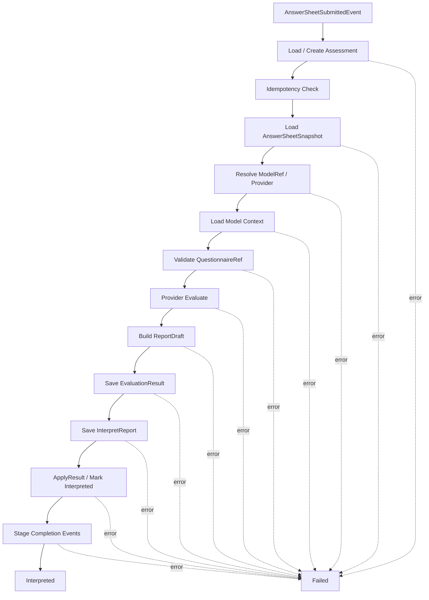
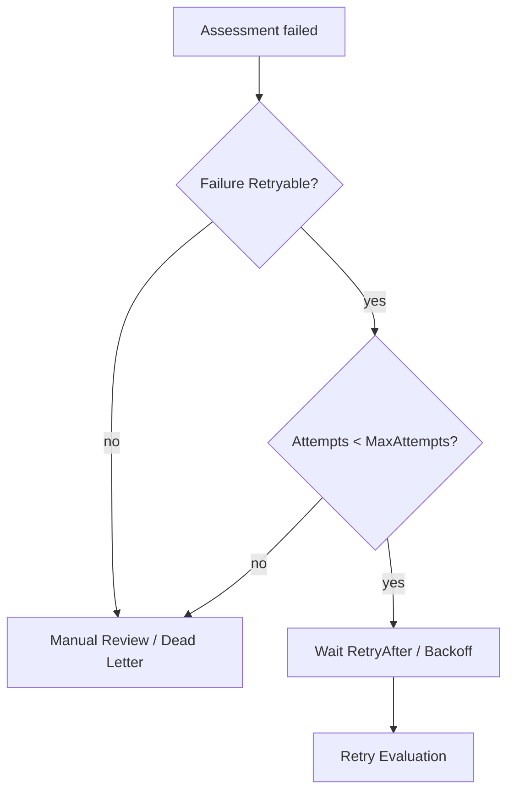
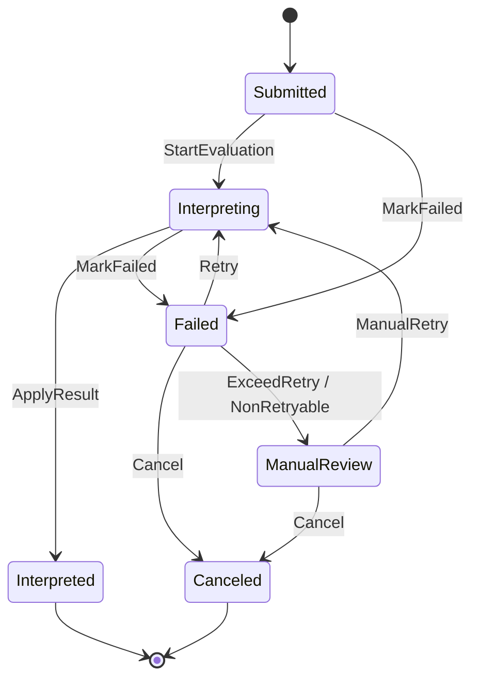

# 04-Evaluation失败重试链路：幂等、错误状态与补偿处理

> 本文是 Evaluation 模块文档的第四篇，聚焦 **Evaluation 的失败重试链路与可靠性设计**。
>
> 前三篇已经说明：`Assessment` 是一次测评执行聚合；`AnswerSheetSubmittedEvent` 触发 Evaluation 主链路；`EvaluationEngine` 通过 `ModelRef / Provider / Context` 执行具体解释模型。
>
> 本文继续回答：当 Evaluation 在加载答卷、解析模型、加载规则、执行模型、生成报告、保存结果或发布事件过程中失败时，系统如何记录失败、如何保证幂等、如何安全重试、如何补偿部分成功状态，以及如何避免同一次测评在重试后使用不同规则。

---

## 1. 结论先行

Evaluation 失败重试链路的核心目标是：

> **让一次 Assessment 即使经历重复事件、并发执行、中途失败、服务崩溃、报告保存失败、事件发布失败，也能保持状态可诊断、结果不重复、报告不漂移、重试可控。**

失败重试链路需要同时解决五类问题：

```text
幂等：重复事件不能重复创建 Assessment、重复生成报告或重复发布完成事件；
状态：失败必须进入 Assessment failed / EvaluationRun failed，而不是只打日志；
重试：重试必须使用原始 AnswerSheetRef + ModelRef + RuleSnapshotRef；
补偿：部分成功状态必须可识别、可修复、可恢复；
观测：每次失败必须知道失败阶段、错误码、是否可重试和 trace。
```

一句话概括：

> **Evaluation 的可靠性不靠“少失败”，而靠“失败可记录、可重试、可补偿、可追溯”。**

---

## 2. 本文边界

本文重点：

```text
Evaluation 失败阶段分类；
Assessment failed 状态语义；
EvaluationRun 失败记录；
FailureReason 设计；
IdempotencyKey 设计；
重复事件处理；
并发执行控制；
重试策略；
补偿处理；
规则版本变化下的重试策略；
事件发布失败处理；
人工处理入口；
失败链路观测字段；
常见错误设计。
```

本文不展开：

```text
Assessment / EvaluationResult / InterpretReport 的基础模型设计；
AnswerSheet 提交流程；
EvaluationEngine 内部模型解析和 Provider 执行细节；
Outbox relay 的具体实现；
消息队列底层 ack / retry / dead-letter 实现细节；
具体数据库事务实现。
```

这些由其它文档承接：

```text
01-Evaluation模型--Assessment-EvaluationRun-Result-Report模型设计.md
02-Evaluation执行链路--从AnswerSheet提交到Assessment完成.md
03-Evaluation引擎链路--模型解析-规则加载-执行-报告生成.md
05-Evaluation事件链路--答卷提交-测评完成-报告生成.md
06-Evaluation模块分层架构与事实源索引.md
../report/README.md
```

---

## 3. 失败重试链路总览

Evaluation 主链路可以失败在多个阶段。



每个失败都必须被归类。

不能只有：

```text
log error
return err
```

而应该变成：

```text
Assessment.Status = failed
EvaluationRun.Status = failed
FailureReason = {FailedStage, Code, Message, Retryable, RawError, TraceID}
```

---

## 4. 失败阶段分类

建议将失败阶段定义为稳定枚举。

```text
LoadAssessment          创建或加载 Assessment 失败
CheckIdempotency        幂等判断失败
LoadAnswerSheet         加载答卷快照失败
ResolveModelRef         解析 ModelRef 失败
ResolveProvider         解析 Provider 失败
LoadModelContext        加载模型上下文失败
ValidateQuestionnaireRef 答卷与模型问卷版本不一致
ProviderEvaluate        Provider 执行失败
NormalizeResult         EvaluationResult 归一化失败
BuildReport             报告草稿生成失败
SaveResult              保存 EvaluationResult 失败
SaveReport              保存 InterpretReport 失败
ApplyResult             推进 Assessment interpreted 失败
StageEvent              写入待出站事件失败
PublishEvent            事件 relay 发布失败
```

这些阶段需要服务于三件事：

```text
日志定位；
重试策略判断；
人工补偿入口。
```

阶段名应该稳定，不要随意改。

因为它可能会出现在：

```text
数据库；
日志；
监控指标；
告警规则；
运维后台；
文档；
测试断言。
```

---

## 5. FailureReason 设计

`FailureReason` 是 failed 状态的核心事实。

推荐结构：

```text
FailureReason
├── FailedStage
├── Code
├── Message
├── RawError
├── Retryable
├── RetryAfter
├── OccurredAt
├── TraceID
└── Metadata
```

字段说明：

| 字段 | 说明 |
| --- | --- |
| FailedStage | 失败阶段，如 LoadModelContext |
| Code | 业务错误码，如 ModelNotPublished |
| Message | 面向后台或日志的简要说明 |
| RawError | 原始错误信息，注意脱敏 |
| Retryable | 是否允许自动重试 |
| RetryAfter | 建议下次重试时间 |
| OccurredAt | 失败发生时间 |
| TraceID | 链路追踪 ID |
| Metadata | 额外上下文，如 modelRef、questionnaireRef |

FailureReason 的价值是：

```text
让 failed 状态可诊断；
让自动重试可判断；
让人工处理有依据；
让监控告警可以按失败类型聚合。
```

---

## 6. Assessment failed 状态语义

`failed` 表示本次 Assessment 的最近一次执行失败。

它不是终局失败。

failed 状态可以有三种后续路径：

```text
自动重试；
人工修复后重试；
人工取消或标记终止。
```

failed 状态必须保留：

```text
原始 AnswerSheetRef；
原始 ModelRef；
原始 QuestionnaireRef；
失败原因；
最后一次 EvaluationRun；
是否可重试；
重试次数；
下次可重试时间。
```

failed 状态不能做：

```text
清空 ModelRef；
切换到 latest model；
删除已保存的部分结果；
吞掉错误只等 MQ 自动重试。
```

Assessment failed 的核心语义是：

> **本次测评执行失败，但执行事实仍然存在，并且必须可诊断、可重试或可人工处理。**

---

## 7. EvaluationRun 失败记录

`EvaluationRun` 用于记录一次执行尝试。

一次 Assessment 可以有多条 EvaluationRun。

推荐结构：

```text
EvaluationRun
├── RunID
├── AssessmentID
├── AttemptNo
├── Status
├── StartedAt
├── FinishedAt
├── FailedStage
├── FailureReason
├── TraceID
└── Metadata
```

失败时：

```text
EvaluationRun.Status = failed
EvaluationRun.FailedStage = xxx
EvaluationRun.FailureReason = xxx
EvaluationRun.FinishedAt = now
```

Assessment 只保存当前最新失败摘要。

EvaluationRun 保存每一次失败历史。

二者分工：

```text
Assessment.Failure       用于当前状态判断和后台展示；
EvaluationRun.Failure    用于审计、重试分析和故障复盘。
```

---

## 8. 幂等键设计

Evaluation 幂等的核心是：同一业务事实不能重复创建有效测评。

推荐幂等键：

```text
assessment:{answerSheetID}:{modelType}:{modelCode}:{modelVersion}
```

它表达：

```text
同一份 AnswerSheet 对同一个解释模型版本，只能有一个有效 Assessment。
```

为什么 ModelRef 要进入幂等键？

因为同一份答卷未来可能被多个模型解释。

例如：

```text
同一份 AnswerSheet 可以用于 Scale；
同一份 AnswerSheet 也可以用于 MBTI；
二者应产生不同 Assessment。
```

错误幂等键：

```text
assessment:{answerSheetID}
```

它会阻止同一答卷被多个模型解释。

正确幂等键：

```text
assessment:{answerSheetID}:{modelRef}
```

---

## 9. 重复事件处理

MQ 至少一次投递是常见事实。

同一个 `AnswerSheetSubmittedEvent` 可能被重复消费。

处理方式：

```text
1. 根据 IdempotencyKey 查找 Assessment；
2. 如果不存在，则创建；
3. 如果已 interpreted，直接返回幂等成功；
4. 如果 interpreting，返回 AlreadyRunning 或延迟重试；
5. 如果 failed，根据 RetryPolicy 判断是否重试；
6. 如果 canceled，直接忽略。
```

状态处理矩阵：

| 状态 | 重复事件处理 |
| --- | --- |
| pending | 可继续提交或忽略，视业务流程 |
| submitted | 可执行 |
| interpreting | 跳过或延迟重试 |
| interpreted | 幂等成功 |
| failed | 根据 RetryPolicy 判断 |
| canceled | 忽略 |

重复事件不是异常。

它是系统必须正常处理的情况。

---

## 10. 并发执行控制

同一个 Assessment 可能被多个 Worker 同时拿到。

需要防止并发重入。

推荐方案：状态 CAS。

```text
submitted / failed -> interpreting
```

只有 CAS 成功的 Worker 可以执行。

伪代码：

```go
ok := repo.CompareAndSwapStatus(
    assessmentID,
    []Status{StatusSubmitted, StatusFailed},
    StatusInterpreting,
)
if !ok {
    return ErrAlreadyRunningOrCompleted
}
```

并发控制不能只依赖：

```text
单 worker；
MQ channel 串行；
服务进程内 mutex；
人工约定不会重复。
```

因为线上系统会出现：

```text
多 worker 实例；
重复投递；
服务重启；
任务超时后重投；
人工重试。
```

---

## 11. 自动重试策略

并不是所有失败都适合自动重试。

可自动重试的典型错误：

```text
数据库临时超时；
缓存临时不可用；
Provider 依赖服务超时；
Report 保存临时失败；
Outbox relay 临时失败；
网络抖动。
```

不宜自动重试的典型错误：

```text
AnswerSheet 不存在；
ModelRef 不存在；
Provider 未注册；
Model 未发布；
QuestionnaireRef 不一致；
ScoringSpec 配置错误；
InterpretationRules 缺失；
TypeProfile 缺失。
```

这些通常需要配置修复或人工处理。

重试策略可以抽象为：

```text
RetryPolicy
├── MaxAttempts
├── BackoffStrategy
├── RetryableCodes
├── NonRetryableCodes
└── DeadLetterAfterExceeded
```

---

## 12. RetryPolicy 判断流程



判断顺序：

```text
1. FailureReason.Retryable 是否为 true；
2. 当前 AttemptNo 是否小于 MaxAttempts；
3. 是否已到 RetryAfter；
4. Assessment 是否仍处于 failed；
5. 原始 ModelRef 是否仍可加载；
6. 原始 AnswerSheetRef 是否仍可加载。
```

如果任意条件不满足，不应自动重试。

---

## 13. 重试必须使用原始 ModelRef

这是 Evaluation 重试链路最重要的规则之一。

重试时必须使用 Assessment 中固化的：

```text
AnswerSheetRef；
InterpretationModelRef；
QuestionnaireRef；
RuleSnapshotRef 可选。
```

不能重新推导：

```text
latest Scale；
latest MBTIModel；
latest QuestionnaireVersion；
latest Provider 默认模型。
```

错误方向：

```text
Retry failed Assessment -> Find latest MedicalScale by QuestionnaireCode
```

正确方向：

```text
Retry failed Assessment -> Load original ModelRef from Assessment
```

原因：

```text
同一次 Assessment 必须具有稳定执行语义；
否则首次执行和重试可能使用不同规则；
历史报告无法追溯；
同一答卷可能得出不同结果。
```

---

## 14. RuleSnapshotRef 与重试

如果系统支持 RuleSnapshotRef，重试应优先使用它。

推荐策略：

```text
Assessment 创建或首次执行时记录 ModelRef；
Provider.LoadContext 后记录 RuleSnapshotRef / RuleHash；
重试时优先加载同一个 RuleSnapshot；
如果没有 RuleSnapshot，则加载原始 ModelRef 指定版本；
如果原始版本已不可用，则进入人工处理。
```

RuleSnapshotRef 的价值：

```text
防止规则发布后修改导致结果漂移；
支持精确排查某次执行使用的规则；
支持已归档模型的历史重试；
支持报告重新生成。
```

短期可以先记录：

```text
ModelRef；
QuestionnaireRef；
RuleHash；
ContextLoadedAt。
```

中长期再引入内容式 ContextSnapshot。

---

## 15. 部分成功状态与补偿

Evaluation 链路中最麻烦的是部分成功。

例如：

```text
EvaluationResult 保存成功，但 InterpretReport 保存失败；
Report 保存成功，但 Assessment.ApplyResult 失败；
Assessment interpreted 成功，但事件出站失败；
EvaluationRun succeeded 保存失败；
事件发布成功，但数据库事务回滚。
```

这些状态不能靠“重新跑一遍”粗暴解决。

需要先识别当前事实。

建议为关键写入建立唯一约束和引用：

```text
EvaluationResult.AssessmentID 唯一；
InterpretReport.AssessmentID 唯一；
Outbox.EventID 唯一；
EvaluationRun.RunID 唯一；
Assessment.ResultRef / ReportRef 明确。
```

补偿任务应能根据 AssessmentID 判断：

```text
结果是否已保存；
报告是否已保存；
状态是否已推进；
事件是否已 stage；
事件是否已 publish。
```

---

## 16. 补偿场景一：结果已保存，报告未保存

状态：

```text
EvaluationResult exists
InterpretReport missing
Assessment not interpreted 或 failed at SaveReport
```

补偿策略：

```text
1. 读取 EvaluationResult；
2. 重新构造 ReportDraft 或使用保存的 ReportDraft snapshot；
3. 保存 InterpretReport；
4. assessment.ApplyResult(resultRef, reportRef)；
5. stage completion events。
```

注意：

```text
不要重新执行 Provider；
优先使用已保存的 EvaluationResult；
否则可能因为规则变化导致报告内容漂移。
```

---

## 17. 补偿场景二：报告已保存，状态未推进

状态：

```text
EvaluationResult exists
InterpretReport exists
Assessment.Status != interpreted
```

补偿策略：

```text
1. 校验 Result 和 Report 都属于同一 Assessment；
2. 调用 assessment.ApplyResult(resultRef, reportRef)；
3. 保存 Assessment；
4. stage completion events。
```

注意：

```text
不要重复生成报告；
不要覆盖已存在报告；
不要重复创建 EvaluationResult。
```

---

## 18. 补偿场景三：状态已完成，事件未出站

状态：

```text
Assessment.Status = interpreted
EvaluationResult exists
InterpretReport exists
CompletionEvent missing or unpublished
```

补偿策略：

```text
1. 根据 Assessment / Result / Report 重建事件 payload；
2. 写入 Outbox；
3. relay 异步发布；
4. 消费者幂等处理。
```

注意：事件补偿必须保证 EventID 或业务幂等键稳定。

例如：

```text
assessment-interpreted:{assessmentID}
report-generated:{reportID}
```

---

## 19. 补偿场景四：事件已发布，数据库状态异常

这是最危险的场景。

例如：

```text
AssessmentInterpretedEvent 已发布；
但数据库中 Assessment 未 interpreted。
```

理想情况下，这不应该发生。

应通过 Outbox 防止：

```text
业务状态保存 + 待出站事件 stage 在同一事务内完成。
```

如果已经发生，只能通过审计和人工修复。

处理方式：

```text
1. 根据事件 payload 查询 Assessment / Result / Report；
2. 判断是否业务事实已存在但状态缺失；
3. 如果事实完整，补状态；
4. 如果事实不完整，标记异常并人工处理；
5. 通知下游消费者进行幂等纠正。
```

---

## 20. 事件发布失败处理

事件发布失败分两类。

### 20.1 Stage 失败

`StageEvent` 失败表示待出站事件没有可靠落库。

如果它发生在业务事务中，应整体失败。

因为不能出现：

```text
Assessment interpreted
但没有任何完成事件待出站
```

除非有补偿扫描任务能可靠发现并补发。

### 20.2 Relay 发布失败

`PublishEvent` 失败表示事件已在 Outbox 中，但 relay 投递 MQ 失败。

这种情况不应该回滚业务状态。

应通过 relay 重试。

原则：

```text
StageEvent 与业务状态强一致；
Relay Publish 与外部 MQ 最终一致；
消费者必须幂等。
```

---

## 21. Worker ack / retry 策略

Worker 消费 AnswerSheetSubmittedEvent 时，需要根据错误类型决定 ack 或 retry。

建议策略：

```text
幂等成功 -> ack；
业务不可重试失败，并已记录 Assessment failed -> ack；
临时失败，Assessment 未成功记录 -> retry；
临时失败，Assessment failed 且 RetryPolicy 接管 -> ack；
未知异常，未确认状态 -> retry 或 dead-letter。
```

核心原则：

```text
不要让 MQ 无限重试替代业务重试；
业务重试应围绕 Assessment / EvaluationRun 管理；
MQ retry 更适合处理短暂基础设施异常；
一旦失败事实已落库，Worker 可以 ack，由业务重试任务接管。
```

---

## 22. Dead Letter 与人工处理

当失败超过自动重试上限，或错误不可重试时，应进入人工处理。

人工处理入口需要展示：

```text
AssessmentID；
AnswerSheetID；
ModelRef；
QuestionnaireRef；
Status；
AttemptNo；
FailedStage；
FailureReason；
RawError；
Retryable；
LastRunAt；
TraceID。
```

可选操作：

```text
重新执行；
重新生成报告；
补发事件；
标记 canceled；
标记 ignored；
切换为人工完成；
导出错误上下文。
```

注意：

```text
人工重新执行默认仍应使用原始 ModelRef；
如果确实要使用新模型规则，应创建新的 Assessment 或显式记录 migration；
不能悄悄覆盖历史执行事实。
```

---

## 23. 失败重试状态机

可以将失败重试状态抽象为：



关键约束：

```text
Interpreted 不应重新进入 Interpreting；
Canceled 不应重试；
Failed 可重试，但必须遵守 RetryPolicy；
ManualRetry 也必须记录新的 EvaluationRun；
Retry 不改变原始 ModelRef。
```

---

## 24. 失败重试伪代码

以下伪代码描述职责边界。

```go
func (s *EvaluationService) RetryAssessment(ctx context.Context, assessmentID string) error {
    assessment, err := s.assessments.Get(ctx, assessmentID)
    if err != nil {
        return err
    }

    if !assessment.CanRetry(s.clock.Now()) {
        return ErrAssessmentNotRetryable
    }

    ok, err := s.assessments.CompareAndSwapStatus(
        ctx,
        assessment.ID(),
        []Status{StatusFailed},
        StatusInterpreting,
    )
    if err != nil {
        return err
    }
    if !ok {
        return ErrAlreadyRunningOrCompleted
    }

    run := NewEvaluationRun(assessment.ID(), assessment.NextAttemptNo())

    answerSheet, err := s.answerSheets.GetSnapshot(ctx, assessment.AnswerSheetRef())
    if err != nil {
        return s.markFailed(ctx, assessment, run, FailedStageLoadAnswerSheet, err)
    }

    input := BuildEvaluationInputFromAssessment(assessment, answerSheet)

    executionResult, err := s.engine.Execute(ctx, input)
    if err != nil {
        return s.markFailed(ctx, assessment, run, FailedStageFromEngineError(err), err)
    }

    return s.applyExecutionResult(ctx, assessment, run, executionResult)
}
```

重点：

```text
Retry 从 Assessment 读取原始 ModelRef；
Retry 不重新推导 latest model；
Retry 创建新的 EvaluationRun；
Retry 仍走同一 EvaluationEngine；
Retry 成功后走同一 apply result 逻辑。
```

---

## 25. markFailed 伪代码

```go
func (s *EvaluationService) markFailed(
    ctx context.Context,
    assessment *Assessment,
    run *EvaluationRun,
    stage FailedStage,
    cause error,
) error {
    failure := BuildFailureReason(stage, cause)

    assessment.MarkFailed(failure, s.clock.Now())
    run.MarkFailed(failure, s.clock.Now())

    return s.unitOfWork.SaveAssessmentRunAndEvents(ctx, assessment, run)
}
```

markFailed 应该：

```text
统一构造 FailureReason；
统一更新 Assessment failed；
统一更新 EvaluationRun failed；
统一 stage AssessmentFailedEvent 可选；
统一保存。
```

不要在各个 catch 分支里散落失败处理逻辑。

---

## 26. 可观测性设计

失败重试链路必须具备可观测性。

建议日志字段：

```text
trace_id
assessment_id
answer_sheet_id
model_type
model_code
model_version
questionnaire_code
questionnaire_version
run_id
attempt_no
failed_stage
error_code
retryable
retry_after
status
```

建议指标：

```text
evaluation_failed_total
evaluation_failed_by_stage_total
evaluation_retry_total
evaluation_retry_succeeded_total
evaluation_retry_exhausted_total
evaluation_compensation_total
evaluation_dead_letter_total
evaluation_already_running_total
evaluation_idempotent_skip_total
```

建议告警：

```text
SaveReport 失败率升高；
ProviderEvaluate 失败率升高；
QuestionnaireRefMismatch 突增；
ProviderNotFound 出现；
DeadLetter 积压；
interpreting 状态超时积压；
Outbox publish 延迟过高。
```

---

## 27. 常见错误设计

### 27.1 失败只打日志，不入库

错误方向：

```go
log.Error(err)
return err
```

正确方向：

```text
Assessment.MarkFailed
EvaluationRun.MarkFailed
FailureReason 入库
```

### 27.2 重试使用 latest model

错误方向：

```text
Retry -> LoadLatestModel(questionnaireCode)
```

正确方向：

```text
Retry -> Load Assessment.ModelRef / RuleSnapshotRef
```

### 27.3 MQ retry 替代业务 retry

错误方向：

```text
失败后一直让 MQ 重投。
```

正确方向：

```text
失败事实落库后 ack，业务重试任务基于 Assessment / EvaluationRun 管理。
```

### 27.4 interpreted 后重复生成报告

错误方向：

```text
重复事件 -> 再执行一次 Provider -> 再保存一份报告。
```

正确方向：

```text
Assessment interpreted -> 幂等成功。
```

### 27.5 结果保存成功后重新执行 Provider 补报告

错误方向：

```text
Result 已保存，Report 保存失败 -> 重新执行 Provider。
```

正确方向：

```text
Result 已保存，Report 保存失败 -> 基于 EvaluationResult 补 Report。
```

### 27.6 事件发布失败后回滚业务状态

错误方向：

```text
Assessment interpreted 后 relay 发布 MQ 失败 -> 回滚 Assessment。
```

正确方向：

```text
Outbox relay 重试；业务状态保持。
```

### 27.7 并发控制只靠单 worker

错误方向：

```text
我们只有一个 worker，所以不会并发。
```

正确方向：

```text
用状态 CAS / 唯一约束保护 Assessment。
```

---

## 28. 小结

Evaluation 失败重试链路可以用一句话总结：

> **每次失败都要落到 Assessment failed 和 EvaluationRun failed，每次重试都要使用原始 AnswerSheetRef / ModelRef / RuleSnapshotRef，每个部分成功状态都要能被补偿，每个重复事件都要能幂等处理。**

本文需要建立七个核心认知：

```text
第一，失败不是异常日志，而是 Assessment 的业务状态；
第二，EvaluationRun 记录每一次执行尝试，Assessment 记录当前执行状态；
第三，IdempotencyKey 应包含 AnswerSheetRef + ModelRef；
第四，重试不能自动切换到 latest model；
第五，结果已保存但报告失败时，应补报告，不应重算模型；
第六，Outbox stage 与业务状态应可靠提交，relay 发布失败靠重试；
第七，MQ retry 不能替代业务重试。
```

守住这些原则，Evaluation 才能在真实线上环境中做到可恢复、可诊断、可追溯，而不是只在理想链路下跑通。
