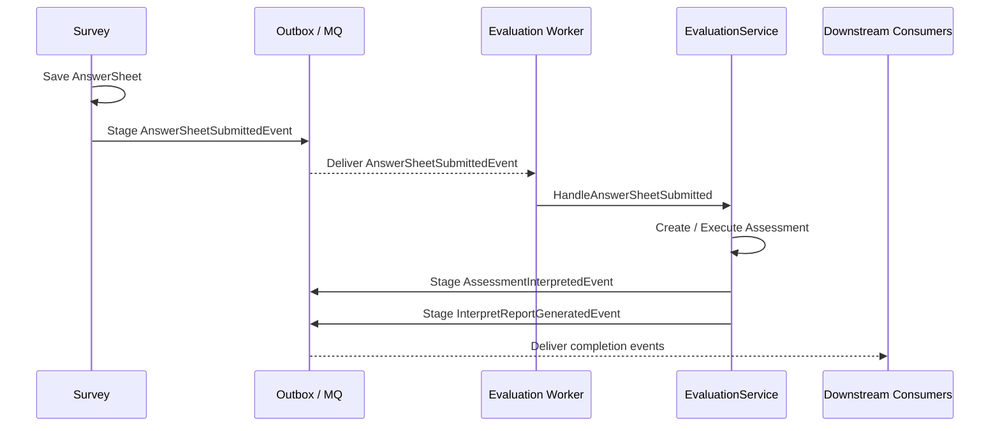

# 05-Evaluation事件链路：答卷提交、测评完成与报告生成

> 本文是 Evaluation 模块文档的第五篇，聚焦 **Evaluation 相关事件的语义、边界与可靠出站链路**。
>
> 前四篇已经说明：`Assessment` 是一次测评执行聚合；`AnswerSheetSubmittedEvent` 触发 Evaluation 主链路；`EvaluationEngine` 通过 `ModelRef / Provider / Context` 执行具体解释模型；失败重试链路通过 `Assessment failed` 与 `EvaluationRun failed` 保证可诊断、可重试、可补偿。
>
> 本文继续回答：从答卷提交到测评完成，系统中会出现哪些事件？这些事件分别属于哪个模块？它们表达什么事实？哪些事件可以驱动 Evaluation？哪些事件只能刷新缓存或通知下游？事件如何通过 Outbox 可靠出站？消费者如何保证幂等？

---

## 1. 结论先行

Evaluation 事件链路的核心目标是：

> **用清晰、稳定、可幂等的事件表达测评生命周期中的关键事实，并通过可靠出站机制驱动异步执行、报告通知、统计刷新和下游集成。**

Evaluation 事件链路中最容易混淆的事件有四类：

```text
AnswerSheetSubmittedEvent      Survey 事件，表示答卷已经提交
ScaleChangedEvent              Scale 事件，表示医学量表规则发生变化
AssessmentInterpretedEvent     Evaluation 事件，表示测评解释完成
InterpretReportGeneratedEvent  Evaluation 事件，表示报告生成完成
```

它们的语义完全不同。

不能把：

```text
答卷提交 = 测评完成
规则变化 = 重新测评
报告生成 = 规则发布
```

混在一起。

一句话概括：

> **Survey 发布答卷提交事件，Evaluation 消费该事件并执行测评；Evaluation 完成后发布测评完成和报告生成事件；Scale / MBTI 等模型事件只表达规则变化，不表达某次测评完成。**

---

## 2. 本文边界

本文重点：

```text
Evaluation 事件类型；
Survey / Assessment Model / MBTI / Evaluation 事件边界；
AnswerSheetSubmittedEvent 如何触发 Evaluation；
AssessmentCreatedEvent / AssessmentStartedEvent / AssessmentInterpretedEvent / AssessmentFailedEvent；
InterpretReportGeneratedEvent；
Outbox 可靠出站边界；
Worker 消费与幂等；
事件 payload 设计；
事件版本与兼容性；
事件消费者职责；
事件链路的监控、补偿和常见错误设计。
```

本文不展开：

```text
AnswerSheet 聚合的提交校验；
Assessment / EvaluationRun / Result / Report 的完整模型设计；
EvaluationEngine 的内部 Provider 执行细节；
失败重试和补偿的完整策略；
具体 MQ / NSQ / Outbox relay 的基础设施实现。
```

这些由其它文档承接：

```text
01-Evaluation模型--Assessment-EvaluationRun-Result-Report模型设计.md
02-Evaluation执行链路--从AnswerSheet提交到Assessment完成.md
03-Evaluation引擎链路--模型解析-规则加载-执行-报告生成.md
04-Evaluation失败重试链路--幂等-错误状态-补偿处理.md
06-Evaluation模块分层架构与事实源索引.md
../survey/README.md
../scale/README.md
../report/README.md
```

---

## 3. 事件链路总览

从答卷提交到报告生成，事件链路可以抽象为：



这个链路里有两个方向：

```text
上游驱动 Evaluation：AnswerSheetSubmittedEvent；
Evaluation 通知下游：AssessmentInterpretedEvent / InterpretReportGeneratedEvent / AssessmentFailedEvent。
```

ScaleChangedEvent、MBTIModelChangedEvent 不是直接的测评完成事件。

它们通常用于：

```text
刷新规则缓存；
重建模型读模型；
提醒后台配置发生变化；
必要时触发人工审查或单独的重算任务。
```

---

## 4. 事件语义分类

建议把事件分为四类。

| 事件类别 | 所属模块 | 语义 |
| --- | --- | --- |
| 作答事实事件 | Survey | 答卷已提交、答卷已撤销等 |
| 规则变化事件 | Scale / MBTI | 解释模型规则发生变化 |
| 测评执行事件 | Evaluation | Assessment 创建、开始、完成、失败 |
| 报告事件 | Evaluation | 报告生成、报告更新、报告发布 |

分类的价值是：

```text
避免事件语义混淆；
避免错误触发链路；
便于 Outbox owner 归属；
便于消费者幂等；
便于监控和排障。
```

一个事件只能表达一个清晰事实。

不要设计大而全事件。

---

## 5. AnswerSheetSubmittedEvent

`AnswerSheetSubmittedEvent` 属于 Survey。

它表示：

> **一份 AnswerSheet 已经成功保存并提交。**

它可以触发 Evaluation。

但它不表示：

```text
Assessment 已经创建；
测评已经开始；
测评已经完成；
报告已经生成；
风险等级已经命中。
```

推荐 payload：

```text
AnswerSheetSubmittedEvent
├── EventID
├── EventType
├── EventVersion
├── OccurredAt
├── AnswerSheetID
├── QuestionnaireCode
├── QuestionnaireVersion
├── SubjectRef
├── SubmittedBy
├── SubmittedAt
├── ModelRef 可选
├── TraceID
└── Metadata
```

其中 `ModelRef` 可以是可选的。

如果事件中包含 ModelRef，Evaluation 可直接使用。

如果事件中不包含 ModelRef，Evaluation 需要根据：

```text
AssessmentPlan；
QuestionnaireBinding；
业务入口配置；
默认模型配置。
```

解析本次要使用的解释模型。

---

## 6. AnswerSheetSubmittedEvent 的可靠出站

Survey 保存 AnswerSheet 与发布 AnswerSheetSubmittedEvent 必须保持可靠一致。

推荐 Outbox 边界：

```text
Save AnswerSheet
+ Stage AnswerSheetSubmittedEvent
```

在同一个可靠事务或一致性边界中完成。

原因是：

```text
如果 AnswerSheet 保存成功但事件丢失，Evaluation 永远不会执行；
如果事件发布成功但 AnswerSheet 回滚，Worker 会加载不到答卷；
如果只依赖同步 MQ 发布，服务崩溃时容易丢事件。
```

Outbox relay 可以异步发布事件到 MQ。

Worker 消费时必须允许事件重复投递。

---

## 7. Worker 消费 AnswerSheetSubmittedEvent

Evaluation Worker 消费该事件后，应调用 EvaluationService。

推荐边界：

```text
Worker
    -> parse event
    -> build command
    -> EvaluationService.HandleAnswerSheetSubmitted(command)
```

Worker 可以做：

```text
订阅事件；
反序列化 payload；
校验事件版本；
构造 command；
调用应用服务；
根据结果 ack / retry / dead-letter；
记录消费日志。
```

Worker 不应该做：

```text
直接读取 MedicalScale；
直接计算 FactorScore；
直接修改 Assessment.Status；
直接保存 InterpretReport；
直接发布 AssessmentInterpretedEvent。
```

Worker 是异步驱动器，不是业务编排中心。

---

## 8. AssessmentCreatedEvent

`AssessmentCreatedEvent` 属于 Evaluation。

它表示：

> **一个 Assessment 已经创建。**

推荐 payload：

```text
AssessmentCreatedEvent
├── EventID
├── EventType
├── EventVersion
├── OccurredAt
├── AssessmentID
├── AnswerSheetID
├── ModelRef
├── QuestionnaireRef
├── SubjectRef
├── Status
└── TraceID
```

这个事件不是必须对外发布。

它适合用于：

```text
内部审计；
运维监控；
异步初始化读模型；
统计 Assessment 创建量。
```

如果系统暂时不需要对外暴露，可以只作为领域事件或审计日志保留。

---

## 9. AssessmentStartedEvent

`AssessmentStartedEvent` 属于 Evaluation。

它表示：

> **一个 Assessment 开始执行解释。**

推荐 payload：

```text
AssessmentStartedEvent
├── EventID
├── EventType
├── EventVersion
├── OccurredAt
├── AssessmentID
├── RunID
├── AttemptNo
├── ModelRef
├── AnswerSheetID
├── QuestionnaireRef
└── TraceID
```

这个事件也不是必须对外发布。

它适合用于：

```text
执行监控；
超时检测；
运维排障；
分析排队延迟和执行耗时。
```

如果事件量较大，可以不进入业务 MQ，而是只进入日志、metrics 或审计表。

---

## 10. AssessmentInterpretedEvent

`AssessmentInterpretedEvent` 是 Evaluation 的核心完成事件。

它表示：

> **一次 Assessment 已经解释完成，结果和报告已经可靠保存，测评状态已经进入 interpreted。**

推荐 payload：

```text
AssessmentInterpretedEvent
├── EventID
├── EventType
├── EventVersion
├── OccurredAt
├── AssessmentID
├── AnswerSheetID
├── ModelRef
├── QuestionnaireRef
├── SubjectRef
├── ResultID
├── ReportID
├── InterpretedAt
├── TraceID
└── Metadata
```

发布该事件前应确保：

```text
EvaluationResult 已保存；
InterpretReport 已保存，或明确该模型不生成报告；
Assessment 已 ApplyResult；
EvaluationRun 已记录成功；
事件已 stage 到 Outbox。
```

不要在只得到 EvaluationResult、但报告还没保存时发布该事件。

否则下游可能收到“测评完成”，但用户实际查不到报告。

---

## 11. InterpretReportGeneratedEvent

`InterpretReportGeneratedEvent` 属于 Evaluation。

它表示：

> **一份 InterpretReport 已经生成并保存。**

推荐 payload：

```text
InterpretReportGeneratedEvent
├── EventID
├── EventType
├── EventVersion
├── OccurredAt
├── ReportID
├── AssessmentID
├── AnswerSheetID
├── ModelRef
├── QuestionnaireRef
├── SubjectRef
├── GeneratedAt
├── TraceID
└── Metadata
```

它与 `AssessmentInterpretedEvent` 的区别是：

```text
AssessmentInterpretedEvent 关注测评执行完成；
InterpretReportGeneratedEvent 关注报告生成完成。
```

在当前系统中，两者可能几乎同时发生。

但未来可能分离：

```text
先完成测评结果；
后异步生成多版本报告；
家长版报告、医生版报告、运营摘要报告分别生成。
```

因此保留两个语义有价值。

---

## 12. AssessmentFailedEvent

`AssessmentFailedEvent` 属于 Evaluation。

它表示：

> **一次 Assessment 执行失败，失败事实已经记录。**

推荐 payload：

```text
AssessmentFailedEvent
├── EventID
├── EventType
├── EventVersion
├── OccurredAt
├── AssessmentID
├── RunID
├── AttemptNo
├── AnswerSheetID
├── ModelRef
├── QuestionnaireRef
├── SubjectRef
├── FailedStage
├── ErrorCode
├── Retryable
├── RetryAfter
├── TraceID
└── Metadata
```

它适合用于：

```text
告警；
运维后台；
人工处理队列；
失败统计；
自动重试调度。
```

是否每次失败都发布该事件，要看事件量和运维需求。

最少应保证失败事实入库。

---

## 13. 规则变化事件不是测评完成事件

Scale、MBTI 等具体解释模型会有自己的规则变化事件。

例如：

```text
ScaleChangedEvent
ScalePublishedEvent
ScaleArchivedEvent
MBTIModelChangedEvent
MBTIModelPublishedEvent
MBTIModelArchivedEvent
```

它们表示：

```text
解释模型规则发生变化。
```

它们不表示：

```text
某次 Assessment 已完成；
某份报告已生成；
某个用户风险等级变化；
历史测评需要自动重算。
```

规则变化事件通常用于：

```text
刷新模型 Context 缓存；
重建模型读模型；
更新后台配置页面；
触发规则审计；
必要时创建单独的重算任务。
```

不要直接让 ScaleChangedEvent 自动重算所有历史 Assessment。

历史重算必须是显式业务任务。

---

## 14. 事件 owner 归属

每个事件必须有明确 owner。

| 事件 | Owner | 说明 |
| --- | --- | --- |
| AnswerSheetSubmittedEvent | Survey | 答卷提交事实 |
| ScaleChangedEvent | Scale | 医学量表规则变化 |
| MBTIModelChangedEvent | MBTI | MBTI 规则变化 |
| AssessmentCreatedEvent | Evaluation | 测评创建 |
| AssessmentInterpretedEvent | Evaluation | 测评解释完成 |
| AssessmentFailedEvent | Evaluation | 测评失败 |
| InterpretReportGeneratedEvent | Evaluation | 报告生成 |

owner 决定：

```text
哪个模块负责定义事件语义；
哪个模块负责 stage Outbox；
哪个模块负责保证事件与业务状态一致；
哪个模块负责维护事件文档和契约测试。
```

不要让 Worker 成为业务事件 owner。

Worker 只是消费者和驱动器。

---

## 15. Outbox 边界

事件可靠出站建议使用 Outbox。

核心原则：

```text
业务事实保存
+ 待出站事件 stage
```

处于同一个可靠边界。

Evaluation 成功完成时，推荐边界：

```text
Save EvaluationResult
Save InterpretReport
Assessment.ApplyResult
EvaluationRun.MarkSucceeded
Stage AssessmentInterpretedEvent
Stage InterpretReportGeneratedEvent
```

如果这个边界成功，relay 后续发布失败也可以重试。

如果这个边界失败，应整体失败或进入补偿。

不要先发布 MQ，再保存数据库状态。

---

## 16. EventID 与业务幂等键

事件需要有稳定 ID。

推荐两层标识：

```text
EventID         技术事件 ID，唯一标识一次事件记录
BusinessKey     业务幂等键，用于消费者去重
```

例如：

```text
AssessmentInterpretedEvent
EventID = uuid
BusinessKey = assessment-interpreted:{assessmentID}
```

```text
InterpretReportGeneratedEvent
EventID = uuid
BusinessKey = report-generated:{reportID}
```

消费者幂等时可以使用：

```text
EventID 去重；
BusinessKey 去重；
目标表唯一约束；
幂等 upsert。
```

EventID 不稳定时，BusinessKey 更重要。

---

## 17. 事件版本

事件必须携带版本。

推荐字段：

```text
EventVersion
```

例如：

```text
AssessmentInterpretedEvent.v1
```

版本演进原则：

```text
新增可选字段可以保持同版本；
删除字段必须升级版本；
修改字段语义必须升级版本；
修改枚举语义必须升级版本；
消费者应能忽略未知字段。
```

不要在不升级版本的情况下修改字段含义。

例如：

```text
ModelCode 原本表示业务编码，后来改成数据库 ID
```

这是破坏性变更。

---

## 18. 事件 payload 设计原则

事件 payload 应该包含足够路由和追溯字段。

通用字段：

```text
EventID；
EventType；
EventVersion；
OccurredAt；
TraceID；
BusinessKey；
Metadata。
```

Evaluation 事件推荐包含：

```text
AssessmentID；
AnswerSheetID；
ModelRef；
QuestionnaireRef；
SubjectRef；
RunID 可选；
ResultID 可选；
ReportID 可选。
```

不建议在事件中放入：

```text
完整 AnswerSheet；
完整 EvaluationResult；
完整 InterpretReport 内容；
完整 MedicalScale / MBTIModel 规则；
敏感个人信息；
大段报告文本。
```

事件是事实通知，不是数据同步大包。

下游需要详细数据时，应通过查询接口按 ID 获取。

---

## 19. Worker 消费幂等

所有事件消费者都必须幂等。

Evaluation 消费 AnswerSheetSubmittedEvent 时的幂等依据：

```text
Assessment IdempotencyKey = answerSheetID + ModelRef
```

下游消费 AssessmentInterpretedEvent 时的幂等依据：

```text
assessmentID；
resultID；
reportID；
BusinessKey。
```

常见幂等策略：

```text
先查目标状态；
唯一索引；
upsert；
处理记录表；
EventID 去重；
BusinessKey 去重。
```

幂等设计不是优化项。

它是事件驱动系统的基础要求。

---

## 20. 事件消费错误处理

消费者处理事件时可能失败。

错误可以分为两类。

### 20.1 临时错误

例如：

```text
数据库超时；
网络抖动；
缓存暂时不可用；
下游服务临时失败。
```

可以重试。

### 20.2 业务不可重试错误

例如：

```text
AnswerSheet 不存在；
ModelRef 不存在；
QuestionnaireRef 不一致；
Provider 未注册；
事件 payload 版本不支持。
```

通常应记录失败事实，进入人工处理或 dead-letter。

不要无限重试业务不可重试错误。

---

## 21. AnswerSheetSubmittedEvent 消费策略

Evaluation Worker 消费 AnswerSheetSubmittedEvent 的推荐策略：

```text
幂等成功 -> ack；
Assessment 已 interpreted -> ack；
Assessment 正在 interpreting -> ack 或延迟重试，取决于队列语义；
业务失败已入库为 Assessment failed -> ack，由业务重试接管；
基础设施临时失败且未能入库失败事实 -> retry；
不可识别事件版本 -> dead-letter / manual review。
```

核心原则：

```text
MQ retry 不应该替代业务 retry；
业务失败应落到 Assessment / EvaluationRun；
MQ retry 主要处理短期基础设施异常。
```

---

## 22. 事件补偿

事件链路中可能出现部分成功。

典型场景：

```text
Assessment interpreted，但 completion event 没有 stage；
Outbox 已 stage，但 relay 发布失败；
事件已发布，但消费者处理失败；
报告已生成，但 ReportGeneratedEvent 缺失。
```

补偿方式：

```text
Outbox relay 重试；
补偿扫描 interpreted 但缺事件的 Assessment；
按 BusinessKey 补发事件；
消费者 dead-letter 后人工处理；
基于状态重建事件 payload。
```

补发事件时必须保持幂等。

推荐 BusinessKey 稳定：

```text
assessment-interpreted:{assessmentID}
report-generated:{reportID}
```

---

## 23. 事件与缓存刷新

Evaluation 事件可以驱动缓存和读模型刷新。

例如：

```text
AssessmentInterpretedEvent -> 刷新 Assessment 查询读模型；
InterpretReportGeneratedEvent -> 刷新 Report 查询缓存；
AssessmentFailedEvent -> 刷新失败任务后台列表；
```

规则变化事件也可以驱动缓存刷新。

例如：

```text
ScaleChangedEvent -> 清理 interpretation-context:scale:* 缓存；
MBTIModelChangedEvent -> 清理 interpretation-context:mbti:* 缓存。
```

注意边界：

```text
Evaluation 完成事件刷新结果缓存；
模型变化事件刷新规则缓存；
不要互相替代。
```

---

## 24. 事件与历史重算

历史重算是独立业务任务。

不应该默认由规则变化事件自动触发。

例如 ScaleChangedEvent 发生后，不应自动：

```text
查出所有历史 Assessment；
重新执行 Provider；
覆盖 InterpretReport；
重新发布 AssessmentInterpretedEvent。
```

如果业务需要历史重算，应设计显式任务：

```text
ReEvaluationJob
├── JobID
├── ModelRef old/new
├── AssessmentRange
├── RecomputePolicy
├── ReportOverwritePolicy
├── NotifyPolicy
└── Audit
```

并明确：

```text
使用旧规则还是新规则；
是否保留旧报告；
是否通知用户；
是否改变历史统计；
如何处理失败。
```

---

## 25. 事件可观测性

事件链路必须可观测。

建议日志字段：

```text
event_id
event_type
event_version
business_key
trace_id
assessment_id
answer_sheet_id
model_type
model_code
model_version
questionnaire_code
questionnaire_version
consumer
status
error_code
duration_ms
```

建议指标：

```text
event_outbox_staged_total
event_outbox_published_total
event_outbox_publish_failed_total
event_consume_total
event_consume_failed_total
event_consume_retry_total
event_dead_letter_total
evaluation_answer_sheet_submitted_consumed_total
evaluation_interpreted_event_published_total
evaluation_report_generated_event_published_total
```

建议告警：

```text
Outbox 积压过高；
Outbox publish 延迟过高；
AnswerSheetSubmittedEvent 消费失败率升高；
AssessmentFailedEvent 突增；
ReportGeneratedEvent 缺失；
Dead-letter 积压；
事件版本不兼容。
```

---

## 26. 事件链路测试

Evaluation 事件链路需要测试。

至少覆盖：

```text
AnswerSheetSubmittedEvent 能触发 EvaluationService；
重复 AnswerSheetSubmittedEvent 不重复创建 Assessment；
Assessment interpreted 后重复事件幂等成功；
Evaluation 成功后 stage AssessmentInterpretedEvent；
报告生成后 stage InterpretReportGeneratedEvent；
Evaluation 失败后记录 AssessmentFailedEvent 或失败事实；
Outbox payload 包含 ModelRef / QuestionnaireRef / SubjectRef；
消费者能忽略未知字段；
事件 BusinessKey 稳定；
事件补偿不会重复产生下游结果。
```

事件契约测试应覆盖：

```text
EventType；
EventVersion；
Required fields；
Enum values；
Backward compatibility。
```

---

## 27. 事件配置事实源

如果项目使用 `configs/events.yaml` 或类似配置管理 topic/channel，应将事件配置作为事实源之一。

建议记录：

```text
EventType；
Topic；
Channel；
Producer；
Consumer；
Payload version；
Retry policy；
Dead-letter policy。
```

修改事件时要同步检查：

```text
事件定义；
事件 payload；
configs/events.yaml；
producer；
consumer；
Outbox mapper；
测试；
文档。
```

不要只改代码中的 struct，而忘了事件配置和消费者。

---

## 28. 常见错误设计

### 28.1 把 AnswerSheetSubmitted 当成测评完成

错误方向：

```text
AnswerSheetSubmittedEvent -> 通知用户报告已生成。
```

正确方向：

```text
AnswerSheetSubmittedEvent 只表示答卷提交；
AssessmentInterpretedEvent / ReportGeneratedEvent 才表示结果可用。
```

### 28.2 ScaleChangedEvent 自动重算历史测评

错误方向：

```text
ScaleChangedEvent -> 自动重算所有历史 Assessment。
```

正确方向：

```text
ScaleChangedEvent -> 刷新规则缓存；
历史重算由显式 ReEvaluationJob 处理。
```

### 28.3 Worker 直接发布完成事件

错误方向：

```text
Worker 消费后直接 publish AssessmentInterpretedEvent。
```

正确方向：

```text
EvaluationService 在结果、报告、状态可靠保存后 stage 完成事件。
```

### 28.4 事件中塞完整报告内容

错误方向：

```text
InterpretReportGeneratedEvent 包含完整报告正文。
```

正确方向：

```text
事件只包含 ReportID / AssessmentID 等引用，下游按需查询。
```

### 28.5 没有 BusinessKey

错误方向：

```text
只依赖随机 EventID，补发事件无法幂等。
```

正确方向：

```text
EventID + BusinessKey 双标识。
```

### 28.6 修改事件字段不升级版本

错误方向：

```text
修改字段语义但 EventVersion 不变。
```

正确方向：

```text
破坏性变更必须升级 EventVersion。
```

---

## 29. 小结

Evaluation 事件链路可以用一句话总结：

> **Survey 用 AnswerSheetSubmittedEvent 驱动 Evaluation，Evaluation 在结果和报告可靠保存后发布 AssessmentInterpretedEvent 与 InterpretReportGeneratedEvent；规则变化事件只表达模型规则变化，不等于测评完成或历史重算。**

本文需要建立七个核心认知：

```text
第一，事件必须表达单一清晰事实；
第二，AnswerSheetSubmittedEvent 是触发事件，不是完成事件；
第三，AssessmentInterpretedEvent 必须在结果和报告可靠保存后发布；
第四，ScaleChangedEvent / MBTIModelChangedEvent 只表达规则变化；
第五，Outbox owner 应归属于事件事实所在模块；
第六，消费者必须基于 EventID / BusinessKey / 状态做幂等；
第七，历史重算必须是显式任务，不能由规则变化事件隐式触发。
```

守住这些事件语义，Evaluation 才能在异步、重试、补偿和多模型接入场景下保持可靠、不漂移、不误触发。
