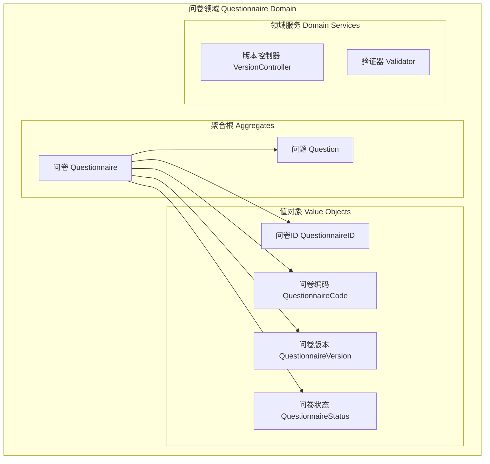
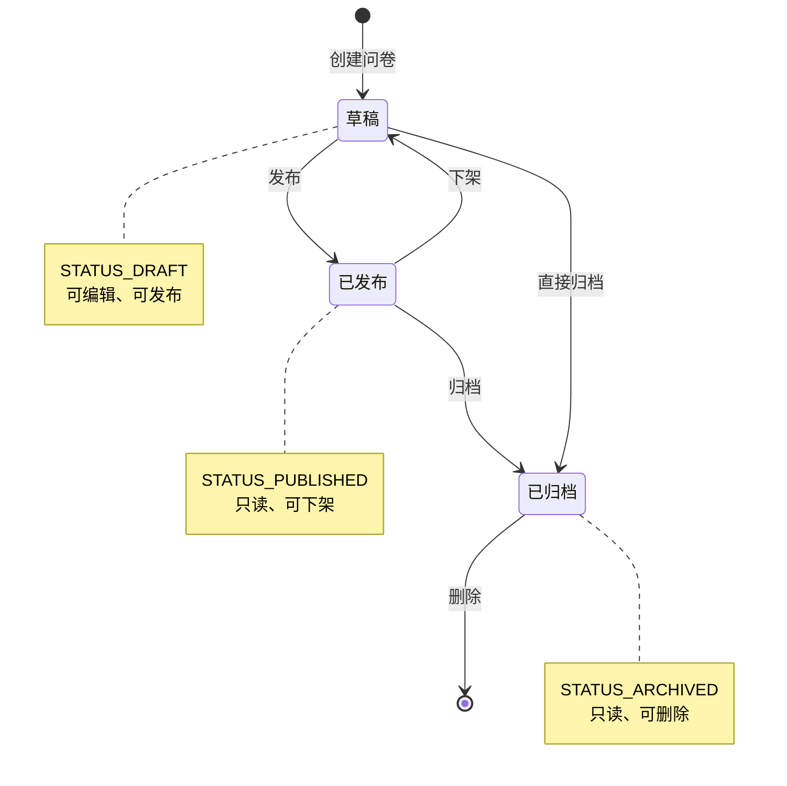
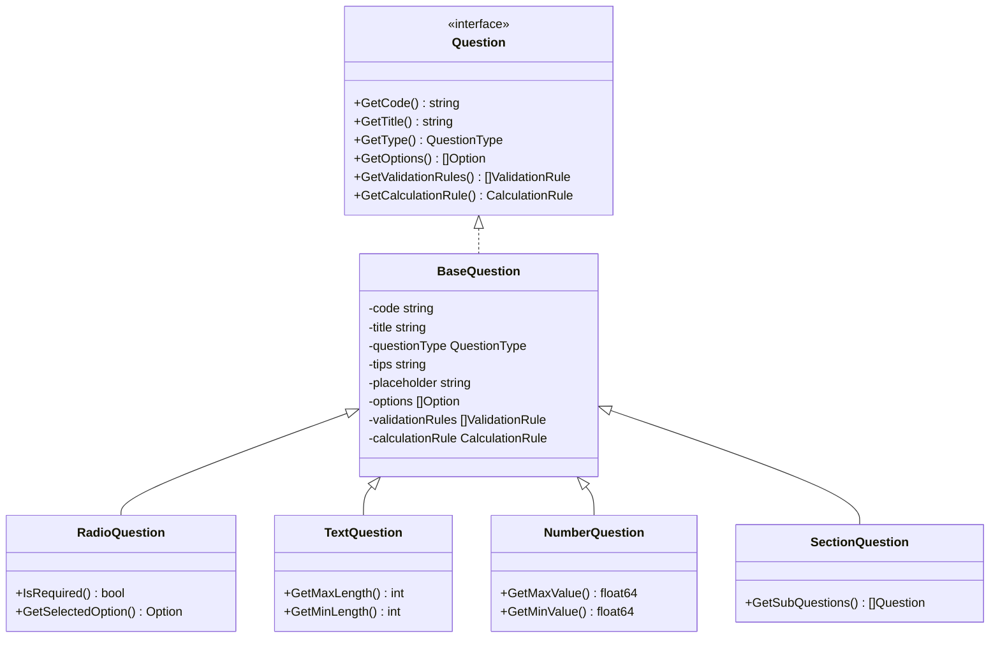
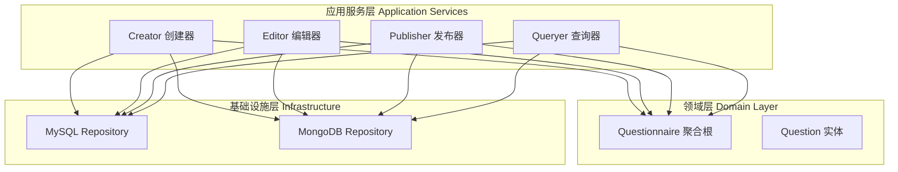
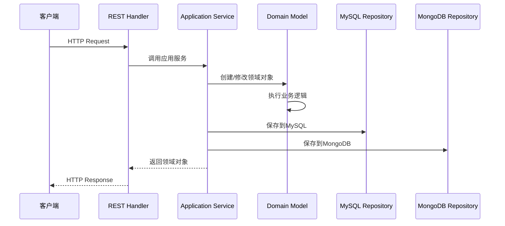

# 📊 问卷领域设计

## 📋 目录

- [领域概述](#domain-overview)
- [问卷聚合根设计](#questionnaire-aggregate)
- [问题领域模型](#question-domain)
- [值对象设计](#value-objects)
- [应用服务设计](#application-services)
- [端口接口设计](#port-interfaces)
- [基础设施适配器](#infrastructure-adapters)

## 🎯 领域概述 {#domain-overview}

问卷领域是系统的核心业务领域，负责管理问卷的创建、编辑、发布、问题管理等核心业务逻辑。采用领域驱动设计（DDD）原则，确保业务逻辑的清晰性和可维护性。

### 🎨 领域边界



## 🏛️ 问卷聚合根设计 {#questionnaire-aggregate}

### 📦 核心结构

```go
// Questionnaire 问卷聚合根
type Questionnaire struct {
    id          QuestionnaireID      // 问卷唯一标识
    code        QuestionnaireCode    // 问卷编码
    title       string              // 问卷标题
    description string              // 问卷描述
    imgUrl      string              // 问卷图片
    version     QuestionnaireVersion // 问卷版本
    status      QuestionnaireStatus  // 问卷状态
    questions   []question.Question  // 问卷问题集合
}
```

### 🔧 核心业务方法

#### 1. 问卷创建

```go
// NewQuestionnaire 创建问卷（工厂方法）
func NewQuestionnaire(code QuestionnaireCode, opts ...Option) *Questionnaire

// 支持的创建选项
- WithTitle(title string)           // 设置标题
- WithDescription(description)      // 设置描述  
- WithImgUrl(imgUrl)               // 设置图片
- WithVersion(version)             // 设置版本
- WithStatus(status)               // 设置状态
```

#### 2. 问卷发布流程

```go
// Publish 发布问卷
func (q *Questionnaire) Publish() {
    q.status = STATUS_PUBLISHED
    q.version = q.version.Increment()
}

// Unpublish 下架问卷
func (q *Questionnaire) Unpublish() {
    q.status = STATUS_DRAFT
}
```

#### 3. 问卷内容管理

```go
// ChangeBasicInfo 修改问卷基本信息
func (q *Questionnaire) ChangeBasicInfo(title, description, imgUrl string)

// AddQuestion 添加问题
func (q *Questionnaire) AddQuestion(question question.Question)

// RemoveQuestion 删除问题
func (q *Questionnaire) RemoveQuestion(question question.Question)
```

### 🔄 状态转换



## 🧩 问题领域模型 {#question-domain}

### 📊 问题类型层次



### 🎯 问题类型定义

```go
// QuestionType 题型枚举
type QuestionType string

const (
    QuestionTypeSection  QuestionType = "section"  // 段落
    QuestionTypeRadio    QuestionType = "radio"    // 单选
    QuestionTypeCheckbox QuestionType = "checkbox" // 多选
    QuestionTypeText     QuestionType = "text"     // 文本
    QuestionTypeTextarea QuestionType = "textarea" // 文本域
    QuestionTypeNumber   QuestionType = "number"   // 数字
)
```

## 💎 值对象设计 {#value-objects}

### 1. **问卷标识符 (QuestionnaireID)**

```go
type QuestionnaireID struct {
    value uint64
}

func NewQuestionnaireID(value uint64) QuestionnaireID
func (id QuestionnaireID) Value() uint64
```

### 2. **问卷编码 (QuestionnaireCode)**

```go
type QuestionnaireCode string

func NewQuestionnaireCode(value string) QuestionnaireCode
func (c QuestionnaireCode) Value() string
```

**编码规则:**
- 全局唯一性
- 可读性强
- 支持业务语义

### 3. **问卷版本 (QuestionnaireVersion)**

```go
type QuestionnaireVersion string

func NewQuestionnaireVersion(value string) QuestionnaireVersion
func (v QuestionnaireVersion) Value() string
func (v QuestionnaireVersion) Increment() QuestionnaireVersion
```

**版本策略:**
- 数字递增: 1 → 2 → 3
- 语义版本: 1.0.0 → 1.0.1 → 1.1.0

### 4. **问卷状态 (QuestionnaireStatus)**

```go
type QuestionnaireStatus uint8

const (
    STATUS_DRAFT     QuestionnaireStatus = 0 // 草稿
    STATUS_PUBLISHED QuestionnaireStatus = 1 // 已发布
    STATUS_ARCHIVED  QuestionnaireStatus = 2 // 已归档
)

func (s QuestionnaireStatus) Value() uint8
func (s QuestionnaireStatus) String() string
```

## 🚀 应用服务设计 {#application-services}

### 📦 服务分层



### 1. **Creator 创建器**

```go
type Creator struct {
    qRepoMySQL port.QuestionnaireRepositoryMySQL
    qRepoMongo port.QuestionnaireRepositoryMongo
}

// CreateQuestionnaire 创建问卷
func (c *Creator) CreateQuestionnaire(
    ctx context.Context, 
    title, description, imgUrl string
) (*questionnaire.Questionnaire, error) {
    // 1. 生成问卷编码
    code, err := codeutil.GenerateCode()
    
    // 2. 创建问卷领域模型
    qBo := questionnaire.NewQuestionnaire(
        questionnaire.NewQuestionnaireCode(code),
        questionnaire.WithTitle(title),
        questionnaire.WithDescription(description),
        questionnaire.WithImgUrl(imgUrl),
        questionnaire.WithVersion(questionnaire.NewQuestionnaireVersion("1")),
        questionnaire.WithStatus(questionnaire.STATUS_DRAFT),
    )
    
    // 3. 双写存储（MySQL + MongoDB）
    if err := c.qRepoMySQL.Save(ctx, qBo); err != nil {
        return nil, err
    }
    if err := c.qRepoMongo.Save(ctx, qBo); err != nil {
        return nil, err
    }
    
    return qBo, nil
}
```

### 2. **Editor 编辑器**

```go
type Editor struct {
    qRepoMySQL port.QuestionnaireRepositoryMySQL
    qRepoMongo port.QuestionnaireRepositoryMongo
}

// EditBasicInfo 编辑问卷基本信息
func (e *Editor) EditBasicInfo(
    ctx context.Context,
    code questionnaire.QuestionnaireCode,
    title, description, imgUrl string,
) (*questionnaire.Questionnaire, error) {
    // 1. 获取现有问卷
    qBo, err := e.qRepoMySQL.FindByCode(ctx, code.Value())
    
    // 2. 业务逻辑：修改基本信息
    qBo.ChangeBasicInfo(title, description, imgUrl)
    
    // 3. 持久化
    if err := e.qRepoMySQL.Save(ctx, qBo); err != nil {
        return nil, err
    }
    if err := e.qRepoMongo.Save(ctx, qBo); err != nil {
        return nil, err
    }
    
    return qBo, nil
}
```

### 3. **Publisher 发布器**

```go
type Publisher struct {
    qRepoMySQL port.QuestionnaireRepositoryMySQL
    qRepoMongo port.QuestionnaireRepositoryMongo
}

// Publish 发布问卷
func (p *Publisher) Publish(
    ctx context.Context,
    code questionnaire.QuestionnaireCode,
) (*questionnaire.Questionnaire, error) {
    // 1. 获取问卷
    qBo, err := p.qRepoMySQL.FindByCode(ctx, code.Value())
    
    // 2. 业务逻辑：执行发布
    qBo.Publish()
    
    // 3. 持久化
    if err := p.qRepoMySQL.Save(ctx, qBo); err != nil {
        return nil, err
    }
    if err := p.qRepoMongo.Save(ctx, qBo); err != nil {
        return nil, err
    }
    
    return qBo, nil
}
```

## 🔌 端口接口设计 {#port-interfaces}

### 📥 入站端口 (Driving Ports)

```go
// QuestionnaireCreator 问卷创建接口
type QuestionnaireCreator interface {
    CreateQuestionnaire(ctx context.Context, title, description, imgUrl string) (*questionnaire.Questionnaire, error)
}

// QuestionnaireEditor 问卷编辑接口
type QuestionnaireEditor interface {
    EditBasicInfo(ctx context.Context, code questionnaire.QuestionnaireCode, title, description, imgUrl string) (*questionnaire.Questionnaire, error)
}

// QuestionnairePublisher 问卷发布接口
type QuestionnairePublisher interface {
    Publish(ctx context.Context, code questionnaire.QuestionnaireCode) (*questionnaire.Questionnaire, error)
    Unpublish(ctx context.Context, code questionnaire.QuestionnaireCode) (*questionnaire.Questionnaire, error)
}

// QuestionnaireQueryer 问卷查询接口
type QuestionnaireQueryer interface {
    GetQuestionnaire(ctx context.Context, id uint64) (*questionnaire.Questionnaire, error)
    GetQuestionnaireByCode(ctx context.Context, code string) (*questionnaire.Questionnaire, error)
    ListQuestionnaires(ctx context.Context, page, pageSize int) ([]*questionnaire.Questionnaire, int64, error)
}
```

### 📤 出站端口 (Driven Ports)

```go
// QuestionnaireRepositoryMySQL MySQL存储库接口
type QuestionnaireRepositoryMySQL interface {
    Save(ctx context.Context, questionnaire *questionnaire.Questionnaire) error
    FindByID(ctx context.Context, id uint64) (*questionnaire.Questionnaire, error)
    FindByCode(ctx context.Context, code string) (*questionnaire.Questionnaire, error)
    Update(ctx context.Context, questionnaire *questionnaire.Questionnaire) error
    Remove(ctx context.Context, id uint64) error
}

// QuestionnaireRepositoryMongo MongoDB存储库接口
type QuestionnaireRepositoryMongo interface {
    Save(ctx context.Context, qDomain *questionnaire.Questionnaire) error
    FindByCode(ctx context.Context, code string) (*questionnaire.Questionnaire, error)
    Update(ctx context.Context, qDomain *questionnaire.Questionnaire) error
    Remove(ctx context.Context, code string) error
    HardDelete(ctx context.Context, code string) error
    ExistsByCode(ctx context.Context, code string) (bool, error)
    FindActiveQuestionnaires(ctx context.Context) ([]*questionnaire.Questionnaire, error)
}
```

## 🏗️ 基础设施适配器 {#infrastructure-adapters}

### 📊 MySQL 适配器

```go
// Repository MySQL存储库实现
type Repository struct {
    mysql.BaseRepository[*QuestionnairePO]
    mapper *QuestionnaireMapper
}

// QuestionnairePO 问卷持久化对象
type QuestionnairePO struct {
    base.AuditFields
    Code        string `gorm:"column:code;type:varchar(255)"`
    Title       string `gorm:"column:title;type:varchar(255)"`
    Description string `gorm:"column:description;type:varchar(255)"`
    ImgUrl      string `gorm:"column:img_url;type:varchar(255)"`
    Version     string `gorm:"column:version;type:varchar(255)"`
    Status      uint8  `gorm:"column:status;type:tinyint"`
}

// Mapper 映射器
type QuestionnaireMapper struct{}

func (m *QuestionnaireMapper) ToPO(bo *questionnaire.Questionnaire) *QuestionnairePO
func (m *QuestionnaireMapper) ToBO(po *QuestionnairePO) *questionnaire.Questionnaire
```

### 📄 MongoDB 适配器

```go
// Repository MongoDB存储库实现
type Repository struct {
    mongoBase.BaseRepository
    mapper *QuestionnaireMapper
}

// QuestionnairePO MongoDB持久化对象
type QuestionnairePO struct {
    base.BaseDocument `bson:",inline"`
    Code              string       `bson:"code"`
    Title             string       `bson:"title"`
    Description       string       `bson:"description,omitempty"`
    ImgUrl            string       `bson:"img_url,omitempty"`
    Version           string       `bson:"version"`
    Status            uint8        `bson:"status"`
    Questions         []QuestionPO `bson:"questions"`
}
```

### 🔄 数据流转



## 🎯 设计原则总结

### ✅ 已实现的设计原则

1. **聚合根完整性**: 问卷作为聚合根管理内部实体
2. **值对象不变性**: 所有值对象都是不可变的
3. **业务逻辑封装**: 业务规则封装在领域对象中
4. **端口适配器**: 清晰的端口接口定义
5. **双写一致性**: MySQL + MongoDB 数据同步

### 🔮 扩展建议

1. **领域事件**: 引入事件机制处理问卷状态变更
2. **规约模式**: 复杂业务规则使用规约模式
3. **版本控制服务**: 独立的版本管理领域服务
4. **问卷模板**: 支持问卷模板和克隆功能

这种领域设计确保了问卷业务逻辑的清晰性、可维护性和可扩展性。 