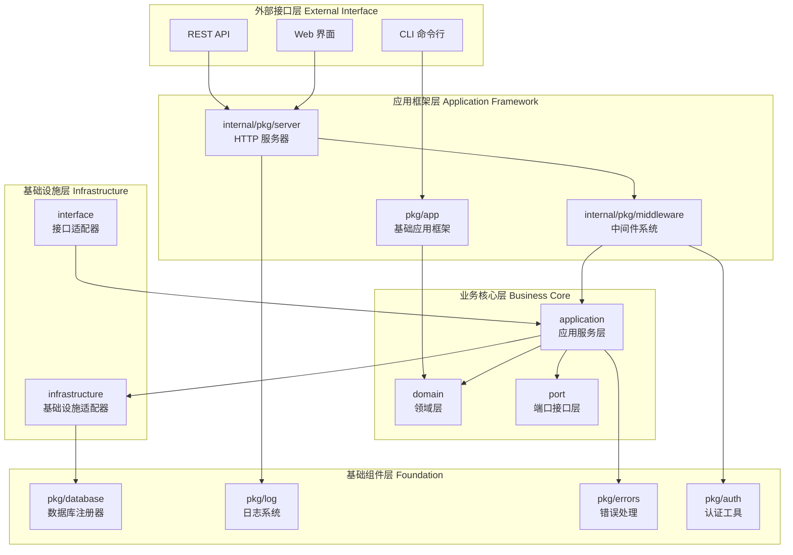
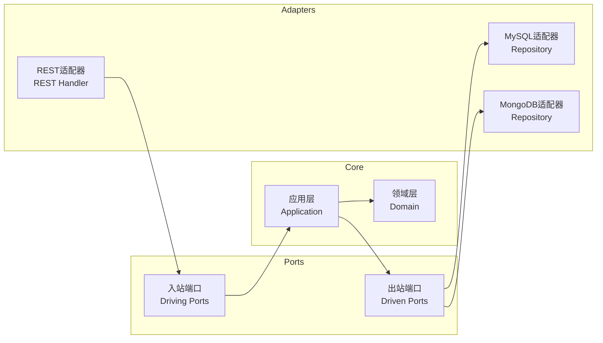
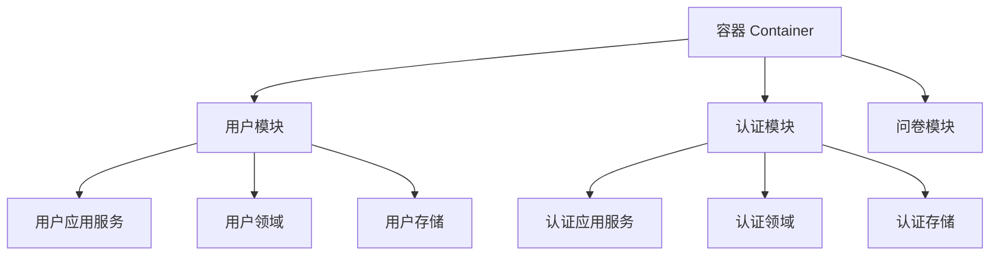
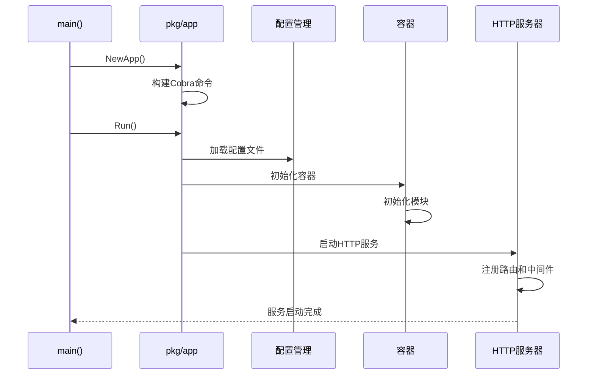

# 🏗️ 软件架构设计总览

## 📋 目录

- [系统概述](#system-overview)
- [架构设计原则](#architecture-principles)
- [系统分层架构](#system-layers)
- [核心设计模式](#core-design-patterns)
- [技术选型](#technology-stack)
- [项目结构](#project-structure)

## 🎯 系统概述 {#system-overview}

Questionnaire Scale 是一个基于 Go 语言开发的企业级问卷量表管理系统，采用现代软件架构设计原则，具备高度的**可扩展性**、**可维护性**和**可测试性**。

### 🎨 核心设计理念

#### **分离关注点 (Separation of Concerns)**

- 业务逻辑与基础设施完全分离
- 应用框架与具体实现解耦
- 领域模型与数据存储无关

#### **依赖倒置 (Dependency Inversion)**

- 高层模块不依赖低层模块
- 抽象不依赖具体实现
- 通过接口定义契约

#### **开闭原则 (Open/Closed Principle)**

- 对扩展开放，对修改关闭
- 通过模块化实现功能扩展
- 新需求通过添加而非修改实现

## 🏛️ 架构设计原则 {#architecture-principles}

### 1. **单一职责原则**

每个模块、类和函数都有明确且单一的职责

### 2. **接口隔离原则**

客户端不应该依赖它不需要的接口

### 3. **最少知识原则**

模块之间只暴露必要的接口

### 4. **控制反转**

通过依赖注入实现松耦合

## 🔧 系统分层架构 {#system-layers}



### 📝 分层说明

| 层次 | 职责 | 关键组件 |
|------|------|----------|
| **外部接口层** | 用户交互界面 | CLI、REST API、Web界面 |
| **应用框架层** | 应用基础设施 | 命令行框架、HTTP服务器、中间件 |
| **业务核心层** | 业务逻辑实现 | 领域模型、应用服务、端口接口 |
| **基础设施层** | 外部系统集成 | 数据库适配器、接口处理器 |
| **基础组件层** | 技术基础设施 | 数据库、日志、错误处理、认证 |

## 🔷 核心设计模式 {#core-design-patterns}

### 1. **六边形架构 (Hexagonal Architecture)**



**优势:**

- ✅ 业务逻辑与外部依赖完全隔离
- ✅ 便于单元测试和集成测试
- ✅ 支持不同的用户界面和数据源
- ✅ 提高代码的可维护性

### 2. **模块化设计 (Modular Design)**



**特点:**

- 🔧 **自包含**: 每个模块包含完整的业务功能
- 🔄 **可插拔**: 模块可以独立开发和部署
- 📦 **标准接口**: 通过统一接口进行交互
- 🏗️ **依赖注入**: 通过容器管理模块依赖

### 3. **策略模式 (Strategy Pattern)**

认证系统采用策略模式，支持多种认证方式：

```go
// 认证策略接口
type AuthStrategy interface {
    AuthFunc() gin.HandlerFunc
}

// 具体策略实现
- BasicStrategy  // Basic认证
- JWTStrategy    // JWT认证  
- AutoStrategy   // 自动选择认证
```

## 🛠️ 技术选型 {#technology-stack}

### **后端技术栈**

| 类别 | 技术 | 版本 | 用途 |
|------|------|------|------|
| **语言** | Go | 1.21+ | 主要开发语言 |
| **Web框架** | Gin | v1.9+ | HTTP服务框架 |
| **CLI框架** | Cobra | v1.7+ | 命令行应用框架 |
| **配置管理** | Viper | v1.16+ | 配置文件管理 |
| **ORM** | GORM | v1.25+ | 数据库ORM |
| **日志** | Zap | v1.24+ | 高性能日志库 |
| **认证** | gin-jwt | v2.9+ | JWT认证中间件 |

### **数据存储**

| 类型 | 技术 | 用途 |
|------|------|------|
| **关系数据库** | MySQL 8.0+ | 主要业务数据存储 |
| **文档数据库** | MongoDB 6.0+ | 问卷数据存储 |
| **缓存** | Redis 7.0+ | 会话和缓存存储 |

## 📁 项目结构 {#project-structure}

```text
questionnaire-scale/
├── 🎯 cmd/                    # 应用程序入口
│   └── qs-apiserver/         # API服务器主程序
├── 📦 pkg/                    # 可复用公共库
│   ├── app/                   # 基础应用框架
│   ├── database/              # 数据库注册器
│   ├── log/                   # 日志系统
│   ├── errors/                # 错误处理
│   └── auth/                  # 认证工具
├── 🏗️ internal/               # 内部应用代码
│   ├── pkg/                   # 内部共享包
│   │   ├── server/            # HTTP服务器
│   │   ├── middleware/        # 中间件系统
│   │   └── code/              # 错误码定义
│   └── apiserver/             # API服务器实现
│       ├── container/         # 依赖注入容器
│       ├── infrastructure/    # 基础设施适配器
│       ├── interface/         # 接口适配器
│       ├── domain/            # 领域层
│       └── application/       # 应用服务层
├── 📊 configs/                # 配置文件
├── 🧪 script/                 # 运维脚本
└── 📚 docs/                   # 项目文档
```

## 🚀 架构优势

### 1. **高可扩展性**

- **水平扩展**: 支持多实例部署
- **模块扩展**: 新功能以模块形式添加
- **接口扩展**: 通过适配器支持新的外部系统

### 2. **高可维护性**

- **代码组织**: 清晰的分层和模块结构
- **职责分离**: 每个组件职责明确
- **文档完善**: 详细的架构和API文档

### 3. **高可测试性**

- **依赖注入**: 便于创建测试替身
- **接口抽象**: 支持mock测试
- **层次隔离**: 可以独立测试各层

### 4. **高性能**

- **Gin框架**: 高性能HTTP路由
- **连接池**: 数据库连接复用
- **异步日志**: 非阻塞日志记录
- **缓存支持**: Redis缓存加速

## 📈 系统启动流程



## 🎯 架构设计目标达成

✅ **业务与技术分离**: 领域层完全独立于技术实现  
✅ **高度可测试**: 每一层都可以独立测试  
✅ **技术栈灵活**: 可以轻松替换技术组件  
✅ **模块化扩展**: 新业务功能以模块形式添加  
✅ **企业级特性**: 完整的日志、错误处理、认证机制

这种架构设计为构建可扩展、可维护的企业级Go应用提供了坚实的基础。
