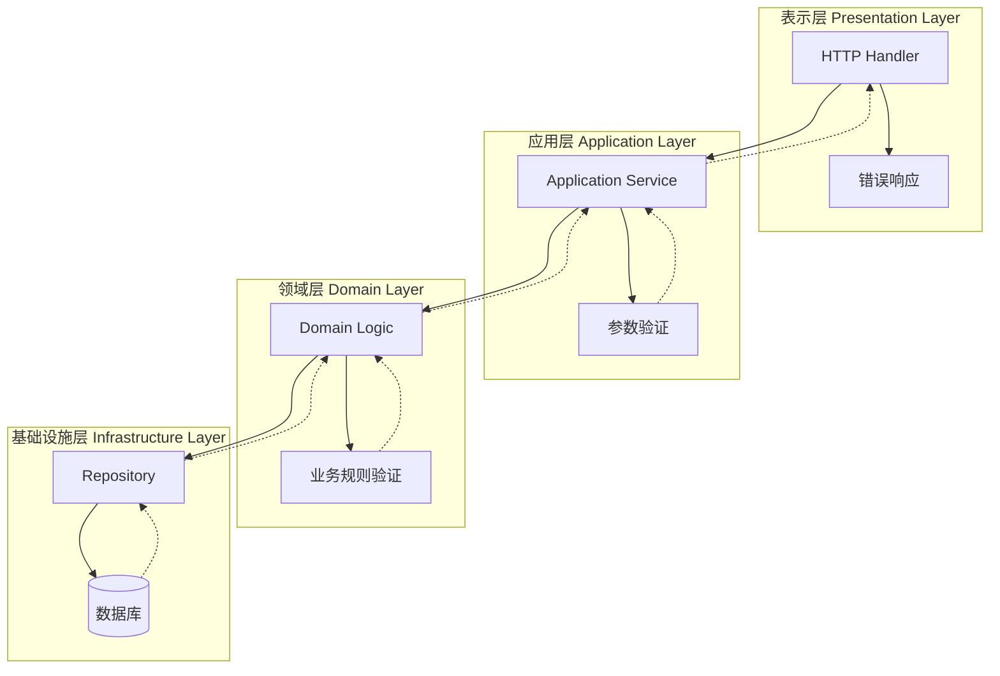
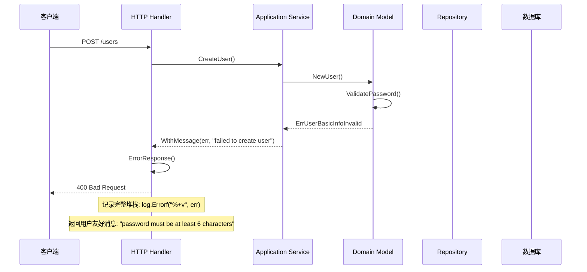

# ⚠️ 错误处理模块设计

## 📋 目录

- [设计概述](#design-overview)
- [错误类型体系](#error-type-system)
- [错误码管理](#error-code-management)
- [堆栈跟踪机制](#stack-trace-mechanism)
- [错误传播策略](#error-propagation)
- [实际应用案例](#practical-cases)

## 🎯 设计概述 {#design-overview}

本项目的错误处理模块基于 **pkg/errors** 构建了完整的错误处理体系，采用**分层错误处理**和**错误码标准化**设计，实现了**堆栈跟踪**、**错误聚合**和**上下文保留**的企业级错误处理机制。

### 🏗️ 设计目标

1. **完整追踪**: 提供完整的错误堆栈信息
2. **分层处理**: 不同层次的错误处理策略
3. **标准化**: 统一的错误码和错误格式
4. **上下文保留**: 保留错误发生的完整上下文
5. **用户友好**: 对外提供友好的错误信息

### 🎨 核心设计原则

- **错误即值**: 将错误作为返回值明确处理
- **快速失败**: 遇到错误立即返回，不隐藏错误
- **上下文丰富**: 为错误添加有用的上下文信息
- **分层责任**: 不同层次负责不同的错误处理

## 🏛️ 错误类型体系 {#error-type-system}

### 📦 基础错误接口

```go
// pkg/errors/errors.go

// 标准错误接口扩展
type Error interface {
    error
    Cause() error           // 获取根本原因
    Format(s fmt.State, verb rune) // 格式化输出
}

// 堆栈跟踪接口
type StackTracer interface {
    StackTrace() StackTrace
}

// 错误原因接口
type Causer interface {
    Cause() error
}
```

### 🔧 核心错误类型

#### 1. **基础错误 (fundamental)**

```go
// fundamental 基础错误类型
type fundamental struct {
    msg string    // 错误消息
    *stack       // 堆栈信息
}

// New 创建新的基础错误
func New(message string) error {
    return &fundamental{
        msg:   message,
        stack: callers(),
    }
}

// Errorf 格式化创建错误
func Errorf(format string, args ...interface{}) error {
    return &fundamental{
        msg:   fmt.Sprintf(format, args...),
        stack: callers(),
    }
}

// Error 实现error接口
func (f *fundamental) Error() string { 
    return f.msg 
}

// Format 实现格式化接口
func (f *fundamental) Format(s fmt.State, verb rune) {
    switch verb {
    case 'v':
        if s.Flag('+') {
            io.WriteString(s, f.msg)
            f.stack.Format(s, verb)
            return
        }
        fallthrough
    case 's':
        io.WriteString(s, f.msg)
    case 'q':
        fmt.Fprintf(s, "%q", f.msg)
    }
}
```

#### 2. **包装错误 (withStack)**

```go
// withStack 带堆栈的错误包装
type withStack struct {
    error        // 原始错误
    *stack      // 堆栈信息
}

// WithStack 为错误添加堆栈信息
func WithStack(err error) error {
    if err == nil {
        return nil
    }

    if e, ok := err.(*withCode); ok {
        return &withCode{
            err:   e.err,
            code:  e.code,
            cause: err,
            stack: callers(),
        }
    }

    return &withStack{
        err,
        callers(),
    }
}

// Cause 获取原始错误
func (w *withStack) Cause() error { 
    return w.error 
}

// Unwrap Go 1.13 错误链支持
func (w *withStack) Unwrap() error {
    if e, ok := w.error.(interface{ Unwrap() error }); ok {
        return e.Unwrap()
    }
    return w.error
}
```

#### 3. **消息错误 (withMessage)**

```go
// withMessage 带消息的错误包装
type withMessage struct {
    cause error  // 原因错误
    msg   string // 附加消息
}

// WithMessage 为错误添加消息
func WithMessage(err error, message string) error {
    if err == nil {
        return nil
    }
    return &withMessage{
        cause: err,
        msg:   message,
    }
}

// WithMessagef 格式化添加消息
func WithMessagef(err error, format string, args ...interface{}) error {
    if err == nil {
        return nil
    }
    return &withMessage{
        cause: err,
        msg:   fmt.Sprintf(format, args...),
    }
}

// Error 返回错误消息
func (w *withMessage) Error() string { 
    return w.msg 
}

// Cause 返回原因错误
func (w *withMessage) Cause() error  { 
    return w.cause 
}

// Unwrap Go 1.13 错误链支持
func (w *withMessage) Unwrap() error { 
    return w.cause 
}
```

#### 4. **错误码错误 (withCode)**

```go
// withCode 带错误码的错误
type withCode struct {
    err   error  // 错误消息
    code  int    // 错误码
    cause error  // 原因错误
    *stack      // 堆栈信息
}

// WithCode 创建带错误码的错误
func WithCode(code int, format string, args ...interface{}) error {
    return &withCode{
        err:   fmt.Errorf(format, args...),
        code:  code,
        stack: callers(),
    }
}

// WrapC 包装错误并添加错误码
func WrapC(err error, code int, format string, args ...interface{}) error {
    if err == nil {
        return nil
    }

    return &withCode{
        err:   fmt.Errorf(format, args...),
        code:  code,
        cause: err,
        stack: callers(),
    }
}

// Error 返回外部安全的错误消息
func (w *withCode) Error() string { 
    return fmt.Sprintf("%v", w) 
}

// Cause 返回错误原因
func (w *withCode) Cause() error { 
    return w.cause 
}

// Unwrap Go 1.13 错误链支持
func (w *withCode) Unwrap() error { 
    return w.cause 
}
```

### 🔍 错误原因追踪

```go
// Cause 递归获取错误的根本原因
func Cause(err error) error {
    type causer interface {
        Cause() error
    }

    for err != nil {
        cause, ok := err.(causer)
        if !ok {
            break
        }

        if cause.Cause() == nil {
            break
        }

        err = cause.Cause()
    }
    return err
}
```

## 🏷️ 错误码管理 {#error-code-management}

### 📊 错误码体系设计

```go
// internal/pkg/code/base.go

// 基础错误码定义
const (
    // 成功
    ErrSuccess int = iota + 100001
    
    // 通用错误 100001-100099
    ErrUnknown
    ErrBind
    ErrValidation
    ErrTokenInvalid
    ErrPageNotFound
    ErrInternalServerError
    
    // 认证授权错误 100100-100199  
    ErrEncrypt
    ErrSignatureInvalid
    ErrExpired
    ErrInvalidAuthHeader
    ErrMissingHeader
    ErrPasswordIncorrect
    ErrPermissionDenied
)

// 错误码信息映射
var codeText = map[int]string{
    ErrSuccess:                 "OK",
    ErrUnknown:                 "Internal server error",
    ErrBind:                    "Error occurred while binding the request body to the struct",
    ErrValidation:              "Validation failed",
    ErrTokenInvalid:            "Token invalid",
    ErrPageNotFound:            "Page not found",
    ErrInternalServerError:     "Internal server error",
    ErrEncrypt:                 "Error occurred while encrypting the user password",
    ErrSignatureInvalid:        "Signature is invalid", 
    ErrExpired:                 "Token expired",
    ErrInvalidAuthHeader:       "Invalid authorization header",
    ErrMissingHeader:           "The Length of the authorization header is zero",
    ErrPasswordIncorrect:       "Password is incorrect",
    ErrPermissionDenied:        "Permission denied",
}
```

### 🎯 业务模块错误码

```go
// internal/pkg/code/apiserver.go

// 用户模块错误码 110001-110099
const (
    // ErrUserNotFound - 404: User not found.
    ErrUserNotFound int = iota + 110001

    // ErrUserAlreadyExists- 400: User already exist.
    ErrUserAlreadyExists

    // ErrUserBasicInfoInvalid - 400: User basic info is invalid.
    ErrUserBasicInfoInvalid

    // ErrUserStatusInvalid - 400: User status is invalid.
    ErrUserStatusInvalid

    // ErrUserInvalid - 400: User is invalid.
    ErrUserInvalid

    // ErrUserBlocked - 403: User is blocked.
    ErrUserBlocked

    // ErrUserInactive - 403: User is inactive.
    ErrUserInactive
)

// 问卷模块错误码 120001-120099
const (
    // ErrQuestionnaireNotFound - 404: Questionnaire not found.
    ErrQuestionnaireNotFound int = iota + 120001
    
    // ErrQuestionnaireCodeExists - 400: Questionnaire code already exists.
    ErrQuestionnaireCodeExists
    
    // ErrQuestionnaireStatusInvalid - 400: Questionnaire status is invalid.
    ErrQuestionnaireStatusInvalid
    
    // ErrQuestionnaireVersionInvalid - 400: Questionnaire version is invalid.
    ErrQuestionnaireVersionInvalid
)
```

### 🔧 错误码工具函数

```go
// pkg/errors/code.go

// GetCode 从错误中提取错误码
func GetCode(err error) int {
    if err == nil {
        return ErrSuccess
    }

    if e, ok := err.(*withCode); ok {
        return e.code
    }

    return ErrUnknown
}

// GetMessage 获取错误码对应的消息
func GetMessage(code int) string {
    if msg, ok := codeText[code]; ok {
        return msg
    }
    return codeText[ErrUnknown]
}

// IsCode 检查错误是否为指定错误码
func IsCode(err error, code int) bool {
    return GetCode(err) == code
}
```

## 📚 堆栈跟踪机制 {#stack-trace-mechanism}

### 🔍 堆栈信息收集

```go
// pkg/errors/stack.go

// Frame 代表调用栈中的一个帧
type Frame uintptr

// pc 返回程序计数器
func (f Frame) pc() uintptr { return uintptr(f) - 1 }

// file 返回文件名
func (f Frame) file() string {
    fn := runtime.FuncForPC(f.pc())
    if fn == nil {
        return "unknown"
    }
    file, _ := fn.FileLine(f.pc())
    return file
}

// line 返回行号
func (f Frame) line() int {
    fn := runtime.FuncForPC(f.pc())
    if fn == nil {
        return 0
    }
    _, line := fn.FileLine(f.pc())
    return line
}

// name 返回函数名
func (f Frame) name() string {
    fn := runtime.FuncForPC(f.pc())
    if fn == nil {
        return "unknown"
    }
    return fn.Name()
}

// Format 格式化输出帧信息
func (f Frame) Format(s fmt.State, verb rune) {
    switch verb {
    case 's':
        switch {
        case s.Flag('+'):
            io.WriteString(s, f.name())
            io.WriteString(s, "\n\t")
            io.WriteString(s, f.file())
        default:
            io.WriteString(s, path.Base(f.file()))
        }
    case 'd':
        io.WriteString(s, strconv.Itoa(f.line()))
    case 'n':
        io.WriteString(s, funcname(f.name()))
    case 'v':
        f.Format(s, 's')
        io.WriteString(s, ":")
        f.Format(s, 'd')
    }
}

// StackTrace 表示程序调用栈
type StackTrace []Frame

// Format 格式化输出堆栈跟踪
func (st StackTrace) Format(s fmt.State, verb rune) {
    switch verb {
    case 'v':
        switch {
        case s.Flag('+'):
            for _, f := range st {
                io.WriteString(s, "\n")
                f.Format(s, verb)
            }
        case s.Flag('#'):
            fmt.Fprintf(s, "%#v", []Frame(st))
        default:
            st.formatSlice(s, verb)
        }
    case 's':
        st.formatSlice(s, verb)
    }
}

// stack 堆栈信息
type stack []uintptr

// callers 收集调用栈信息
func callers() *stack {
    const depth = 32
    var pcs [depth]uintptr
    n := runtime.Callers(3, pcs[:])
    var st stack = pcs[0:n]
    return &st
}

// StackTrace 返回堆栈跟踪
func (s *stack) StackTrace() StackTrace {
    f := make([]Frame, len(*s))
    for i := 0; i < len(f); i++ {
        f[i] = Frame((*s)[i])
    }
    return f
}

// Format 格式化输出堆栈
func (s *stack) Format(st fmt.State, verb rune) {
    switch verb {
    case 'v':
        switch {
        case st.Flag('+'):
            for _, pc := range *s {
                f := Frame(pc)
                fmt.Fprintf(st, "\n%+v", f)
            }
        }
    }
}
```

### 📋 堆栈信息使用

```go
// 创建带堆栈的错误
err := errors.New("something went wrong")

// 添加堆栈信息
err = errors.WithStack(err)

// 格式化输出详细堆栈
fmt.Printf("%+v", err)

// 输出示例:
// something went wrong
//     main.doSomething
//         /path/to/main.go:25
//     main.main
//         /path/to/main.go:15
//     runtime.main
//         /usr/local/go/src/runtime/proc.go:250
```

## 🔄 错误传播策略 {#error-propagation}

### 📊 分层错误处理策略



### 🎯 错误处理最佳实践

#### 1. **领域层错误处理**

```go
// internal/apiserver/domain/user/model.go

// ChangePassword 修改密码（领域层）
func (u *User) ChangePassword(newPassword string) error {
    if len(newPassword) < 6 {
        return errors.WithCode(code.ErrUserBasicInfoInvalid, 
            "password must be at least 6 characters")
    }

    hashedPassword, err := auth.Encrypt(newPassword)
    if err != nil {
        return errors.WithCode(code.ErrEncrypt, 
            "failed to encrypt password")
    }

    u.password = hashedPassword
    return nil
}
```

#### 2. **应用层错误处理**

```go
// internal/apiserver/application/user/creator.go

// CreateUser 创建用户（应用层）
func (c *UserCreator) CreateUser(ctx context.Context, username, password, nickname, email, phone, introduction string) (*user.User, error) {
    // 参数验证
    if username == "" {
        return nil, errors.WithCode(code.ErrValidation, "username is required")
    }

    // 唯一性检查
    if c.usernameUnique(ctx, username) {
        return nil, errors.WithCode(code.ErrUserAlreadyExists, "username already exists")
    }

    // 创建用户领域对象
    userObj := user.NewUserBuilder().
        WithUsername(username).
        WithPassword(password).
        WithNickname(nickname).
        WithEmail(email).
        WithPhone(phone).
        WithStatus(user.StatusInit).
        WithIntroduction(introduction).
        Build()

    // 保存用户，传播底层错误
    if err := c.userRepo.Save(ctx, userObj); err != nil {
        return nil, errors.WithMessage(err, "failed to save user")
    }

    return userObj, nil
}
```

#### 3. **基础设施层错误处理**

```go
// internal/apiserver/infrastructure/mysql/user/repo.go

// FindByUsername 根据用户名查询用户（基础设施层）
func (r *Repository) FindByUsername(ctx context.Context, username string) (*user.User, error) {
    var po UserPO
    err := r.BaseRepository.FindByField(ctx, &po, "username", username)
    if err != nil {
        if errors.Is(err, gorm.ErrRecordNotFound) {
            return nil, errors.WithCode(code.ErrUserNotFound, 
                "user not found: %s", username)
        }
        return nil, errors.WithStack(err)
    }
    return r.mapper.ToBO(&po), nil
}
```

#### 4. **接口层错误处理**

```go
// internal/apiserver/interface/restful/handler/user.go

// CreateUser HTTP处理器（接口层）
func (h *UserHandler) CreateUser(c *gin.Context) {
    var req dto.CreateUserRequest
    if err := h.BindJSON(c, &req); err != nil {
        h.ErrorResponse(c, errors.WithCode(code.ErrBind, err.Error()))
        return
    }

    // 参数验证
    if ok, err := govalidator.ValidateStruct(req); !ok {
        h.ErrorResponse(c, errors.WithCode(code.ErrValidation, err.Error()))
        return
    }

    // 调用应用服务
    user, err := h.userCreator.CreateUser(c, req.Username, req.Password, 
        req.Nickname, req.Email, req.Phone, req.Introduction)
    if err != nil {
        h.ErrorResponse(c, err)
        return
    }

    // 成功响应
    h.SuccessResponse(c, toUserResponse(user))
}

// ErrorResponse 统一错误响应处理
func (h *BaseHandler) ErrorResponse(c *gin.Context, err error) {
    if err == nil {
        return
    }

    // 记录详细错误信息（包含堆栈）
    log.Errorf("Request failed: %+v", err)

    // 提取错误码
    code := errors.GetCode(err)
    message := errors.GetMessage(code)

    // 返回用户友好的错误信息
    core.WriteResponse(c, err, nil)
}
```

### 🔄 错误包装与传播

```go
// Wrap 包装错误并添加上下文
func processUser(userID string) error {
    user, err := getUserFromDB(userID)
    if err != nil {
        return errors.Wrap(err, "failed to get user from database")
    }
    
    if err := validateUser(user); err != nil {
        return errors.Wrapf(err, "user validation failed for userID %s", userID)
    }
    
    return nil
}

// 调用方
func handleRequest() error {
    if err := processUser("123"); err != nil {
        return errors.WithMessage(err, "process user request failed")
    }
    return nil
}
```

## 📚 实际应用案例 {#practical-cases}

### 🎯 完整的错误处理流程



### 💡 错误聚合处理

```go
// pkg/errors/aggregate.go

// Aggregate 错误聚合器
type Aggregate interface {
    error
    Errors() []error
    Is(error) bool
}

// aggregate 错误聚合实现
type aggregate []error

// NewAggregate 创建错误聚合器
func NewAggregate(errlist []error) Aggregate {
    if len(errlist) == 0 {
        return nil
    }
    
    var errs []error
    for _, err := range errlist {
        if err != nil {
            errs = append(errs, err)
        }
    }
    
    if len(errs) == 0 {
        return nil
    }
    return aggregate(errs)
}

// Error 实现error接口
func (agg aggregate) Error() string {
    if len(agg) == 1 {
        return agg[0].Error()
    }
    
    var result []string
    for _, err := range agg {
        result = append(result, err.Error())
    }
    return fmt.Sprintf("[%s]", strings.Join(result, ", "))
}

// Errors 返回所有错误
func (agg aggregate) Errors() []error {
    return []error(agg)
}

// Is 检查是否包含指定错误
func (agg aggregate) Is(target error) bool {
    for _, err := range agg {
        if errors.Is(err, target) {
            return true
        }
    }
    return false
}

// 使用示例
func validateUserInput(req *UserCreateRequest) error {
    var errs []error
    
    if req.Username == "" {
        errs = append(errs, errors.WithCode(code.ErrValidation, "username is required"))
    }
    
    if len(req.Password) < 6 {
        errs = append(errs, errors.WithCode(code.ErrValidation, "password too short"))
    }
    
    if !isValidEmail(req.Email) {
        errs = append(errs, errors.WithCode(code.ErrValidation, "invalid email format"))
    }
    
    return errors.NewAggregate(errs)
}
```

### 🔧 错误恢复机制

```go
// 错误恢复和降级处理
func (s *UserService) GetUserWithFallback(ctx context.Context, userID string) (*User, error) {
    // 尝试从主数据源获取
    user, err := s.primaryRepo.GetUser(ctx, userID)
    if err == nil {
        return user, nil
    }
    
    // 记录主数据源错误
    log.Warnf("Primary datasource failed: %+v", err)
    
    // 尝试从缓存获取
    user, cacheErr := s.cacheRepo.GetUser(ctx, userID)
    if cacheErr == nil {
        log.Info("Fallback to cache successful")
        return user, nil
    }
    
    // 所有数据源都失败
    return nil, errors.WithMessage(err, 
        "all datasources failed, primary error is the root cause")
}
```

## 🎯 最佳实践总结

### ✅ 错误创建最佳实践

1. **使用WithCode**: 为业务错误添加错误码
2. **保留上下文**: 使用WithMessage添加有用的上下文信息
3. **避免重复**: 不要重复包装同一个错误
4. **及时处理**: 在合适的层级处理错误

### 🔧 错误传播最佳实践

1. **向上传播**: 低层错误向高层传播时添加上下文
2. **保留原因**: 使用Wrap而不是创建新错误
3. **分层处理**: 不同层次有不同的错误处理策略
4. **日志记录**: 在合适的地方记录详细错误信息

### 📊 错误响应最佳实践

1. **用户友好**: 对外返回用户友好的错误信息
2. **安全考虑**: 不要暴露敏感的系统内部信息
3. **一致格式**: 保持错误响应格式的一致性
4. **追踪支持**: 提供请求ID以便问题追踪

### 🔍 错误调试最佳实践

1. **完整堆栈**: 开发环境记录完整的错误堆栈
2. **结构化日志**: 使用结构化日志便于分析
3. **错误监控**: 设置关键错误的监控和告警
4. **性能考虑**: 在生产环境平衡详细程度和性能

这种完整的错误处理体系为应用提供了强大的错误管理和调试能力，确保系统的稳定性和可维护性。
