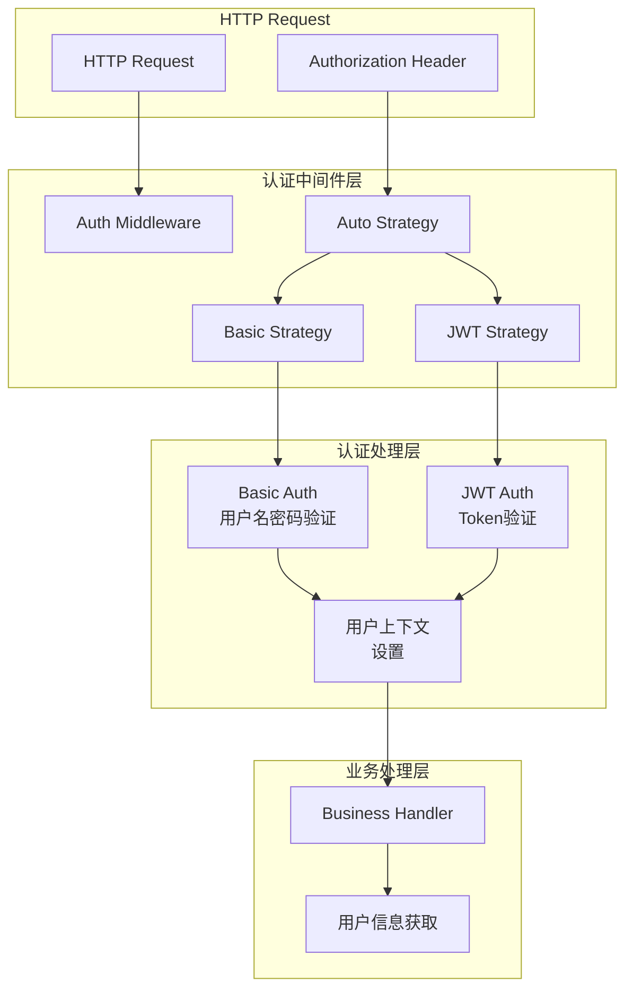
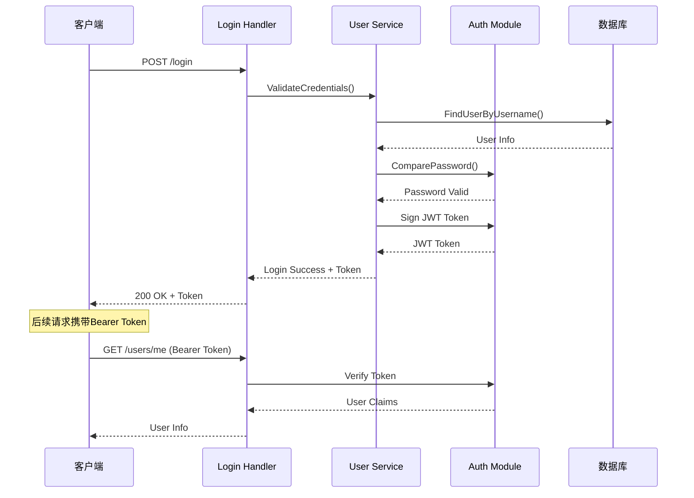

# 🔐 认证模块设计

## 📋 目录

- [设计概述](#design-overview)
- [认证策略体系](#authentication-strategies)
- [JWT认证实现](#jwt-authentication)
- [Basic认证实现](#basic-authentication)
- [认证中间件设计](#authentication-middleware)
- [实际应用案例](#practical-cases)

## 🎯 设计概述 {#design-overview}

本项目的认证模块基于**策略模式**构建了灵活的认证体系，支持**多种认证方式**，实现了**无状态认证**、**自动认证选择**和**细粒度权限控制**的企业级认证机制。

### 🏗️ 设计目标

1. **多策略支持**: 支持JWT、Basic等多种认证方式
2. **无状态认证**: JWT token实现无状态会话管理
3. **自动选择**: 根据请求头自动选择认证策略
4. **安全可靠**: 完善的token验证和加密机制
5. **易于扩展**: 策略模式支持新认证方式的快速接入

### 🎨 核心设计原则

- **策略模式**: 不同认证方式采用独立策略实现
- **职责分离**: 认证与授权逻辑分离
- **安全优先**: 默认拒绝，明确授权
- **向后兼容**: 支持传统Basic认证方式

## 🏛️ 认证策略体系 {#authentication-strategies}

### 📦 认证策略接口

```go
// internal/pkg/middleware/auth/auth.go

// Strategy 认证策略接口
type Strategy interface {
    // AuthFunc 认证函数，返回认证处理器
    AuthFunc() gin.HandlerFunc
}

// AuthzAudience 认证授权受众信息
type AuthzAudience struct {
    Aud string `json:"aud"`
    Iss string `json:"iss"`
}

// 认证策略管理器
type authStrategy struct {
    basic AuthStrategy // Basic认证策略
    jwt   AuthStrategy // JWT认证策略
}

// AuthStrategy 认证策略基础接口
type AuthStrategy interface {
    AuthFunc() gin.HandlerFunc
}
```

### 🔧 自动认证策略

```go
// auto.go - 自动认证策略实现

// AutoStrategy 自动认证策略
type AutoStrategy struct {
    basic Strategy
    jwt   Strategy
}

// NewAutoStrategy 创建自动认证策略
func NewAutoStrategy(basic, jwt Strategy) AutoStrategy {
    return AutoStrategy{
        basic: basic,
        jwt:   jwt,
    }
}

// AuthFunc 自动选择认证策略
func (a AutoStrategy) AuthFunc() gin.HandlerFunc {
    return gin.HandlerFunc(func(c *gin.Context) {
        // 获取Authorization头
        authHeader := strings.SplitN(c.Request.Header.Get("Authorization"), " ", 2)

        if len(authHeader) != 2 {
            // 没有认证头，返回未授权
            core.WriteResponse(
                c,
                errors.WithCode(code.ErrMissingHeader, "Authorization header required"),
                nil,
            )
            c.Abort()
            return
        }

        // 根据认证类型选择策略
        switch authHeader[0] {
        case "Basic":
            // 使用Basic认证
            a.basic.AuthFunc()(c)
        case "Bearer":
            // 使用JWT认证
            a.jwt.AuthFunc()(c)
        default:
            // 不支持的认证类型
            core.WriteResponse(
                c,
                errors.WithCode(code.ErrSignatureInvalid, "Unsupported authorization type"),
                nil,
            )
            c.Abort()
            return
        }
    })
}
```

### 🎯 认证策略工厂

```go
// 认证策略工厂
func NewAuthStrategy(authType string) (Strategy, error) {
    switch authType {
    case "basic":
        return NewBasicStrategy(), nil
    case "jwt":
        return NewJWTStrategy(), nil
    case "auto":
        basic := NewBasicStrategy()
        jwt := NewJWTStrategy()
        return NewAutoStrategy(basic, jwt), nil
    default:
        return nil, fmt.Errorf("unsupported auth type: %s", authType)
    }
}
```

## 🔑 JWT认证实现 {#jwt-authentication}

### 📊 JWT Token结构

```go
// pkg/auth/auth.go

// JWTInfo JWT Token信息
type JWTInfo struct {
    UserID   string `json:"userID"`
    Username string `json:"username"`
    jwt.RegisteredClaims
}

// Claims JWT声明
type Claims struct {
    UserID   string `json:"userID"`
    Username string `json:"username"`
    jwt.RegisteredClaims
}
```

### 🔧 JWT工具函数

```go
// JWT密钥配置
var (
    secretKey = []byte("your-secret-key") // 实际使用时从配置读取
)

// Sign 生成JWT token
func Sign(userID, username string, expire time.Duration) (string, error) {
    // 设置过期时间
    now := time.Now()
    expirationTime := now.Add(expire)

    // 创建声明
    claims := &Claims{
        UserID:   userID,
        Username: username,
        RegisteredClaims: jwt.RegisteredClaims{
            ExpiresAt: jwt.NewNumericDate(expirationTime),
            IssuedAt:  jwt.NewNumericDate(now),
            NotBefore: jwt.NewNumericDate(now),
            Issuer:    "questionnaire-scale",
            Subject:   userID,
            ID:        uuid.New().String(),
            Audience:  []string{"api-server"},
        },
    }

    // 创建token
    token := jwt.NewWithClaims(jwt.SigningMethodHS256, claims)

    // 使用密钥签名
    tokenString, err := token.SignedString(secretKey)
    if err != nil {
        return "", errors.WithStack(err)
    }

    return tokenString, nil
}

// Verify 验证JWT token
func Verify(tokenString string) (*Claims, error) {
    // 解析token
    token, err := jwt.ParseWithClaims(tokenString, &Claims{}, func(token *jwt.Token) (interface{}, error) {
        // 验证签名方法
        if _, ok := token.Method.(*jwt.SigningMethodHMAC); !ok {
            return nil, fmt.Errorf("unexpected signing method: %v", token.Header["alg"])
        }
        return secretKey, nil
    })

    if err != nil {
        return nil, errors.WithStack(err)
    }

    // 验证token有效性
    if claims, ok := token.Claims.(*Claims); ok && token.Valid {
        return claims, nil
    }

    return nil, errors.New("invalid token")
}

// Refresh 刷新JWT token
func Refresh(tokenString string, expire time.Duration) (string, error) {
    // 验证旧token
    claims, err := Verify(tokenString)
    if err != nil {
        return "", errors.WithMessage(err, "failed to verify old token")
    }

    // 生成新token
    return Sign(claims.UserID, claims.Username, expire)
}
```

### 🛡️ JWT认证策略

```go
// internal/pkg/middleware/auth/strategys/jwt.go

// JWTStrategy JWT认证策略
type JWTStrategy struct{}

// NewJWTStrategy 创建JWT认证策略
func NewJWTStrategy() JWTStrategy {
    return JWTStrategy{}
}

// AuthFunc JWT认证处理
func (j JWTStrategy) AuthFunc() gin.HandlerFunc {
    return gin.HandlerFunc(func(c *gin.Context) {
        var token string

        // 从Authorization头获取token
        authHeader := c.Request.Header.Get("Authorization")
        if authHeader != "" {
            // Bearer token格式
            fields := strings.SplitN(authHeader, " ", 2)
            if len(fields) == 2 && fields[0] == "Bearer" {
                token = fields[1]
            }
        }

        // 从查询参数获取token (用于WebSocket等场景)
        if token == "" {
            token = c.Query("token")
        }

        // token为空，返回未授权
        if token == "" {
            core.WriteResponse(
                c,
                errors.WithCode(code.ErrTokenInvalid, "Token required"),
                nil,
            )
            c.Abort()
            return
        }

        // 验证token
        claims, err := auth.Verify(token)
        if err != nil {
            core.WriteResponse(
                c,
                errors.WithCode(code.ErrTokenInvalid, "Invalid token: %v", err),
                nil,
            )
            c.Abort()
            return
        }

        // 将用户信息存储到上下文
        c.Set("UserID", claims.UserID)
        c.Set("Username", claims.Username)

        c.Next()
    })
}
```

## 🔐 Basic认证实现 {#basic-authentication}

### 📊 Basic认证策略

```go
// internal/pkg/middleware/auth/strategys/basic.go

// BasicStrategy Basic认证策略
type BasicStrategy struct {
    compare func(username, password string) bool
}

// NewBasicStrategy 创建Basic认证策略
func NewBasicStrategy() BasicStrategy {
    return BasicStrategy{
        compare: func(username, password string) bool {
            // 从数据库或缓存验证用户名密码
            return validateUserCredentials(username, password)
        },
    }
}

// AuthFunc Basic认证处理
func (b BasicStrategy) AuthFunc() gin.HandlerFunc {
    return gin.HandlerFunc(func(c *gin.Context) {
        // 获取Authorization头
        auth := strings.SplitN(c.Request.Header.Get("Authorization"), " ", 2)

        if len(auth) != 2 || auth[0] != "Basic" {
            core.WriteResponse(
                c,
                errors.WithCode(code.ErrInvalidAuthHeader, "Invalid authorization header"),
                nil,
            )
            c.Abort()
            return
        }

        // Base64解码
        payload, err := base64.StdEncoding.DecodeString(auth[1])
        if err != nil {
            core.WriteResponse(
                c,
                errors.WithCode(code.ErrInvalidAuthHeader, "Invalid base64 encoding"),
                nil,
            )
            c.Abort()
            return
        }

        // 分割用户名和密码
        pair := strings.SplitN(string(payload), ":", 2)
        if len(pair) != 2 {
            core.WriteResponse(
                c,
                errors.WithCode(code.ErrInvalidAuthHeader, "Invalid credential format"),
                nil,
            )
            c.Abort()
            return
        }

        username, password := pair[0], pair[1]

        // 验证用户名密码
        if !b.compare(username, password) {
            core.WriteResponse(
                c,
                errors.WithCode(code.ErrPasswordIncorrect, "Invalid username or password"),
                nil,
            )
            c.Abort()
            return
        }

        // 将用户信息存储到上下文
        c.Set("Username", username)

        c.Next()
    })
}

// validateUserCredentials 验证用户凭据
func validateUserCredentials(username, password string) bool {
    // 实际实现中，这里会查询数据库验证用户名密码
    // 这里简化为硬编码验证
    users := map[string]string{
        "admin": "admin123",
        "test":  "test123",
    }

    if expectedPassword, exists := users[username]; exists {
        // 在实际应用中应该使用哈希比较
        return auth.CompareHashAndPassword(expectedPassword, password)
    }

    return false
}
```

### 🔧 密码加密工具

```go
// pkg/auth/auth.go

// Encrypt 加密密码
func Encrypt(source string) (string, error) {
    hashedBytes, err := bcrypt.GenerateFromPassword([]byte(source), bcrypt.DefaultCost)
    if err != nil {
        return "", errors.WithStack(err)
    }
    return string(hashedBytes), nil
}

// CompareHashAndPassword 比较密码哈希
func CompareHashAndPassword(hashedPassword, password string) bool {
    err := bcrypt.CompareHashAndPassword([]byte(hashedPassword), []byte(password))
    return err == nil
}
```

## 🔒 认证中间件设计 {#authentication-middleware}

### 📊 认证中间件架构



### 🔧 认证中间件实现

```go
// internal/pkg/middleware/auth/auth.go

// Auther 认证中间件接口
type Auther interface {
    AuthFunc() gin.HandlerFunc
}

// authStrategy 认证策略管理
type authStrategy struct {
    basic AuthStrategy
    jwt   AuthStrategy
}

// AuthStrategy 认证策略接口
type AuthStrategy interface {
    AuthFunc() gin.HandlerFunc
}

// NewAuth 创建认证中间件
func NewAuth(authType string) gin.HandlerFunc {
    var strategy Strategy

    switch authType {
    case "basic":
        strategy = NewBasicStrategy()
    case "jwt":
        strategy = NewJWTStrategy()
    case "auto":
        strategy = NewAutoStrategy(NewBasicStrategy(), NewJWTStrategy())
    default:
        // 默认使用自动策略
        strategy = NewAutoStrategy(NewBasicStrategy(), NewJWTStrategy())
    }

    return strategy.AuthFunc()
}

// AuthFunc 获取认证处理函数
func (a authStrategy) AuthFunc() gin.HandlerFunc {
    return NewAuth("auto")
}
```

### 🎯 认证中间件使用

```go
// internal/apiserver/routers.go

// InstallAPIServer 安装API路由
func InstallAPIServer(g *gin.Engine, options *options.Options) {
    // 创建认证中间件
    authMiddleware := auth.NewAuth("auto")

    // API路由组
    v1 := g.Group("/v1")
    
    // 需要认证的路由
    authGroup := v1.Group("").Use(authMiddleware)
    {
        // 用户相关路由
        userHandler := handler.NewUserHandler()
        authGroup.POST("/users", userHandler.CreateUser)
        authGroup.GET("/users/:id", userHandler.GetUser)
        authGroup.PUT("/users/:id", userHandler.UpdateUser)
        authGroup.DELETE("/users/:id", userHandler.DeleteUser)
        
        // 问卷相关路由
        questionnaireHandler := handler.NewQuestionnaireHandler()
        authGroup.POST("/questionnaires", questionnaireHandler.Create)
        authGroup.GET("/questionnaires/:id", questionnaireHandler.Get)
        authGroup.PUT("/questionnaires/:id", questionnaireHandler.Update)
        authGroup.DELETE("/questionnaires/:id", questionnaireHandler.Delete)
    }

    // 不需要认证的路由
    publicGroup := v1.Group("")
    {
        // 用户登录
        publicGroup.POST("/login", userHandler.Login)
        // 健康检查
        publicGroup.GET("/health", handler.HealthCheck)
    }
}
```

### 🔧 用户上下文工具

```go
// internal/pkg/middleware/context.go

// 用户上下文键
const (
    UserIDKey   = "UserID"
    UsernameKey = "Username"
)

// GetUserID 从上下文获取用户ID
func GetUserID(c *gin.Context) string {
    if userID, exists := c.Get(UserIDKey); exists {
        if id, ok := userID.(string); ok {
            return id
        }
    }
    return ""
}

// GetUsername 从上下文获取用户名
func GetUsername(c *gin.Context) string {
    if username, exists := c.Get(UsernameKey); exists {
        if name, ok := username.(string); ok {
            return name
        }
    }
    return ""
}

// MustGetUserID 从上下文获取用户ID（必须存在）
func MustGetUserID(c *gin.Context) string {
    userID := GetUserID(c)
    if userID == "" {
        panic("user id not found in context")
    }
    return userID
}

// SetUserContext 设置用户上下文
func SetUserContext(c *gin.Context, userID, username string) {
    c.Set(UserIDKey, userID)
    c.Set(UsernameKey, username)
}
```

## 📚 实际应用案例 {#practical-cases}

### 🎯 用户登录认证流程



### 💡 完整登录实现

```go
// internal/apiserver/interface/restful/handler/user.go

// LoginRequest 登录请求
type LoginRequest struct {
    Username string `json:"username" binding:"required"`
    Password string `json:"password" binding:"required"`
}

// LoginResponse 登录响应
type LoginResponse struct {
    Token     string    `json:"token"`
    ExpiresAt time.Time `json:"expires_at"`
    User      UserInfo  `json:"user"`
}

// Login 用户登录
func (h *UserHandler) Login(c *gin.Context) {
    var req LoginRequest
    if err := h.BindJSON(c, &req); err != nil {
        h.ErrorResponse(c, errors.WithCode(code.ErrBind, err.Error()))
        return
    }

    // 验证用户凭据
    user, err := h.userService.ValidateCredentials(c, req.Username, req.Password)
    if err != nil {
        h.ErrorResponse(c, err)
        return
    }

    // 生成JWT token
    expire := 24 * time.Hour // 24小时过期
    token, err := auth.Sign(user.ID, user.Username, expire)
    if err != nil {
        h.ErrorResponse(c, errors.WithCode(code.ErrSignatureInvalid, 
            "Failed to generate token"))
        return
    }

    // 成功响应
    response := LoginResponse{
        Token:     token,
        ExpiresAt: time.Now().Add(expire),
        User:      toUserInfo(user),
    }

    h.SuccessResponse(c, response)
}

// GetCurrentUser 获取当前用户信息
func (h *UserHandler) GetCurrentUser(c *gin.Context) {
    // 从认证中间件设置的上下文获取用户ID
    userID := middleware.GetUserID(c)
    if userID == "" {
        h.ErrorResponse(c, errors.WithCode(code.ErrTokenInvalid, "User not authenticated"))
        return
    }

    // 查询用户信息
    user, err := h.userService.GetUserByID(c, userID)
    if err != nil {
        h.ErrorResponse(c, err)
        return
    }

    h.SuccessResponse(c, toUserInfo(user))
}
```

### 🔧 用户服务认证实现

```go
// internal/apiserver/application/user/authenticator.go

// UserAuthenticator 用户认证器
type UserAuthenticator struct {
    userRepo port.UserRepository
}

// NewUserAuthenticator 创建用户认证器
func NewUserAuthenticator(userRepo port.UserRepository) *UserAuthenticator {
    return &UserAuthenticator{
        userRepo: userRepo,
    }
}

// ValidateCredentials 验证用户凭据
func (a *UserAuthenticator) ValidateCredentials(ctx context.Context, username, password string) (*user.User, error) {
    // 根据用户名查找用户
    userObj, err := a.userRepo.FindByUsername(ctx, username)
    if err != nil {
        if errors.IsCode(err, code.ErrUserNotFound) {
            return nil, errors.WithCode(code.ErrPasswordIncorrect, "Invalid username or password")
        }
        return nil, err
    }

    // 检查用户状态
    if userObj.Status() == user.StatusBlocked {
        return nil, errors.WithCode(code.ErrUserBlocked, "User is blocked")
    }

    if userObj.Status() == user.StatusInactive {
        return nil, errors.WithCode(code.ErrUserInactive, "User is inactive")
    }

    // 验证密码
    if !auth.CompareHashAndPassword(userObj.Password(), password) {
        return nil, errors.WithCode(code.ErrPasswordIncorrect, "Invalid username or password")
    }

    return userObj, nil
}
```

### 🎯 Token刷新机制

```go
// RefreshTokenRequest Token刷新请求
type RefreshTokenRequest struct {
    Token string `json:"token" binding:"required"`
}

// RefreshToken 刷新Token
func (h *UserHandler) RefreshToken(c *gin.Context) {
    var req RefreshTokenRequest
    if err := h.BindJSON(c, &req); err != nil {
        h.ErrorResponse(c, errors.WithCode(code.ErrBind, err.Error()))
        return
    }

    // 刷新token
    expire := 24 * time.Hour
    newToken, err := auth.Refresh(req.Token, expire)
    if err != nil {
        h.ErrorResponse(c, errors.WithCode(code.ErrTokenInvalid, 
            "Failed to refresh token: %v", err))
        return
    }

    // 返回新token
    response := LoginResponse{
        Token:     newToken,
        ExpiresAt: time.Now().Add(expire),
    }

    h.SuccessResponse(c, response)
}
```

### 🔐 权限控制扩展

```go
// 基于角色的权限控制中间件
func RequireRole(roles ...string) gin.HandlerFunc {
    return gin.HandlerFunc(func(c *gin.Context) {
        userID := middleware.GetUserID(c)
        if userID == "" {
            core.WriteResponse(c, errors.WithCode(code.ErrTokenInvalid, "Authentication required"), nil)
            c.Abort()
            return
        }

        // 获取用户角色（从数据库或缓存）
        userRoles, err := getUserRoles(userID)
        if err != nil {
            core.WriteResponse(c, errors.WithStack(err), nil)
            c.Abort()
            return
        }

        // 检查权限
        if !hasAnyRole(userRoles, roles) {
            core.WriteResponse(c, errors.WithCode(code.ErrPermissionDenied, "Insufficient permissions"), nil)
            c.Abort()
            return
        }

        c.Next()
    })
}

// 使用示例
func setupAdminRoutes(g *gin.RouterGroup) {
    // 需要管理员权限的路由
    adminGroup := g.Group("").Use(RequireRole("admin", "super_admin"))
    {
        adminGroup.DELETE("/users/:id", userHandler.DeleteUser)
        adminGroup.POST("/users/:id/block", userHandler.BlockUser)
    }
}
```

## 🎯 最佳实practices总结

### ✅ 认证设计最佳实践

1. **多策略支持**: 同时支持多种认证方式以适应不同场景
2. **自动选择**: 根据请求头自动选择合适的认证策略
3. **无状态设计**: 使用JWT实现无状态认证，提高扩展性
4. **安全存储**: 敏感信息如密钥应从配置文件或环境变量读取

### 🔧 Token管理最佳实践

1. **合理过期**: 设置合理的token过期时间，平衡安全性和用户体验
2. **刷新机制**: 提供token刷新接口，避免频繁登录
3. **撤销支持**: 支持token主动撤销（可结合Redis实现黑名单）
4. **安全传输**: 使用HTTPS确保token传输安全

### 📊 错误处理最佳实践

1. **统一错误码**: 使用统一的认证错误码体系
2. **安全错误信息**: 避免在错误信息中泄露敏感信息
3. **日志记录**: 记录认证失败事件用于安全审计
4. **限流保护**: 对认证接口实施访问限流防止暴力破解

### 🔍 性能优化最佳实践

1. **缓存用户信息**: 缓存用户基本信息减少数据库查询
2. **密码哈希**: 使用适当的哈希算法和工作因子
3. **连接复用**: 复用数据库连接减少连接开销
4. **异步日志**: 使用异步日志记录避免影响响应时间

这种完整的认证体系为应用提供了安全可靠、灵活扩展的认证机制，满足企业级应用的安全要求。