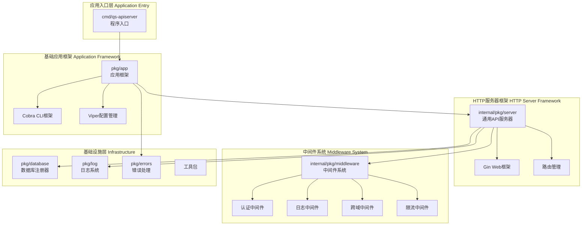
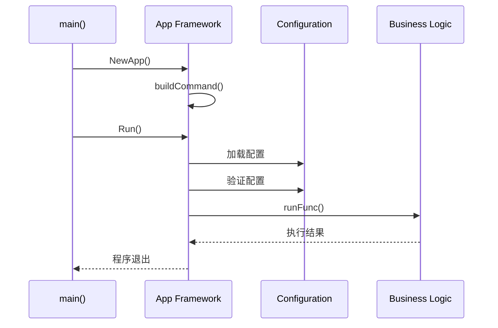

# 🛠️ 框架设计总览

## 📋 目录

- [框架设计概述](#framework-overview)
- [基础应用框架](#application-framework)
- [HTTP服务器框架](#http-server-framework)
- [中间件系统](#middleware-system)
- [配置管理系统](#configuration-system)
- [依赖注入容器](#dependency-injection-container)
- [框架特性总结](#framework-features)

## 🎯 框架设计概述 {#framework-overview}

本项目构建了一套完整的企业级Go应用框架，采用**分层架构**和**模块化设计**，为业务逻辑提供稳定可靠的技术基础。框架设计遵循**分离关注点**原则，将非业务相关的技术基础设施抽象为独立的框架层。

### 🏗️ 框架架构图



### 🎨 设计原则

1. **框架与业务分离**: 技术框架不包含业务逻辑
2. **高度可配置**: 通过配置文件控制框架行为
3. **插件化设计**: 中间件和组件可插拔
4. **生产就绪**: 具备企业级特性（监控、日志、安全等）

## 🚀 基础应用框架 {#application-framework}

### 📦 核心组件

基础应用框架位于 `pkg/app`，基于 **Cobra** 构建，提供完整的CLI应用生命周期管理。

```go
// App 应用结构
type App struct {
    basename    string              // 应用基名
    name        string              // 应用名称
    description string              // 应用描述
    noVersion   bool               // 是否禁用版本信息
    noConfig    bool               // 是否禁用配置文件
    silence     bool               // 是否静默模式
    options     CliOptions         // CLI选项接口
    cmd         *cobra.Command     // Cobra命令
    args        cobra.PositionalArgs // 位置参数验证
    commands    []*Command         // 子命令列表
    runFunc     RunFunc            // 运行函数
}
```

### 🔧 核心接口设计

#### 1. CLI选项接口

```go
// CliOptions CLI选项接口
type CliOptions interface {
    // Flags 返回命令行标志集合
    Flags() cliflag.NamedFlagSets
    // Validate 验证选项的有效性
    Validate() []error
}

// CompleteableOptions 可完成选项接口
type CompleteableOptions interface {
    Complete() error
}

// PrintableOptions 可打印选项接口
type PrintableOptions interface {
    String() string
}
```

#### 2. 运行函数定义

```go
// RunFunc 定义应用程序的启动回调函数
type RunFunc func(basename string) error
```

### 🌟 框架特性

#### 1. **优雅的应用构建**

```go
// 应用构建示例
func NewApp(basename string) *app.App {
    opts := options.NewOptions()
    application := app.NewApp("Questionnaire Scale API Server",
        basename,
        app.WithDescription(commandDesc),
        app.WithDefaultValidArgs(),
        app.WithOptions(opts),
        app.WithRunFunc(run(opts)),
    )
    return application
}
```

#### 2. **完整的生命周期**



#### 3. **灵活的配置支持**

- **命令行参数**: 通过 Cobra 处理
- **配置文件**: 通过 Viper 自动加载
- **环境变量**: 自动绑定环境变量
- **配置验证**: 启动时验证配置有效性

## 🌐 HTTP服务器框架 {#http-server-framework}

### 📦 通用API服务器

HTTP服务器框架位于 `internal/pkg/server`，基于 **Gin** 构建通用API服务器。

```go
// GenericAPIServer 通用API服务器
type GenericAPIServer struct {
    middlewares         []string           // 中间件列表
    SecureServingInfo   *SecureServingInfo // HTTPS配置
    InsecureServingInfo *InsecureServingInfo // HTTP配置
    ShutdownTimeout     time.Duration      // 关闭超时
    *gin.Engine                           // Gin引擎
    healthz             bool              // 健康检查
    enableMetrics       bool              // 指标监控
    enableProfiling     bool              // 性能分析
    insecureServer      *http.Server      // HTTP服务器
    secureServer        *http.Server      // HTTPS服务器
}
```

### 🔧 核心功能

#### 1. **双协议支持**

```go
// 同时启动HTTP和HTTPS服务器
func (s *GenericAPIServer) Run() error {
    var eg errgroup.Group
    
    // 启动HTTP服务器
    eg.Go(func() error {
        return s.insecureServer.ListenAndServe()
    })
    
    // 启动HTTPS服务器
    eg.Go(func() error {
        return s.secureServer.ListenAndServeTLS(cert, key)
    })
    
    return eg.Wait()
}
```

#### 2. **标准API路由**

```go
// InstallAPIs 安装标准API
func (s *GenericAPIServer) InstallAPIs() {
    // 健康检查
    if s.healthz {
        s.GET("/healthz", func(c *gin.Context) {
            core.WriteResponse(c, nil, map[string]string{"status": "ok"})
        })
    }
    
    // 版本信息
    s.GET("/version", func(c *gin.Context) {
        core.WriteResponse(c, nil, version.Get())
    })
    
    // 指标监控
    if s.enableMetrics {
        prometheus := ginprometheus.NewPrometheus("gin")
        prometheus.Use(s.Engine)
    }
}
```

#### 3. **优雅关闭**

```go
// Close 优雅关闭服务器
func (s *GenericAPIServer) Close() {
    ctx, cancel := context.WithTimeout(context.Background(), 10*time.Second)
    defer cancel()
    
    // 关闭HTTPS服务器
    if err := s.secureServer.Shutdown(ctx); err != nil {
        log.Warnf("Shutdown secure server failed: %s", err.Error())
    }
    
    // 关闭HTTP服务器
    if err := s.insecureServer.Shutdown(ctx); err != nil {
        log.Warnf("Shutdown insecure server failed: %s", err.Error())
    }
}
```

## 🔌 中间件系统 {#middleware-system}

### 📦 中间件架构

中间件系统位于 `internal/pkg/middleware`，采用**插件化设计**，支持动态加载和配置。

```go
// 中间件注册表
var Middlewares = map[string]gin.HandlerFunc{
    "cors":            cors.Default(),
    "logger":          logger.Logger(),
    "enhanced-logger": enhanced_logger.Logger(),
    "limit":           limit.Limit(),
    "auth":            auth.Authenticate(),
}
```

### 🛡️ 核心中间件

#### 1. **请求ID中间件**

```go
// RequestID 为每个请求生成唯一ID
func RequestID() gin.HandlerFunc {
    return gin.HandlerFunc(func(c *gin.Context) {
        // 从请求头获取或生成新的请求ID
        requestID := c.Request.Header.Get(XRequestIDKey)
        if requestID == "" {
            requestID = uuid.New().String()
        }
        
        // 设置到上下文和响应头
        c.Set(XRequestIDKey, requestID)
        c.Writer.Header().Set(XRequestIDKey, requestID)
        
        c.Next()
    })
}
```

#### 2. **上下文中间件**

```go
// Context 增强Gin上下文
func Context() gin.HandlerFunc {
    return gin.HandlerFunc(func(c *gin.Context) {
        // 从Gin上下文创建标准上下文
        ctx := context.WithValue(context.Background(), KeyRequestID, c.GetString(XRequestIDKey))
        ctx = context.WithValue(ctx, KeyUsername, c.GetString(UsernameKey))
        
        // 将上下文传递给下游
        c.Request = c.Request.WithContext(ctx)
        c.Next()
    })
}
```

#### 3. **认证中间件**

```go
// AuthStrategy 认证策略接口
type AuthStrategy interface {
    AuthFunc() gin.HandlerFunc
}

// AuthOperator 认证操作器
type AuthOperator struct {
    strategy AuthStrategy
}

// SetStrategy 设置认证策略
func (operator *AuthOperator) SetStrategy(strategy AuthStrategy) {
    operator.strategy = strategy
}

// AuthFunc 执行认证
func (operator *AuthOperator) AuthFunc() gin.HandlerFunc {
    return operator.strategy.AuthFunc()
}
```

#### 4. **日志中间件**

```go
// Logger 日志中间件
func Logger() gin.HandlerFunc {
    return gin.LoggerWithConfig(gin.LoggerConfig{
        Formatter: func(param gin.LogFormatterParams) string {
            return fmt.Sprintf("[%s] %s %s %d %s %s\n",
                param.TimeStamp.Format("2006/01/02 - 15:04:05"),
                param.Method,
                param.Path,
                param.StatusCode,
                param.Latency,
                param.ClientIP,
            )
        },
        Output: log.StdInfoLogger().Writer(),
    })
}
```

## ⚙️ 配置管理系统 {#configuration-system}

### 📦 配置架构

配置管理基于 **Viper**，支持多种配置源和格式。

```go
// Options 配置选项
type Options struct {
    GenericServerRunOptions *server.ServerRunOptions `json:"server" mapstructure:"server"`
    MySQLOptions           *mysql.MySQLOptions      `json:"mysql" mapstructure:"mysql"`
    MongoDBOptions         *mongodb.MongoDBOptions  `json:"mongodb" mapstructure:"mongodb"`
    RedisOptions           *redis.RedisOptions      `json:"redis" mapstructure:"redis"`
    Log                    *log.Options             `json:"log" mapstructure:"log"`
}
```

### 🔧 配置特性

#### 1. **多源配置**

- **配置文件**: YAML、JSON、TOML格式
- **环境变量**: 自动绑定和转换
- **命令行参数**: 最高优先级
- **默认值**: 合理的默认配置

#### 2. **配置验证**

```go
// Validate 验证配置
func (o *Options) Validate() []error {
    var errs []error
    
    // 验证服务器配置
    errs = append(errs, o.GenericServerRunOptions.Validate()...)
    
    // 验证数据库配置  
    errs = append(errs, o.MySQLOptions.Validate()...)
    
    // 验证日志配置
    errs = append(errs, o.Log.Validate()...)
    
    return errs
}
```

#### 3. **配置热重载**

```go
// 监听配置文件变化
viper.WatchConfig()
viper.OnConfigChange(func(e fsnotify.Event) {
    log.Infof("Config file changed: %s", e.Name)
    // 重新加载配置
})
```

## 🏗️ 依赖注入容器 {#dependency-injection-container}

### 📦 容器设计

依赖注入容器位于 `internal/apiserver/container`，管理模块的生命周期和依赖关系。

```go
// Container 主容器
type Container struct {
    // 基础设施
    mysqlDB *gorm.DB
    mongoDB *mongo.Database
    
    // 业务模块
    AuthModule          *assembler.AuthModule
    UserModule          *assembler.UserModule
    QuestionnaireModule *assembler.QuestionnaireModule
    
    // 容器状态
    initialized bool
}
```

### 🔧 模块管理

#### 1. **模块接口**

```go
// Module 模块接口
type Module interface {
    Initialize(params ...interface{}) error
    CheckHealth() error
    Cleanup() error
    ModuleInfo() ModuleInfo
}
```

#### 2. **模块初始化**

```go
// Initialize 初始化容器
func (c *Container) Initialize() error {
    if c.initialized {
        return nil
    }
    
    // 初始化用户模块
    if err := c.initUserModule(); err != nil {
        return fmt.Errorf("failed to initialize user module: %w", err)
    }
    
    // 初始化认证模块
    if err := c.initAuthModule(); err != nil {
        return fmt.Errorf("failed to initialize auth module: %w", err)
    }
    
    // 初始化问卷模块
    if err := c.initQuestionnaireModule(); err != nil {
        return fmt.Errorf("failed to initialize questionnaire module: %w", err)
    }
    
    c.initialized = true
    return nil
}
```

#### 3. **健康检查**

```go
// HealthCheck 容器健康检查
func (c *Container) HealthCheck(ctx context.Context) error {
    // 检查MySQL连接
    if c.mysqlDB != nil {
        sqlDB, err := c.mysqlDB.DB()
        if err != nil {
            return fmt.Errorf("failed to get mysql db: %w", err)
        }
        if err := sqlDB.PingContext(ctx); err != nil {
            return fmt.Errorf("mysql ping failed: %w", err)
        }
    }
    
    // 检查模块健康状态
    for _, module := range modulePool {
        if err := module.CheckHealth(); err != nil {
            return fmt.Errorf("module health check failed: %w", err)
        }
    }
    
    return nil
}
```

## 🌟 框架特性总结 {#framework-features}

### ✅ 核心特性

1. **企业级就绪**
   - 完整的生命周期管理
   - 优雅启动和关闭
   - 健康检查机制
   - 指标监控支持

2. **高度可配置**
   - 多源配置支持
   - 配置验证机制
   - 热重载能力
   - 环境适应性

3. **模块化设计**
   - 插件化中间件
   - 模块化组件
   - 依赖注入容器
   - 标准化接口

4. **安全特性**
   - 多策略认证
   - HTTPS支持
   - 跨域处理
   - 请求限流

5. **可观测性**
   - 结构化日志
   - 请求链路追踪
   - 性能指标监控
   - 错误追踪

### 🔧 技术栈

| 组件 | 技术 | 用途 |
|------|------|------|
| **CLI框架** | Cobra | 命令行应用框架 |
| **配置管理** | Viper | 配置文件和参数管理 |
| **Web框架** | Gin | HTTP服务器框架 |
| **日志** | Zap | 高性能结构化日志 |
| **ORM** | GORM | 数据库对象关系映射 |
| **监控** | Prometheus | 指标收集和监控 |

### 🚀 框架优势

1. **开发效率**: 提供标准化的应用开发模式
2. **运维友好**: 完整的监控和诊断能力  
3. **扩展性强**: 模块化和插件化设计
4. **生产稳定**: 企业级特性和最佳实践
5. **学习成本低**: 基于成熟的开源技术栈

这套框架为业务应用提供了稳定可靠的技术基础，使开发者能够专注于业务逻辑的实现。 