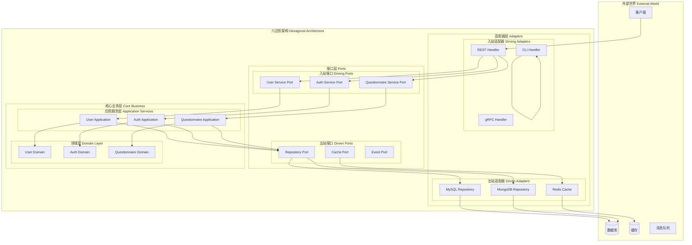
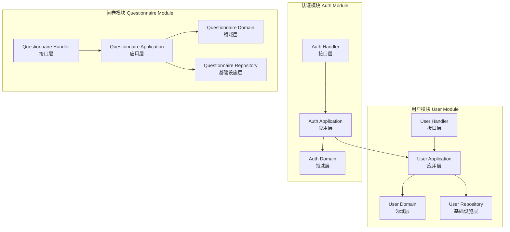
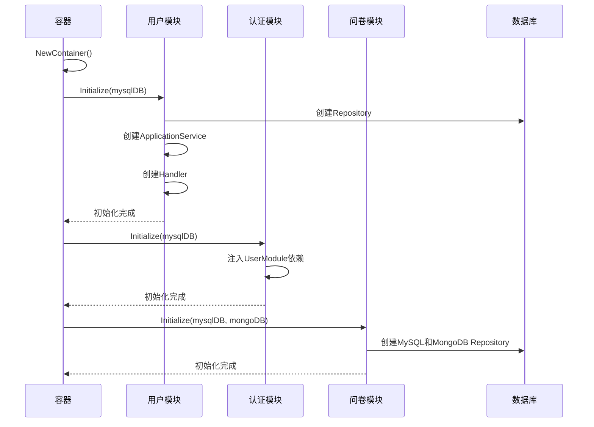
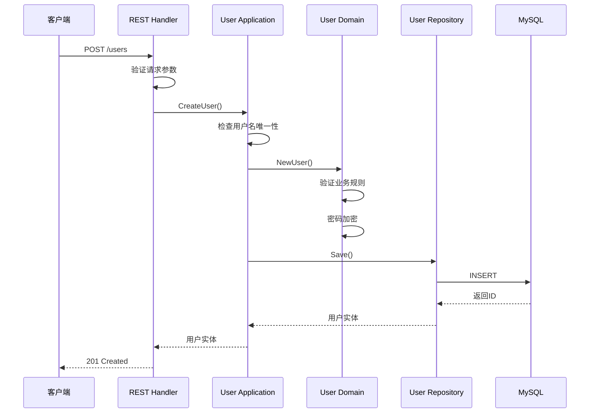
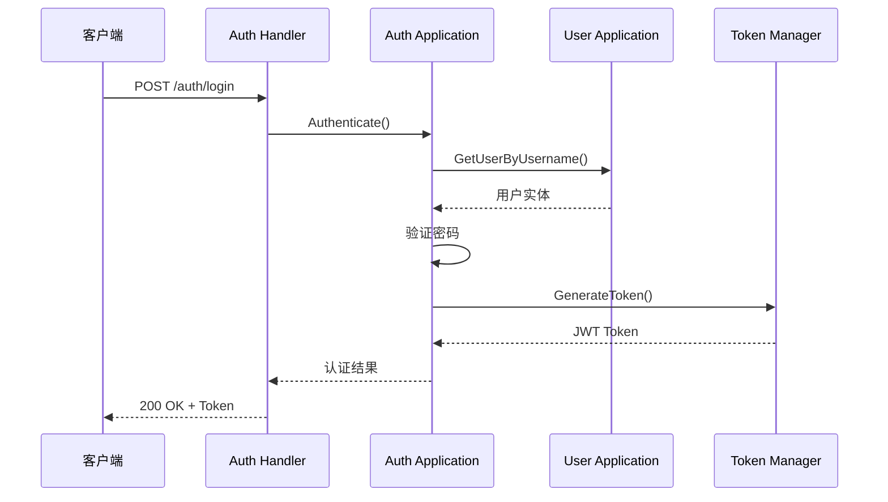

# 🔷 基于六边形架构的模块化设计

## 📋 目录

- [六边形架构概述](#hexagonal-overview)
- [端口与适配器设计](#ports-adapters)
- [模块系统架构](#module-system)
- [依赖注入容器](#dependency-injection)
- [模块间通信](#inter-module-communication)
- [实际应用案例](#practical-cases)

## 🎯 六边形架构概述 {#hexagonal-overview}

本系统采用六边形架构（Hexagonal Architecture），也称为端口和适配器架构，实现了**业务逻辑与外部依赖的完全解耦**。这种架构确保核心业务逻辑不受外部技术选择的影响。

### 🏗️ 架构层次图



### 🎨 核心设计原则

1. **依赖倒置**: 业务逻辑定义接口，外部实现接口
2. **端口抽象**: 通过接口隔离内外部依赖
3. **适配器封装**: 外部技术细节封装在适配器中
4. **业务中心**: 业务逻辑是架构的核心

## 🔌 端口与适配器设计 {#ports-adapters}

### 📥 入站端口设计

入站端口定义了外部世界调用业务逻辑的接口契约。

#### 1. 用户服务端口

```go
// internal/apiserver/domain/user/port/service.go

package port

import (
    "context"
    "github.com/yshujie/questionnaire-scale/internal/apiserver/domain/user"
)

// UserCreator 用户创建接口
type UserCreator interface {
    CreateUser(ctx context.Context, username, password, nickname, email, phone, introduction string) (*user.User, error)
}

// UserQueryer 用户查询接口
type UserQueryer interface {
    GetUser(ctx context.Context, id uint64) (*user.User, error)
    GetUserByUsername(ctx context.Context, username string) (*user.User, error)
    ListUsers(ctx context.Context, page, pageSize int) ([]*user.User, int64, error)
}

// UserEditor 用户编辑接口
type UserEditor interface {
    UpdateBasicInfo(ctx context.Context, id uint64, nickname, email, phone, introduction string) (*user.User, error)
    UpdateAvatar(ctx context.Context, id uint64, avatar string) error
}

// PasswordChanger 密码管理接口
type PasswordChanger interface {
    ChangePassword(ctx context.Context, id uint64, oldPassword, newPassword string) error
}

// UserActivator 用户状态管理接口
type UserActivator interface {
    ActivateUser(ctx context.Context, id uint64) error
    BlockUser(ctx context.Context, id uint64) error
    DeactivateUser(ctx context.Context, id uint64) error
}
```

#### 2. 认证服务端口

```go
// internal/apiserver/domain/auth/port/service.go

// Authenticator 认证接口
type Authenticator interface {
    Authenticate(ctx context.Context, username, password string) (*user.User, error)
    GenerateToken(ctx context.Context, user *user.User) (string, time.Time, error)
    ValidateToken(ctx context.Context, token string) (*user.User, error)
    RefreshToken(ctx context.Context, refreshToken string) (string, time.Time, error)
}

// TokenManager 令牌管理接口
type TokenManager interface {
    CreateToken(userID uint64, expiration time.Duration) (string, error)
    ValidateToken(token string) (uint64, error)
    RevokeToken(token string) error
    RefreshToken(token string) (string, error)
}
```

### 📤 出站端口设计

出站端口定义了业务逻辑对外部依赖的接口需求。

#### 1. 存储库端口

```go
// internal/apiserver/domain/user/port/repository.go

// UserRepository 用户存储库接口
type UserRepository interface {
    // 基础CRUD操作
    Save(ctx context.Context, user *user.User) error
    FindByID(ctx context.Context, id uint64) (*user.User, error)
    FindByUsername(ctx context.Context, username string) (*user.User, error)
    Update(ctx context.Context, user *user.User) error
    Remove(ctx context.Context, id uint64) error
    
    // 查询操作
    List(ctx context.Context, offset, limit int) ([]*user.User, error)
    Count(ctx context.Context) (int64, error)
    
    // 存在性检查
    ExistsByUsername(ctx context.Context, username string) bool
    ExistsByEmail(ctx context.Context, email string) bool
    ExistsByPhone(ctx context.Context, phone string) bool
}
```

#### 2. 缓存端口

```go
// internal/apiserver/domain/shared/port/cache.go

// CacheRepository 缓存接口
type CacheRepository interface {
    Set(ctx context.Context, key string, value interface{}, expiration time.Duration) error
    Get(ctx context.Context, key string, dest interface{}) error
    Delete(ctx context.Context, key string) error
    Exists(ctx context.Context, key string) bool
    Increment(ctx context.Context, key string) (int64, error)
    Expire(ctx context.Context, key string, expiration time.Duration) error
}
```

### 🔄 适配器实现

#### 1. REST适配器

```go
// internal/apiserver/interface/restful/handler/user.go

type UserHandler struct {
    BaseHandler
    userCreator         port.UserCreator
    userQueryer         port.UserQueryer
    userEditor          port.UserEditor
    userActivator       port.UserActivator
    userPasswordChanger port.PasswordChanger
}

// CreateUser 创建用户REST接口
func (h *UserHandler) CreateUser(c *gin.Context) {
    var req dto.CreateUserRequest
    if err := h.BindJSON(c, &req); err != nil {
        h.ErrorResponse(c, err)
        return
    }

    // 调用应用服务
    user, err := h.userCreator.CreateUser(
        c.Request.Context(),
        req.Username, req.Password, req.Nickname,
        req.Email, req.Phone, req.Introduction,
    )
    if err != nil {
        h.ErrorResponse(c, err)
        return
    }

    // 转换为DTO响应
    response := &dto.UserResponse{
        ID:           user.ID().Value(),
        Username:     user.Username(),
        Nickname:     user.Nickname(),
        Email:        user.Email(),
        Phone:        user.Phone(),
        Avatar:       user.Avatar(),
        Introduction: user.Introduction(),
        Status:       user.Status().String(),
        CreatedAt:    user.CreatedAt().Format(time.RFC3339),
        UpdatedAt:    user.UpdatedAt().Format(time.RFC3339),
    }

    h.SuccessResponse(c, response)
}
```

#### 2. MySQL适配器

```go
// internal/apiserver/infra/mysql/user/repo.go

type Repository struct {
    mysql.BaseRepository[*UserPO]
    mapper *UserMapper
}

func NewRepository(db *gorm.DB) port.UserRepository {
    return &Repository{
        BaseRepository: mysql.NewBaseRepository[*UserPO](db),
        mapper:         NewUserMapper(),
    }
}

// Save 保存用户
func (r *Repository) Save(ctx context.Context, userDomain *user.User) error {
    po := r.mapper.ToPO(userDomain)
    return r.CreateAndSync(ctx, po, func(saved *UserPO) {
        userDomain.SetID(user.NewUserID(saved.ID))
        userDomain.SetCreatedAt(saved.CreatedAt)
        userDomain.SetUpdatedAt(saved.UpdatedAt)
    })
}

// FindByUsername 根据用户名查询用户
func (r *Repository) FindByUsername(ctx context.Context, username string) (*user.User, error) {
    var po UserPO
    err := r.BaseRepository.FindByField(ctx, &po, "username", username)
    if err != nil {
        if errors.Is(err, gorm.ErrRecordNotFound) {
            return nil, errors.WithCode(code.ErrUserNotFound, "user not found: %s", username)
        }
        return nil, err
    }
    return r.mapper.ToBO(&po), nil
}
```

## 🏗️ 模块系统架构 {#module-system}

### 📦 模块接口设计

```go
// internal/apiserver/container/assembler/module.go

// Module 模块接口
type Module interface {
    // Initialize 初始化模块
    Initialize(params ...interface{}) error
    
    // CheckHealth 健康检查
    CheckHealth() error
    
    // Cleanup 清理资源
    Cleanup() error
    
    // ModuleInfo 模块信息
    ModuleInfo() ModuleInfo
}

// ModuleInfo 模块信息
type ModuleInfo struct {
    Name        string `json:"name"`
    Version     string `json:"version"`
    Description string `json:"description"`
}
```

### 👤 用户模块实现

```go
// internal/apiserver/container/assembler/user.go

// UserModule 用户模块
type UserModule struct {
    // 基础设施层
    UserRepo port.UserRepository

    // 应用服务层
    UserCreator         port.UserCreator
    UserQueryer         port.UserQueryer
    UserEditor          port.UserEditor
    UserActivator       port.UserActivator
    UserPasswordChanger port.PasswordChanger

    // 接口层
    UserHandler *userHandler.Handler
}

// NewUserModule 创建用户模块
func NewUserModule() *UserModule {
    return &UserModule{}
}

// Initialize 初始化用户模块
func (m *UserModule) Initialize(params ...interface{}) error {
    if len(params) == 0 {
        return fmt.Errorf("missing required parameter: database connection")
    }

    db, ok := params[0].(*gorm.DB)
    if !ok {
        return fmt.Errorf("invalid parameter type, expected *gorm.DB")
    }

    // 1. 初始化基础设施层
    m.UserRepo = userRepo.NewRepository(db)

    // 2. 初始化应用服务层
    m.UserCreator = userApp.NewUserCreator(m.UserRepo)
    m.UserQueryer = userApp.NewUserQueryer(m.UserRepo)
    m.UserEditor = userApp.NewUserEditor(m.UserRepo)
    m.UserActivator = userApp.NewUserActivator(m.UserRepo)
    m.UserPasswordChanger = userApp.NewPasswordChanger(m.UserRepo)

    // 3. 初始化接口层
    m.UserHandler = userHandler.NewHandler(
        m.UserCreator,
        m.UserQueryer,
        m.UserEditor,
        m.UserActivator,
        m.UserPasswordChanger,
    )

    return nil
}

// CheckHealth 健康检查
func (m *UserModule) CheckHealth() error {
    // 检查基础设施连接状态
    // 这里可以添加具体的健康检查逻辑
    return nil
}

// Cleanup 清理资源
func (m *UserModule) Cleanup() error {
    // 清理模块资源
    return nil
}

// ModuleInfo 返回模块信息
func (m *UserModule) ModuleInfo() ModuleInfo {
    return ModuleInfo{
        Name:        "user",
        Version:     "1.0.0",
        Description: "用户管理模块",
    }
}
```

### 🏛️ 模块依赖关系



## 🏗️ 依赖注入容器 {#dependency-injection}

### 📦 容器设计

```go
// internal/apiserver/container/container.go

type Container struct {
    // 基础设施
    mysqlDB *gorm.DB
    mongoDB *mongo.Database

    // 业务模块
    AuthModule          *assembler.AuthModule
    UserModule          *assembler.UserModule
    QuestionnaireModule *assembler.QuestionnaireModule

    // 容器状态
    initialized bool
}

func NewContainer(mysqlDB *gorm.DB, mongoDB *mongo.Database) *Container {
    return &Container{
        mysqlDB:     mysqlDB,
        mongoDB:     mongoDB,
        initialized: false,
    }
}
```

### 🔧 模块初始化流程



### 🔄 依赖注入实现

```go
// Initialize 初始化容器
func (c *Container) Initialize() error {
    if c.initialized {
        return nil
    }

    // 1. 初始化用户模块
    if err := c.initUserModule(); err != nil {
        return fmt.Errorf("failed to initialize user module: %w", err)
    }

    // 2. 初始化认证模块（依赖用户模块）
    if err := c.initAuthModule(); err != nil {
        return fmt.Errorf("failed to initialize auth module: %w", err)
    }

    // 3. 初始化问卷模块
    if err := c.initQuestionnaireModule(); err != nil {
        return fmt.Errorf("failed to initialize questionnaire module: %w", err)
    }

    c.initialized = true
    return nil
}

// initAuthModule 初始化认证模块（展示模块间依赖）
func (c *Container) initAuthModule() error {
    authModule := assembler.NewAuthModule()
    
    // 注入用户模块的依赖
    if err := authModule.Initialize(c.mysqlDB, c.UserModule.UserQueryer); err != nil {
        return fmt.Errorf("failed to initialize auth module: %w", err)
    }

    c.AuthModule = authModule
    return nil
}
```

## 📡 模块间通信 {#inter-module-communication}

### 🔄 同步通信

模块间通过明确的接口进行同步通信：

```go
// 认证模块依赖用户模块的查询功能
type AuthApplication struct {
    userQueryer port.UserQueryer  // 依赖用户模块的接口
    tokenManager TokenManager
}

func (a *AuthApplication) Authenticate(ctx context.Context, username, password string) (*user.User, error) {
    // 通过用户模块接口查询用户
    user, err := a.userQueryer.GetUserByUsername(ctx, username)
    if err != nil {
        return nil, err
    }
    
    // 验证密码
    if !user.ValidatePassword(password) {
        return nil, errors.New("invalid password")
    }
    
    return user, nil
}
```

### 📨 事件通信（扩展设计）

对于松耦合的模块间通信，可以引入事件机制：

```go
// 领域事件接口
type DomainEvent interface {
    EventType() string
    AggregateID() string
    OccurredOn() time.Time
}

// 用户创建事件
type UserCreatedEvent struct {
    userID      string
    username    string
    occurredOn  time.Time
}

// 事件总线
type EventBus interface {
    Publish(event DomainEvent) error
    Subscribe(eventType string, handler EventHandler) error
}
```

## 📚 实际应用案例 {#practical-cases}

### 🎯 用户注册流程



### 🔑 用户认证流程



## 🎯 架构优势总结

### ✅ 业务价值

1. **业务逻辑保护**: 核心业务不受技术变更影响
2. **快速迭代**: 新功能通过新适配器快速接入
3. **技术债务控制**: 技术变更局限在适配器层
4. **团队协作**: 不同团队可并行开发不同模块

### 🔧 技术优势

1. **高度可测试**: 每层都可独立进行单元测试
2. **灵活替换**: 数据库、消息队列可无缝切换
3. **模块复用**: 模块可在不同项目间复用
4. **清晰边界**: 每个模块职责明确，边界清晰

### 📈 扩展能力

1. **新接口类型**: 增加GraphQL、gRPC接口
2. **新存储方案**: 增加ElasticSearch、ClickHouse
3. **新认证方式**: 增加OAuth2、SAML认证
4. **微服务演进**: 模块可独立部署为微服务

这种基于六边形架构的模块化设计，为系统提供了强大的可扩展性和可维护性基础。 