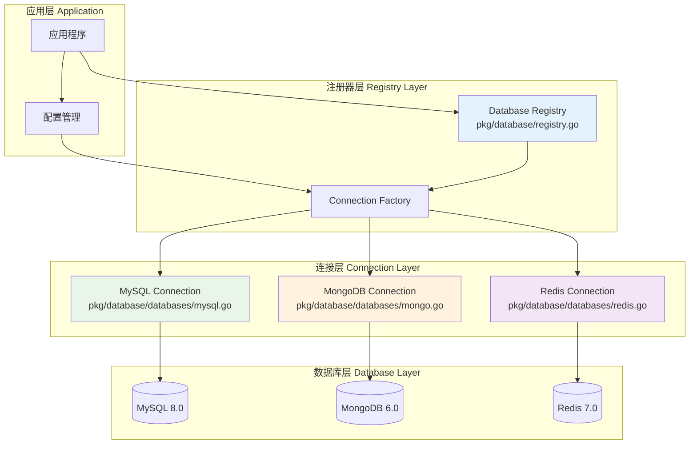

# 🗄️ 数据库注册器设计

## 📋 目录

- [设计概述](#design-overview)
- [注册器核心架构](#registry-architecture)
- [连接管理策略](#connection-management)
- [多数据源支持](#multi-datasource)
- [健康检查机制](#health-check)
- [实际应用案例](#practical-cases)

## 🎯 设计概述 {#design-overview}

数据库注册器是一个集中化的数据库连接管理系统，采用**注册器模式**和**工厂模式**，实现了多种数据库的统一管理、连接池优化和健康监控。

### 🏗️ 设计目标

1. **统一管理**: 集中管理多种数据库连接
2. **类型安全**: 通过泛型和接口保证类型安全
3. **连接复用**: 高效的连接池管理
4. **健康监控**: 实时监控数据库连接状态
5. **优雅关闭**: 支持优雅的资源清理

### 🎨 核心设计原则

- **单一职责**: 专注于数据库连接管理
- **开闭原则**: 支持新数据库类型扩展
- **依赖倒置**: 基于接口而非具体实现
- **线程安全**: 支持并发访问

## 🏛️ 注册器核心架构 {#registry-architecture}

### 📦 核心结构

```go
// pkg/database/registry.go

// Registry 数据库注册器
type Registry struct {
    mu          sync.RWMutex                           // 读写锁保护
    connections map[dbs.DatabaseType]dbs.Connection    // 连接映射
    configs     map[dbs.DatabaseType]interface{}       // 配置映射
    initialized bool                                   // 初始化状态
}
```

### 🔧 数据库类型与连接接口

```go
// pkg/database/databases/connections.go

// DatabaseType 数据库类型枚举
type DatabaseType string

const (
    MySQL   DatabaseType = "mysql"
    MongoDB DatabaseType = "mongodb"
    Redis   DatabaseType = "redis"
)

// Connection 数据库连接接口
type Connection interface {
    Type() DatabaseType                    // 返回数据库类型
    Connect() error                        // 建立连接
    Close() error                          // 关闭连接
    GetClient() interface{}               // 获取客户端实例
    HealthCheck(ctx context.Context) error // 健康检查
}
```

### 🚀 架构流程图



## 🔗 连接管理策略 {#connection-management}

### 📝 注册器API设计

#### 1. 注册器创建和初始化

```go
// NewRegistry 创建新的数据库注册器
func NewRegistry() *Registry {
    return &Registry{
        connections: make(map[dbs.DatabaseType]dbs.Connection),
        configs:     make(map[dbs.DatabaseType]interface{}),
    }
}

// Register 注册数据库连接
func (r *Registry) Register(dbType dbs.DatabaseType, config interface{}, connection dbs.Connection) error {
    r.mu.Lock()
    defer r.mu.Unlock()

    if r.initialized {
        return fmt.Errorf("registry already initialized, cannot register new connections")
    }

    if connection == nil {
        return fmt.Errorf("connection cannot be nil")
    }

    if connection.Type() != dbType {
        return fmt.Errorf("connection type mismatch: expected %s, got %s", dbType, connection.Type())
    }

    r.connections[dbType] = connection
    r.configs[dbType] = config

    log.Printf("Registered database connection: %s", dbType)
    return nil
}
```

#### 2. 连接初始化

```go
// Init 初始化所有已注册的数据库连接
func (r *Registry) Init() error {
    r.mu.Lock()
    defer r.mu.Unlock()

    if r.initialized {
        return nil
    }

    for dbType, connection := range r.connections {
        log.Printf("Initializing database connection: %s", dbType)
        if err := connection.Connect(); err != nil {
            return fmt.Errorf("failed to connect to %s: %w", dbType, err)
        }
    }

    r.initialized = true
    log.Println("All database connections initialized successfully")
    return nil
}
```

#### 3. 连接获取

```go
// Get 获取指定类型的数据库连接
func (r *Registry) Get(dbType dbs.DatabaseType) (dbs.Connection, error) {
    r.mu.RLock()
    defer r.mu.RUnlock()

    connection, exists := r.connections[dbType]
    if !exists {
        return nil, fmt.Errorf("database connection not found: %s", dbType)
    }

    return connection, nil
}

// GetClient 获取指定类型的数据库客户端
func (r *Registry) GetClient(dbType dbs.DatabaseType) (interface{}, error) {
    connection, err := r.Get(dbType)
    if err != nil {
        return nil, err
    }

    return connection.GetClient(), nil
}
```

## 🌐 多数据源支持 {#multi-datasource}

### 📊 MySQL连接实现

```go
// pkg/database/databases/mysql.go

// MySQLConnection MySQL连接实现
type MySQLConnection struct {
    config *MySQLConfig
    db     *gorm.DB
}

// MySQLConfig MySQL配置
type MySQLConfig struct {
    Host            string
    Port            int
    Username        string
    Password        string
    Database        string
    Parameters      string
    MaxIdleConns    int
    MaxOpenConns    int
    MaxLifetime     time.Duration
    LogLevel        int
    SlowThreshold   time.Duration
}

// NewMySQLConnection 创建MySQL连接
func NewMySQLConnection(config *MySQLConfig) *MySQLConnection {
    return &MySQLConnection{
        config: config,
    }
}

// Type 返回数据库类型
func (m *MySQLConnection) Type() DatabaseType {
    return MySQL
}

// Connect 建立MySQL连接
func (m *MySQLConnection) Connect() error {
    dsn := fmt.Sprintf("%s:%s@tcp(%s:%d)/%s?%s",
        m.config.Username,
        m.config.Password,
        m.config.Host,
        m.config.Port,
        m.config.Database,
        m.config.Parameters,
    )

    db, err := gorm.Open(mysql.Open(dsn), &gorm.Config{
        Logger: logger.Default.LogMode(logger.LogLevel(m.config.LogLevel)),
        NowFunc: func() time.Time {
            return time.Now().Local()
        },
    })
    if err != nil {
        return fmt.Errorf("failed to connect to MySQL: %w", err)
    }

    // 配置连接池
    sqlDB, err := db.DB()
    if err != nil {
        return fmt.Errorf("failed to get underlying sql.DB: %w", err)
    }

    sqlDB.SetMaxIdleConns(m.config.MaxIdleConns)
    sqlDB.SetMaxOpenConns(m.config.MaxOpenConns)
    sqlDB.SetConnMaxLifetime(m.config.MaxLifetime)

    m.db = db
    return nil
}

// GetClient 获取GORM实例
func (m *MySQLConnection) GetClient() interface{} {
    return m.db
}

// HealthCheck MySQL健康检查
func (m *MySQLConnection) HealthCheck(ctx context.Context) error {
    if m.db == nil {
        return fmt.Errorf("MySQL connection not initialized")
    }

    sqlDB, err := m.db.DB()
    if err != nil {
        return fmt.Errorf("failed to get underlying sql.DB: %w", err)
    }

    return sqlDB.PingContext(ctx)
}

// Close 关闭MySQL连接
func (m *MySQLConnection) Close() error {
    if m.db == nil {
        return nil
    }

    sqlDB, err := m.db.DB()
    if err != nil {
        return fmt.Errorf("failed to get underlying sql.DB: %w", err)
    }

    return sqlDB.Close()
}
```

### 📄 MongoDB连接实现

```go
// pkg/database/databases/mongo.go

// MongoConnection MongoDB连接实现
type MongoConnection struct {
    config *MongoConfig
    client *mongo.Client
    db     *mongo.Database
}

// MongoConfig MongoDB配置
type MongoConfig struct {
    URI      string
    Database string
    Username string
    Password string
    Timeout  time.Duration
}

// Connect 建立MongoDB连接
func (m *MongoConnection) Connect() error {
    ctx, cancel := context.WithTimeout(context.Background(), m.config.Timeout)
    defer cancel()

    // 构建连接选项
    opts := options.Client().ApplyURI(m.config.URI)
    if m.config.Username != "" && m.config.Password != "" {
        credential := options.Credential{
            Username: m.config.Username,
            Password: m.config.Password,
        }
        opts.SetAuth(credential)
    }

    // 建立连接
    client, err := mongo.Connect(ctx, opts)
    if err != nil {
        return fmt.Errorf("failed to connect to MongoDB: %w", err)
    }

    // 测试连接
    if err := client.Ping(ctx, nil); err != nil {
        return fmt.Errorf("failed to ping MongoDB: %w", err)
    }

    m.client = client
    m.db = client.Database(m.config.Database)
    return nil
}

// GetClient 获取MongoDB数据库实例
func (m *MongoConnection) GetClient() interface{} {
    return m.db
}

// HealthCheck MongoDB健康检查
func (m *MongoConnection) HealthCheck(ctx context.Context) error {
    if m.client == nil {
        return fmt.Errorf("MongoDB connection not initialized")
    }

    return m.client.Ping(ctx, nil)
}
```

### ⚡ Redis连接实现

```go
// pkg/database/databases/redis.go

// RedisConnection Redis连接实现
type RedisConnection struct {
    config *RedisConfig
    client *redis.Client
}

// RedisConfig Redis配置
type RedisConfig struct {
    Host         string
    Port         int
    Password     string
    Database     int
    PoolSize     int
    MinIdleConns int
    DialTimeout  time.Duration
    ReadTimeout  time.Duration
    WriteTimeout time.Duration
}

// Connect 建立Redis连接
func (r *RedisConnection) Connect() error {
    addr := fmt.Sprintf("%s:%d", r.config.Host, r.config.Port)
    
    client := redis.NewClient(&redis.Options{
        Addr:         addr,
        Password:     r.config.Password,
        DB:           r.config.Database,
        PoolSize:     r.config.PoolSize,
        MinIdleConns: r.config.MinIdleConns,
        DialTimeout:  r.config.DialTimeout,
        ReadTimeout:  r.config.ReadTimeout,
        WriteTimeout: r.config.WriteTimeout,
    })

    // 测试连接
    ctx, cancel := context.WithTimeout(context.Background(), 5*time.Second)
    defer cancel()

    if err := client.Ping(ctx).Err(); err != nil {
        return fmt.Errorf("failed to connect to Redis: %w", err)
    }

    r.client = client
    return nil
}

// GetClient 获取Redis客户端
func (r *RedisConnection) GetClient() interface{} {
    return r.client
}

// HealthCheck Redis健康检查
func (r *RedisConnection) HealthCheck(ctx context.Context) error {
    if r.client == nil {
        return fmt.Errorf("Redis connection not initialized")
    }

    return r.client.Ping(ctx).Err()
}
```

## 🏥 健康检查机制 {#health-check}

### 📊 健康检查接口

```go
// HealthCheck 对所有数据库连接进行健康检查
func (r *Registry) HealthCheck(ctx context.Context) error {
    r.mu.RLock()
    defer r.mu.RUnlock()

    var errs []error

    for dbType, connection := range r.connections {
        if err := connection.HealthCheck(ctx); err != nil {
            errs = append(errs, fmt.Errorf("%s health check failed: %w", dbType, err))
        }
    }

    if len(errs) > 0 {
        return fmt.Errorf("database health check failed: %v", errs)
    }

    return nil
}
```

### 📈 健康状态监控

```go
// HealthStatus 健康状态
type HealthStatus struct {
    DatabaseType DatabaseType `json:"database_type"`
    Status       string      `json:"status"`
    Message      string      `json:"message,omitempty"`
    Timestamp    time.Time   `json:"timestamp"`
}

// GetHealthStatus 获取所有数据库的健康状态
func (r *Registry) GetHealthStatus(ctx context.Context) []HealthStatus {
    r.mu.RLock()
    defer r.mu.RUnlock()

    var statuses []HealthStatus

    for dbType, connection := range r.connections {
        status := HealthStatus{
            DatabaseType: dbType,
            Timestamp:    time.Now(),
        }

        if err := connection.HealthCheck(ctx); err != nil {
            status.Status = "unhealthy"
            status.Message = err.Error()
        } else {
            status.Status = "healthy"
        }

        statuses = append(statuses, status)
    }

    return statuses
}
```

### 🔄 定期健康检查

```go
// StartHealthChecker 启动定期健康检查
func (r *Registry) StartHealthChecker(interval time.Duration) {
    ticker := time.NewTicker(interval)
    go func() {
        for range ticker.C {
            ctx, cancel := context.WithTimeout(context.Background(), 10*time.Second)
            
            if err := r.HealthCheck(ctx); err != nil {
                log.Printf("Database health check failed: %v", err)
            } else {
                log.Println("All databases are healthy")
            }
            
            cancel()
        }
    }()
}
```

## 📚 实际应用案例 {#practical-cases}

### 🚀 注册器使用示例

```go
// 创建数据库注册器
registry := database.NewRegistry()

// 注册MySQL连接
mysqlConfig := &databases.MySQLConfig{
    Host:         "localhost",
    Port:         3306,
    Username:     "root",
    Password:     "password",
    Database:     "questionnaire",
    MaxIdleConns: 10,
    MaxOpenConns: 100,
    MaxLifetime:  time.Hour,
}
mysqlConn := databases.NewMySQLConnection(mysqlConfig)
registry.Register(databases.MySQL, mysqlConfig, mysqlConn)

// 注册MongoDB连接
mongoConfig := &databases.MongoConfig{
    URI:      "mongodb://localhost:27017",
    Database: "questionnaire",
    Timeout:  10 * time.Second,
}
mongoConn := databases.NewMongoConnection(mongoConfig)
registry.Register(databases.MongoDB, mongoConfig, mongoConn)

// 初始化所有连接
if err := registry.Init(); err != nil {
    log.Fatal("Failed to initialize database connections:", err)
}

// 获取MySQL客户端
mysqlClient, err := registry.GetClient(databases.MySQL)
if err != nil {
    log.Fatal("Failed to get MySQL client:", err)
}
db := mysqlClient.(*gorm.DB)

// 获取MongoDB客户端
mongoClient, err := registry.GetClient(databases.MongoDB)
if err != nil {
    log.Fatal("Failed to get MongoDB client:", err)
}
mongoDB := mongoClient.(*mongo.Database)
```

### 🔧 在应用中集成

```go
// internal/apiserver/database.go

func setupDatabase(cfg *config.Config) (*gorm.DB, *mongo.Database, error) {
    // 创建数据库注册器
    registry := database.NewRegistry()

    // 注册MySQL
    mysqlConn := databases.NewMySQLConnection(cfg.MySQLOptions)
    if err := registry.Register(databases.MySQL, cfg.MySQLOptions, mysqlConn); err != nil {
        return nil, nil, fmt.Errorf("failed to register MySQL: %w", err)
    }

    // 注册MongoDB
    mongoConn := databases.NewMongoConnection(cfg.MongoDBOptions)
    if err := registry.Register(databases.MongoDB, cfg.MongoDBOptions, mongoConn); err != nil {
        return nil, nil, fmt.Errorf("failed to register MongoDB: %w", err)
    }

    // 初始化连接
    if err := registry.Init(); err != nil {
        return nil, nil, fmt.Errorf("failed to initialize databases: %w", err)
    }

    // 启动健康检查
    registry.StartHealthChecker(30 * time.Second)

    // 获取客户端
    mysqlClient, _ := registry.GetClient(databases.MySQL)
    mongoClient, _ := registry.GetClient(databases.MongoDB)

    return mysqlClient.(*gorm.DB), mongoClient.(*mongo.Database), nil
}
```

## 🎯 设计优势总结

### ✅ 核心优势

1. **统一管理**: 所有数据库连接的集中化管理
2. **类型安全**: 通过接口和类型系统保证安全性
3. **配置灵活**: 支持不同数据库的个性化配置
4. **健康监控**: 完整的健康检查和监控机制
5. **优雅关闭**: 支持资源的优雅释放

### 🔧 技术特性

1. **线程安全**: 使用读写锁保护并发访问
2. **连接池**: 每种数据库都有优化的连接池配置
3. **错误处理**: 完善的错误处理和恢复机制
4. **扩展性**: 易于添加新的数据库类型支持

### 📈 运维价值

1. **故障诊断**: 快速定位数据库连接问题
2. **性能监控**: 连接池状态和性能监控
3. **配置管理**: 集中化的数据库配置管理
4. **资源控制**: 精确控制数据库连接资源

这种数据库注册器设计为多数据源应用提供了稳定、高效、可扩展的数据库连接管理方案。 